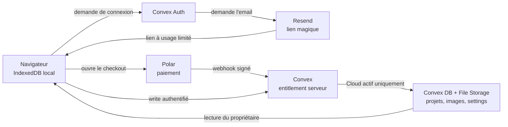

# ScreenForge Cloud — guide concret

Ce document explique les responsabilités de Local, Convex, Resend et Polar. Il
ne contient aucun inventaire d'environnement, email, identifiant, jeton ou URL
privée.

## En une minute

- **Local** fonctionne sans compte et sans backend. Les projets et images
  restent dans IndexedDB, dans le navigateur.
- **Resend** envoie le lien magique de connexion. Il ne donne aucun droit Cloud.
- **Polar** encaisse l'abonnement. Il ne reçoit pas les projets et n'autorise
  jamais directement une écriture.
- **Convex** gère les comptes, reflète l'état de l'abonnement et stocke les
  projets, images et settings. C'est lui qui autorise ou refuse chaque écriture
  Cloud.

Autrement dit : **Resend identifie, Polar facture, Convex décide et stocke**.

## Comptes et environnements

- Local ne demande aucun compte.
- Un compte ScreenForge authentifié peut recevoir le droit Cloud; il n'est
  jamais un compte administrateur.
- Les comptes automatisés utilisent le fournisseur réservé aux tests et restent
  confinés au déploiement Convex local.
- Les comptes d'infrastructure Resend, Polar, Convex et Vercel sont distincts
  des comptes clients ScreenForge.
- Sandbox et Production ne partagent ni clients, ni produits, ni jetons.

Il n'existe aucun mot de passe de test partagé à retenir. Les tests E2E génèrent
leurs propres identifiants `@screenforge.test`; les connexions hébergées passent
par les fournisseurs configurés pour l'environnement concerné.

## Le flux complet



Le stockage local reste toujours présent. Cloud ajoute une copie synchronisée;
il ne transforme pas l'éditeur en client dépendant du réseau.

## Resend : la connexion

1. L'utilisateur saisit son email dans ScreenForge.
2. Convex Auth demande à Resend d'envoyer un lien magique.
3. Le lien revient sur l'origine ScreenForge autorisée et crée une session
   Convex.
4. L'application demande ensuite à Convex si cette session possède Cloud.

Points importants :

- le lien expire après une heure et les demandes sont limitées par adresse, par
  source réseau pseudonymisée et par un plafond global de dernier recours ;
- les erreurs affichées côté client restent génériques pour ne pas révéler si
  un compte existe ;
- avec l'expéditeur de test `resend.dev`, Resend n'autorise que l'adresse liée
  au compte Resend. Pour tester plusieurs vraies adresses, il faudra vérifier un
  domaine d'envoi avec SPF et DKIM ;
- la clé Resend vit dans les variables du déploiement Convex, jamais dans le
  navigateur ou le dépôt.

Resend ne connaît ni les projets, ni les droits Cloud, ni l'état du paiement.

## Polar : le paiement

Polar fonctionne comme la caisse, pas comme la base d'autorisation :

1. Un utilisateur déjà connecté clique sur « Passer au Cloud ».
2. Une action Convex crée un checkout Polar pour le produit Cloud configuré.
3. Polar associe le client à l'identifiant interne transmis par Convex.
4. Après le paiement, Polar envoie un webhook `customer.state_changed`.
5. Convex vérifie la signature du webhook sur le corps brut.
6. Convex recopie l'état utile dans la table `entitlements`.
7. Le frontend relit cet état; le retour du checkout peut prendre quelques
   secondes parce que le webhook est asynchrone.

Les environnements Polar **Sandbox et Production sont isolés** : organisations,
clients, produits et jetons d'un environnement ne valent pas dans l'autre. Les
tests doivent rester en Sandbox jusqu'au GO Production.

## Convex : l'autorité et le stockage

Convex est la source de vérité du service Cloud :

- Convex Auth stocke utilisateurs et sessions ;
- `entitlements` reflète Polar ou la dérogation propriétaire ;
- les métadonnées projet vivent dans la table `projects` et le JSON complet
  dans Convex File Storage ;
- les métadonnées image vivent dans `assets` et les octets dans File Storage ;
- les préférences de compte durables vivent dans `userSettings` ;
- chaque propriété est déduite de la session authentifiée, jamais d'un
  `userId` choisi par le navigateur.

Toutes les créations et modifications de projet, d'image ou de setting passent
par `requireCloud`. Cette barrière exige à la fois :

1. une session valide ;
2. aucun effacement de compte en cours ;
3. un entitlement Cloud actif côté serveur.

Modifier `localStorage`, Zustand ou le bundle frontend ne peut donc pas accorder
Cloud. Le serveur refusera le write. Après expiration d'un abonnement, la
lecture, l'export et la suppression des données restent possibles; seules les
nouvelles écritures Cloud sont bloquées.

Les téléchargements de projets et d'images passent par des routes authentifiées.
Le client ne reçoit pas d'URL publique permanente vers les fichiers.

## Comment la synchronisation se comporte

- Sans `VITE_CONVEX_URL`, aucun client Convex n'est chargé : ScreenForge est
  strictement Local.
- Avant la première connexion, les anciens projets locaux ne sont envoyés
  qu'après le choix explicite « Ajouter … au Cloud ».
- « Pas maintenant » n'écrit rien et repropose le rattachement plus tard.
- Après connexion et rattachement, les nouvelles modifications sont mises en
  file puis synchronisées automatiquement.
- Les images requises sont envoyées avant le document projet qui les référence.
- Une panne réseau n'empêche pas de continuer à travailler localement.
- En cas de modifications concurrentes, la version au `updatedAt` le plus
  récent gagne.

## Tests concrets

### 1. Vérifier Local, sans aucun fournisseur

```bash
pnpm dev
```

Attendu : aucun compte demandé pour créer un projet, ajouter une image,
modifier, recharger puis exporter un ZIP. Aucune variable d'environnement
n'est nécessaire.

### 2. Vérifier tout Cloud automatiquement et localement

```bash
pnpm run test:e2e:release
```

La commande démarre un Convex local anonyme, active le fournisseur de mot de
passe réservé aux tests et crée des comptes `@screenforge.test` aléatoires.
Elle doit terminer sans scénario Cloud ignoré. Ces comptes ne sont pas conçus
pour une connexion manuelle.

Pour le gate complet avant release :

```bash
pnpm run test:release
```

### 3. Vérifier un compte en préproduction

```bash
pnpm run dev:preprod
```

1. Ouvrir l'application locale.
2. Demander un lien magique avec l'adresse autorisée dans Resend.
3. Ouvrir ce lien sur la même origine que celle affichée dans le lien.
4. Vérifier que Cloud est actif.
5. Créer une fixture clairement nommée, ajouter une image et changer le thème.
6. Attendre l'état « Synchronisé ».
7. Ouvrir une seconde session avec un nouveau lien magique et vérifier le même
   contenu.
8. Supprimer uniquement la fixture créée par ce parcours.

Attention : `localhost` et `127.0.0.1` sont deux origines différentes. Un lien
pour l'une ne connecte pas automatiquement l'autre.

### 4. Vérifier Polar Sandbox

Le parcours doit rester entièrement dans Polar Sandbox :

1. créer le checkout du produit Cloud configuré ;
2. utiliser la carte de test officielle ;
3. vérifier le retour sur l'origine configurée ;
4. vérifier que le paramètre de session client est retiré de l'URL ;
5. vérifier l'acceptation du webhook signé `customer.state_changed` ;
6. vérifier l'attribution puis la révocation du droit Cloud ;
7. relivrer l'événement et vérifier l'idempotence ;
8. supprimer les fixtures créées par le parcours.

Toute annulation Sandbox demande une confirmation explicite. Les refus de
signature, de corps altéré et de taille excessive sont couverts par les tests
backend.

Ne jamais effectuer ce test dans Polar Production et ne jamais copier de
payload, email ou identifiant fournisseur dans `aidd_docs/`.

## Où vivent les variables et secrets ?

| Information                            | Emplacement autorisé                        | Publique ?                     |
| -------------------------------------- | ------------------------------------------- | ------------------------------ |
| URL Convex utilisée par Vite           | Vercel/GitHub ou variable locale            | Oui, c'est une URL de client   |
| Clés Resend et OAuth                   | Variables du déploiement Convex             | Non                            |
| Jeton, produit et secret webhook Polar | Variables du déploiement Convex             | Non                            |
| Deploy keys Convex et token Vercel     | GitHub Environment/Secrets                  | Non                            |
| Deploy key locale de préproduction     | `apps/backend/.env.preprod`, ignoré par Git | Non                            |
| Exemples de noms de variables          | `.env.example`                              | Oui, sans aucune valeur réelle |

Les secrets ne doivent apparaître ni dans Git, ni dans les logs, ni dans les
artifacts, ni dans les documents AIDD. Les fichiers `.env` réels et `.private/`
sont ignorés.

## Gates avant activation de Production

- Local et Cloud passent le gate de release sur le même SHA.
- L'auth Cloud utilise une origine de préproduction stable et exacte.
- Une restauration de sauvegarde est vérifiée dans une cible jetable.
- Le domaine d'envoi Resend possède SPF, DKIM et idéalement DMARC.
- Les obligations légales et marchand de référence sont validées hors Git.
- Le déploiement Production est vérifié avant tout paiement réel.

## Sources et runbooks

- Runbook opérateur détaillé :
  [`aidd_docs/tasks/2026_08/2026_08_11_migration-convex/environnements.md`](aidd_docs/tasks/2026_08/2026_08_11_migration-convex/environnements.md)
- [Polar — environnements API](https://polar.sh/docs/api-reference/introduction)
- [Polar — endpoints et tests de webhooks](https://polar.sh/docs/integrate/webhooks/endpoints)
- [Polar — `customer.state_changed`](https://polar.sh/docs/api-reference/webhooks/customer.state_changed)
- [Resend — limites du domaine de test](https://resend.com/docs/knowledge-base/403-error-resend-dev-domain)
- [Resend — vérifier un domaine](https://resend.com/docs/dashboard/domains/introduction)
- [Convex — fonctions internes](https://docs.convex.dev/functions/internal-functions)
- [Convex — variables par déploiement](https://docs.convex.dev/production/environment-variables)
- [Convex — File Storage](https://docs.convex.dev/file-storage/overview)
- [Convex — sauvegarde et restauration](https://docs.convex.dev/database/backup-restore)
