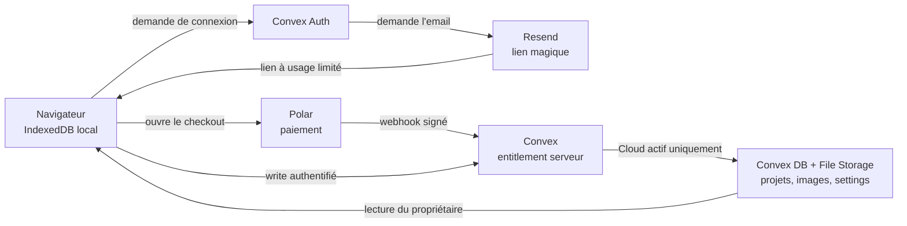

# ScreenForge Cloud — guide concret

Ce document explique l'état actuel des comptes et le rôle de Convex, Resend et
Polar. Il ne contient volontairement aucun email, identifiant, jeton ou URL
privée.

## En une minute

- **Local** fonctionne sans compte et sans backend. Les projets et images
  restent dans IndexedDB, dans le navigateur.
- **Resend** envoie le lien magique de connexion. Il ne donne aucun droit Cloud.
- **Polar** encaisse l'abonnement. Il ne reçoit pas les projets et n'autorise
  jamais directement une écriture.
- **Convex** gère les comptes, reflète l'état de l'abonnement et stocke les
  projets, images et settings. C'est lui qui autorise ou refuse chaque écriture
  Cloud.

Autrement dit : **Resend identifie, Polar facture, Convex décide et stocke**.

## Quels comptes existent aujourd'hui ?

| Compte ou environnement              | État au 18 août 2026                          | À quoi il sert                                                                     |
| ------------------------------------ | --------------------------------------------- | ---------------------------------------------------------------------------------- |
| Utilisateur Local                    | Aucun compte nécessaire                       | Éditeur, projets, images et exports entièrement locaux                             |
| Compte propriétaire de préproduction | Actif, créé par lien magique Resend           | Test réel du compte et de la synchronisation sur deux sessions                     |
| Droit Cloud du propriétaire          | Actif par Polar Sandbox et offert en secours  | Le paiement et la dérogation sont indépendants; aucun des deux n'est un rôle admin |
| Comptes E2E automatiques             | Éphémères, créés pendant les tests locaux     | Testent auth et Cloud sur un Convex local, jamais en préproduction ou production   |
| Client Polar Sandbox                 | Achat et webhook validés; révocation à tester | Prouve la facturation Sandbox et l'attribution du droit au compte propriétaire     |
| Compte de test Vercel Preview        | Pas encore validé                             | Servira à tester le frontend déployé contre la préproduction                       |
| Compte Production                    | Aucun parcours réel validé dans cette phase   | La production reste fermée jusqu'aux gates explicites                              |

À ne pas confondre avec les comptes d'infrastructure : **oui, l'organisation
Polar opérateur existe déjà**. Le compte Resend expéditeur et le projet Convex
de préproduction existent aussi. Ce sont les consoles qui font tourner le
service, pas des comptes clients ScreenForge. L'achat client Sandbox a été
validé dans cette organisation existante; aucune organisation en doublon n'a
été créée.

Il n'existe donc **aucun mot de passe de test partagé** à retenir :

- le compte propriétaire se connecte avec un lien magique envoyé à l'adresse
  associée à ton compte Resend ;
- les tests E2E génèrent seuls une adresse `@screenforge.test` et un mot de passe
  aléatoire et restent confinés au déploiement Convex local ;
- le client Polar Sandbox est le compte propriétaire ScreenForge utilisé pour
  le checkout; il n'existe pas de mot de passe Polar partagé.

### État réel et expurgé de la préproduction

Une lecture seule effectuée le 18 août 2026 confirme :

- 1 utilisateur ;
- 2 sessions actives ;
- 1 entitlement Cloud, à la fois relié à Polar et complémentaire ;
- 3 projets, 18 assets et 1 jeu de settings ;
- 1 abonnement Polar Sandbox actif avec une échéance enregistrée ;
- le preflight fournisseur est prêt, sans variable manquante ou incohérente.

Ces projets et assets comprennent de vraies données utilisateur. Ils ne doivent
pas être supprimés comme des fixtures de test.

## Le flux complet



Le stockage local reste toujours présent. Cloud ajoute une copie synchronisée;
il ne transforme pas l'éditeur en client dépendant du réseau.

## Resend : la connexion

1. L'utilisateur saisit son email dans ScreenForge.
2. Convex Auth demande à Resend d'envoyer un lien magique.
3. Le lien revient sur l'origine ScreenForge autorisée et crée une session
   Convex.
4. L'application demande ensuite à Convex si cette session possède Cloud.

Points importants :

- le lien expire après une heure et les demandes sont limitées globalement et
  par adresse ;
- les erreurs affichées côté client restent génériques pour ne pas révéler si
  un compte existe ;
- avec l'expéditeur de test `resend.dev`, Resend n'autorise que l'adresse liée
  au compte Resend. Pour tester plusieurs vraies adresses, il faudra vérifier un
  domaine d'envoi avec SPF et DKIM ;
- la clé Resend vit dans les variables du déploiement Convex, jamais dans le
  navigateur ou le dépôt.

Resend ne connaît ni les projets, ni les droits Cloud, ni l'état du paiement.

## Polar : le paiement

Polar fonctionne comme la caisse, pas comme la base d'autorisation :

1. Un utilisateur déjà connecté clique sur « Passer au Cloud ».
2. Une action Convex crée un checkout Polar pour le produit Cloud configuré.
3. Polar associe le client à l'identifiant interne transmis par Convex.
4. Après le paiement, Polar envoie un webhook `customer.state_changed`.
5. Convex vérifie la signature du webhook sur le corps brut.
6. Convex recopie l'état utile dans la table `entitlements`.
7. Le frontend relit cet état; le retour du checkout peut prendre quelques
   secondes parce que le webhook est asynchrone.

Les environnements Polar **Sandbox et Production sont isolés** : organisations,
clients, produits et jetons d'un environnement ne valent pas dans l'autre. Les
tests doivent rester en Sandbox jusqu'au GO Production.

Le compte propriétaire possède maintenant deux sources indépendantes de droit
Cloud : l'abonnement Polar Sandbox actif et la dérogation interne
`complimentaryCloud`. Une lecture expurgée du miroir confirme que Polar seul
suffit à maintenir Cloud actif; la dérogation reste un secours opérateur et ne
masque pas le résultat du paiement.

## Convex : l'autorité et le stockage

Convex est la source de vérité du service Cloud :

- Convex Auth stocke utilisateurs et sessions ;
- `entitlements` reflète Polar ou la dérogation propriétaire ;
- les métadonnées projet vivent dans la table `projects` et le JSON complet
  dans Convex File Storage ;
- les métadonnées image vivent dans `assets` et les octets dans File Storage ;
- les préférences de compte durables vivent dans `userSettings` ;
- chaque propriété est déduite de la session authentifiée, jamais d'un
  `userId` choisi par le navigateur.

Toutes les créations et modifications de projet, d'image ou de setting passent
par `requireCloud`. Cette barrière exige à la fois :

1. une session valide ;
2. aucun effacement de compte en cours ;
3. un entitlement Cloud actif côté serveur.

Modifier `localStorage`, Zustand ou le bundle frontend ne peut donc pas accorder
Cloud. Le serveur refusera le write. Après expiration d'un abonnement, la
lecture, l'export et la suppression des données restent possibles; seules les
nouvelles écritures Cloud sont bloquées.

Les téléchargements de projets et d'images passent par des routes authentifiées.
Le client ne reçoit pas d'URL publique permanente vers les fichiers.

## Comment la synchronisation se comporte

- Sans `VITE_CONVEX_URL`, aucun client Convex n'est chargé : ScreenForge est
  strictement Local.
- Avant la première connexion, les anciens projets locaux ne sont envoyés
  qu'après le choix explicite « Ajouter … au Cloud ».
- « Pas maintenant » n'écrit rien et repropose le rattachement plus tard.
- Après connexion et rattachement, les nouvelles modifications sont mises en
  file puis synchronisées automatiquement.
- Les images requises sont envoyées avant le document projet qui les référence.
- Une panne réseau n'empêche pas de continuer à travailler localement.
- En cas de modifications concurrentes, la version au `updatedAt` le plus
  récent gagne.

## Tests concrets

### 1. Vérifier Local, sans aucun fournisseur

```bash
pnpm dev
```

Attendu : aucun compte demandé pour créer un projet, ajouter une image,
modifier, recharger puis exporter un ZIP. Aucune variable d'environnement
n'est nécessaire.

### 2. Vérifier tout Cloud automatiquement et localement

```bash
pnpm run test:e2e:release
```

La commande démarre un Convex local anonyme, active le fournisseur de mot de
passe réservé aux tests et crée des comptes `@screenforge.test` aléatoires.
Elle doit terminer sans scénario Cloud ignoré. Ces comptes ne sont pas conçus
pour une connexion manuelle.

Pour le gate complet avant release :

```bash
pnpm run test:release
```

### 3. Vérifier le vrai compte propriétaire en préproduction

```bash
pnpm run dev:preprod
```

1. Ouvrir l'application locale.
2. Demander un lien magique avec l'adresse autorisée dans Resend.
3. Ouvrir ce lien sur la même origine que celle affichée dans le lien.
4. Vérifier que Cloud est actif.
5. Créer un **nouveau projet de test clairement nommé**, ajouter une image et
   changer le thème.
6. Attendre l'état « Synchronisé ».
7. Ouvrir une seconde session avec un nouveau lien magique et vérifier le même
   contenu.
8. Supprimer uniquement la fixture créée pour ce test, jamais les projets
   existants non identifiés.

Attention : `localhost` et `127.0.0.1` sont deux origines différentes. Un lien
pour l'une ne connecte pas automatiquement l'autre.

### 4. Vérifier Polar Sandbox

Le 18 août 2026, le parcours achat a été validé sans argent réel :

1. ScreenForge a créé le checkout du produit Cloud dans Polar Sandbox ;
2. la carte de test officielle a produit un abonnement et une facture Sandbox ;
3. le retour a rejoint l'origine locale configurée ;
4. le paramètre de session client ajouté par Polar a été retiré immédiatement
   de l'URL par ScreenForge ;
5. `customer.state_changed` a été vérifié avec le secret du déploiement puis
   accepté en HTTP 200 ;
6. Convex porte une unique ligne d'entitlement reliée à Polar, au statut actif ;
7. une relivraison du même événement a de nouveau rendu HTTP 200 sans créer de
   seconde ligne ;
8. l'interface authentifiée affiche le plan Cloud et l'accès aux factures.

La dernière preuve manuelle de ce cycle consiste à annuler l'abonnement dans
Sandbox, vérifier l'état propagé et confirmer la règle de fin de période. Cette
action ne doit être effectuée qu'avec une confirmation explicite au moment de
l'annulation. Les refus de signature, de corps altéré et de taille excessive
sont déjà couverts par les tests backend.

Ne jamais effectuer ce test dans Polar Production et ne jamais copier de
payload, email ou identifiant fournisseur dans `aidd_docs/`.

## Où vivent les variables et secrets ?

| Information                            | Emplacement autorisé                        | Publique ?                     |
| -------------------------------------- | ------------------------------------------- | ------------------------------ |
| URL Convex utilisée par Vite           | Vercel/GitHub ou variable locale            | Oui, c'est une URL de client   |
| Clés Resend et OAuth                   | Variables du déploiement Convex             | Non                            |
| Jeton, produit et secret webhook Polar | Variables du déploiement Convex             | Non                            |
| Deploy keys Convex et token Vercel     | GitHub Environment/Secrets                  | Non                            |
| Deploy key locale de préproduction     | `apps/backend/.env.preprod`, ignoré par Git | Non                            |
| Exemples de noms de variables          | `.env.example`                              | Oui, sans aucune valeur réelle |

Les secrets ne doivent apparaître ni dans Git, ni dans les logs, ni dans les
artifacts, ni dans les documents AIDD. Les fichiers `.env` réels et `.private/`
sont ignorés.

## Ce qui reste avant de vendre Cloud

- valider l'annulation Polar Sandbox et la propagation de la fin de période ;
- valider Local puis Cloud sur une Preview Vercel reliée uniquement à la
  préproduction ;
- exécuter et vérifier une restauration de sauvegarde dans une cible jetable ;
- acheter le domaine seulement après le GO Domain, puis configurer Resend avec
  SPF, DKIM et idéalement DMARC ;
- terminer les informations légales, le KYC et le compte bancaire Polar ;
- valider le déploiement de production avant le GO Production et le premier
  paiement réel.

## Sources et runbooks

- État interne :
  [`aidd_docs/tasks/2026_08/2026_08_16_cloud-prelaunch-validation/verification.md`](aidd_docs/tasks/2026_08/2026_08_16_cloud-prelaunch-validation/verification.md)
- Runbook opérateur détaillé :
  [`aidd_docs/tasks/2026_08/2026_08_11_migration-convex/environnements.md`](aidd_docs/tasks/2026_08/2026_08_11_migration-convex/environnements.md)
- [Polar — environnements API](https://polar.sh/docs/api-reference/introduction)
- [Polar — endpoints et tests de webhooks](https://polar.sh/docs/integrate/webhooks/endpoints)
- [Polar — `customer.state_changed`](https://polar.sh/docs/api-reference/webhooks/customer.state_changed)
- [Resend — limites du domaine de test](https://resend.com/docs/knowledge-base/403-error-resend-dev-domain)
- [Resend — vérifier un domaine](https://resend.com/docs/dashboard/domains/introduction)
- [Convex — fonctions internes](https://docs.convex.dev/functions/internal-functions)
- [Convex — variables par déploiement](https://docs.convex.dev/production/environment-variables)
- [Convex — File Storage](https://docs.convex.dev/file-storage/overview)
- [Convex — sauvegarde et restauration](https://docs.convex.dev/database/backup-restore)
