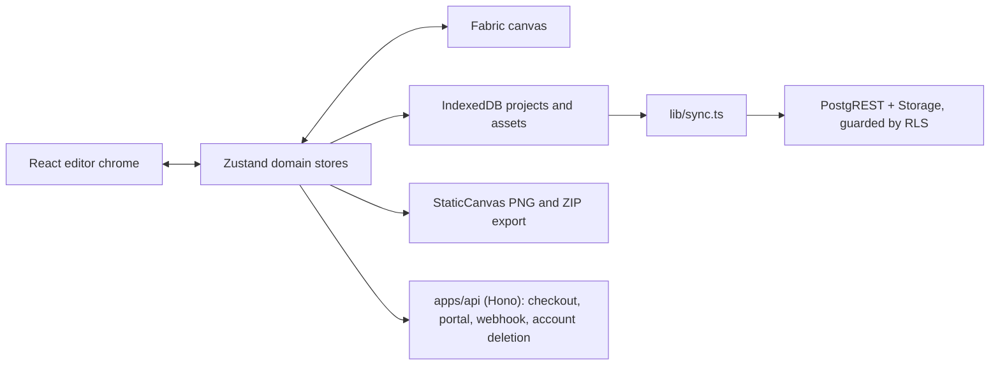

# Architecture

## Stack

- pnpm workspace: `apps/web` (Vite + React editor and landing), `apps/api` (Hono, no build step), `supabase/` (migrations and RLS tests), root-level tooling.
- Fabric owns interactive and export canvases; Zustand stores remain the source of truth.
- Tailwind CSS supplies utility styling from the CSS-first theme in `apps/web/src/index.css`.
- The SaaS layer is additive: Supabase (auth, Postgres, Storage) for accounts and cloud sync, Polar as Merchant of Record for the sale. Without those environment variables the editor still boots and runs entirely offline.

## How it fits together

## Key decisions

- The app is local-first: the editor, the render and the export never need the network, which is what keeps user projects private and the marginal cost near zero.
- The browser talks to PostgREST and Storage directly for project sync; `apps/api` exists only for what needs a secret (Polar calls, webhook reception, account deletion).
- Two independent entitlements, not one plan: `licence` is perpetual, `cloud` is annual and requires the licence. The mirror is rebuilt whole from Polar's `customer.state_changed`, never from a sequence of events.
- The commercial rule has three deliberate projections, each naming the other two in a comment: `public.has_cloud()` in SQL, `toEntitlements` in `apps/api`, `projectEntitlements` in `apps/web`.
- The free-tier watermark and export counter are client-side by design. Server-side validation would send the render or the file upstream and destroy the local-first promise; the model is honest payment, not unbreakable DRM.
- `project.store` alone owns the project graph, active screen and layers. `canvas.store` owns selection plus interaction/history commands and always reads domain data from the project at call time.
- `src/hooks/use-canvas.ts` owns the Fabric instance and granular project synchronization. Flat installers under `src/lib/canvas/install-*` own interactions, viewport and cancellable thumbnail work; Fabric objects are never a second domain store.
- Binary payloads live in `src/lib/assets.ts`, not layers, keeping history snapshots and sync diffs small.
- Apple output dimensions come only from `src/lib/dimensions.ts`; export correctness takes priority over configurable formats.
- Canvas objects disable caching and use render-time clipping rather than Fabric `clipPath` to avoid double-antialiased export edges.

## Gotchas

- Fabric object origins and post-transform synchronization can move objects unless changes flow through the established canvas/store path.
- Every Fabric/DOM/store listener belongs to an installer cleanup so React StrictMode cannot duplicate gestures.
- Any change that re-enables object caching or Fabric clip paths can soften both editor and exported edges.
- Imported assets must be persisted atomically with their owning project; layer references alone are not durable.
- Sync never traverses `apps/api`, so an HTTP middleware cannot gate it. The cloud gate is RLS: `public.has_cloud()` in the `with check` of the project and asset write policies. `select` and `delete` stay open so an expired subscription never holds someone's files hostage.
- The Supabase service-role key must never appear in `apps/web`, not even in a comment: CI greps for the string and fails on it.
