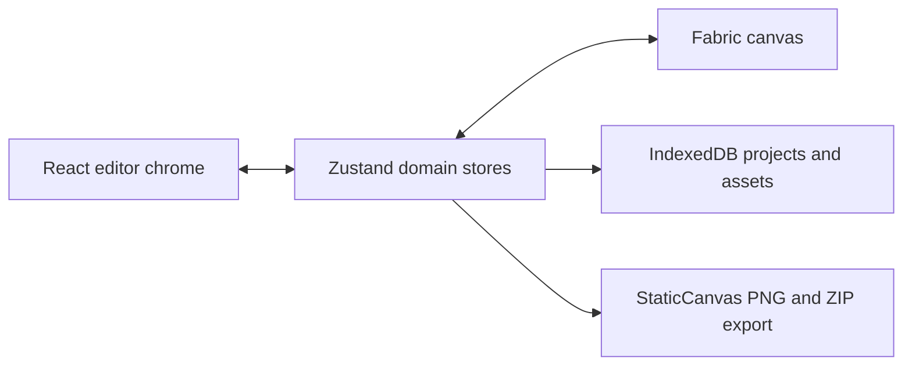

# Architecture

## Stack

- TypeScript browser application built with Vite and React; no backend runtime.
- Fabric owns interactive and export canvases; Zustand stores remain the source of truth.
- Tailwind CSS supplies utility styling from the CSS-first theme in `src/index.css`.

## How it fits together

## Key decisions

- The app is local-first and backend-free to keep user projects private and eliminate recurring infrastructure cost.
- `project.store` alone owns the project graph, active screen and layers. `canvas.store` owns selection plus interaction/history commands and always reads domain data from the project at call time.
- `src/hooks/use-canvas.ts` performs bidirectional granular synchronization between that project graph and Fabric; Fabric objects are never a second domain store.
- Binary payloads live in `src/lib/assets.ts`, not layers, keeping history snapshots and sync diffs small.
- Apple output dimensions come only from `src/lib/dimensions.ts`; export correctness takes priority over configurable formats.
- Canvas objects disable caching and use render-time clipping rather than Fabric `clipPath` to avoid double-antialiased export edges.

## Gotchas

- Fabric object origins and post-transform synchronization can move objects unless changes flow through the established canvas/store path.
- Any change that re-enables object caching or Fabric clip paths can soften both editor and exported edges.
- Imported assets must be persisted atomically with their owning project; layer references alone are not durable.
