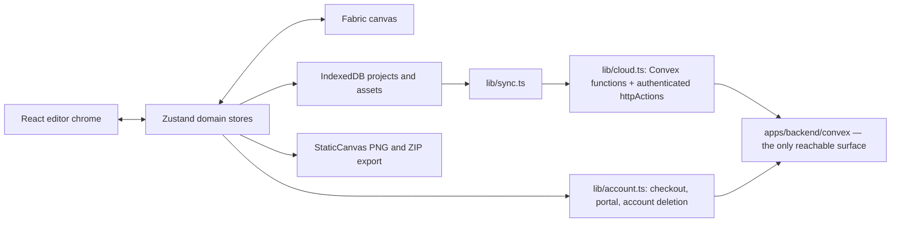

# Architecture

## Stack

- pnpm workspace: `apps/web` (Vite + React editor and landing), `apps/backend` (the Convex deployment), `apps/bridge` (optional local daemon), root-level tooling.
- Fabric owns interactive and export canvases; Zustand stores remain the source of truth.
- Tailwind CSS supplies utility styling from the CSS-first theme in `apps/web/src/index.css`.
- The SaaS layer is additive: one Convex deployment (auth, database, files, functions) for accounts and cloud sync, Polar as Merchant of Record for the sale. Without `VITE_CONVEX_URL` the editor still boots and runs entirely offline.

## How it fits together

## Key decisions

- The app is local-first: the editor, the render and the export never need the network, which is what keeps user projects private and the marginal cost near zero.
- The browser reaches nothing but functions: there is no table URL, no anonymous key and no direct path to the data. Bytes travel through authenticated `httpAction`s rather than signed file URLs, so a leaked link is not a leaked file.
- Cloud is the only entitlement. Polar's annual Cloud subscription is mirrored from `customer.state_changed`; Local capabilities never consult an account, entitlement or commercial switch.
- The commercial rule is written once, in `apps/backend/convex/entitlements.ts`, and both the deployment and the editor import that file. It used to have three projections — SQL, server, client — each naming the other two in a comment; the migration is what removed the need for them to agree.
- Local export is universally clean and unlimited. Historical releases may still record `watermarked` only so the app can refuse an old frozen artifact and ask for a clean regeneration; new exports never create one.
- `project.store` alone owns the project graph, active screen and layers. `canvas.store` owns selection plus interaction/history commands and always reads domain data from the project at call time.
- `src/hooks/use-canvas.ts` owns the Fabric instance and granular project synchronization. Flat installers under `src/lib/canvas/install-*` own interactions, viewport and cancellable thumbnail work; Fabric objects are never a second domain store.
- Binary payloads live in `src/lib/assets.ts`, not layers, keeping history snapshots and sync diffs small.
- Apple output dimensions come only from `src/lib/dimensions.ts`; export correctness takes priority over configurable formats.
- Canvas objects disable caching and use render-time clipping rather than Fabric `clipPath` to avoid double-antialiased export edges.

## Gotchas

- Fabric object origins and post-transform synchronization can move objects unless changes flow through the established canvas/store path.
- Every Fabric/DOM/store listener belongs to an installer cleanup so React StrictMode cannot duplicate gestures.
- Any change that re-enables object caching or Fabric clip paths can soften both editor and exported edges.
- Imported assets must be persisted atomically with their owning project; layer references alone are not durable.
- The cloud gate is `requireCloud` in `apps/backend/convex/authz.ts`, and it is the wall rather than a door beside one: no client can reach data except through a function. Reads and deletes stay open when the subscription ends, so an expired period never holds someone's files hostage.
- There is no key that bypasses authorization any more. Privileged work lives in `internalMutation`s, which no client can address — a boundary declared in the code and checked by the compiler, not a secret to keep.
- Account deletion has no cascade behind it: `TABLES_OWNED_BY_USER` in `convex/accountDeletion.ts` is the list, and `accountDeletion.test.ts` enumerates the schema so a new table carrying `userId` fails the suite until it is classified.
