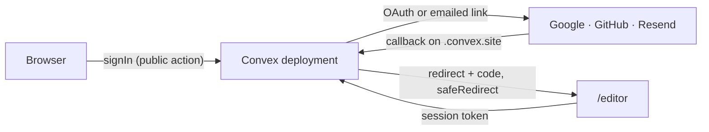

# Auth

## Authentication

- Convex Auth on the deployment, wired once in `apps/backend/convex/auth.ts`. `apps/web/src/lib/cloud-bridge.tsx` is the only point of contact with the React tree, mounted as a sibling of `App` so opening a session never remounts the canvas.
- Four doors: **Google** and **GitHub** OAuth, a **Resend magic link**, and `test-password` — a fixture restricted to `@screenforge.test` addresses and to loopback deployments, never an identity offered in the product.
- The deployment trusts only itself: `auth.config.ts` declares a single issuer, its own `CONVEX_SITE_URL`, verified through the JWKS that `http.ts` exposes on that same domain. A second issuer would mean accepting tokens minted elsewhere.

- `safeRedirect` is the reason that diagram ends where it does. `signIn` is a public action, so `redirectTo` is attacker input, and the redirect carries the sign-in code — a destination outside the site is not an open redirect, it is the session handed to whoever asked. A prefix test is not enough (`https://site.example`, `https://site@evil`); the character after the prefix must close the host. An unauthorized destination lands on the editor root rather than raising.
- Admission control is one mutation, `authAdmission.admit`, and that shape is the point: it takes the whole hierarchical reservation at once, so a later refusal rolls back every earlier component write. Otherwise an attacker could poison a narrower victim bucket with a request that never cleared the broader gates. It also ages out OAuth verifiers on a grace period longer than Auth.js's own state-cookie lifetime.
- Rate limits sit in front of every unauthenticated door, counted before the work they guard: magic-link sends are capped per address, per pseudonymized network source and globally; password attempts are capped per address and cleared on success. `signUp` on an existing address returns the existing account, so it is a sign-in path the library's own counter does not see — the wrapper in `auth.ts` closes that half.

## Authorization

- `convex/authz.ts` is the wall and the only file that decides who may write. Three helpers: `requireUser`, `readEntitlements`, `requireCloud`. A fourth entry point would be a fourth thing to re-read the day the rule changes.
- There is no policy per table because there is no table to reach: no collection URL, no anonymous key, no path to the data beside the functions. Ownership is structural — every write starts from the id `requireUser` returns.
- No key bypasses authorization. Privileged work lives in `internalMutation` and `internalAction`, unreachable from any client — a boundary declared in the code and checked by the compiler, which is a better lock than a secret, because there is no secret to avoid disclosing.
- `requireCloud` is one account, one active Cloud subscription, and no deletion in flight. Reads and deletes stay open when the right expires: a period ending must never look like data loss, and must never hold files hostage.
- `readEntitlements` takes `now` with no default on purpose. A Convex query re-runs only when the data it read changes, and nothing changes at the instant a period ends — a query reading its own clock would keep answering `cloud: true` past the deadline. The caller must say where its instant comes from, so the case is decided at compile time.
- Local capabilities never consult an account, an entitlement or a commercial switch. `convex/entitlements.ts` is the single written form of the rule, imported by both the deployment and the editor.

## Sessions

- Session storage is namespaced by `SESSION_NAMESPACE` (`lib/session-keys.ts`) so cloud state stays isolated per account.
- `useQuery(api.users.me)` is the single subscription that carries auth state into the store. `undefined` means "not known yet" and `null` means "nobody"; conflating them would flash "Sign in" at someone already signed in.
- Authenticated asset responses are `private, no-store`, so account change, revocation and replacement always re-enter the ownership check instead of hitting a browser cache.
- The two local daemons authenticate separately and never with this session: see `cli.md` for their per-capability pairing tokens.
