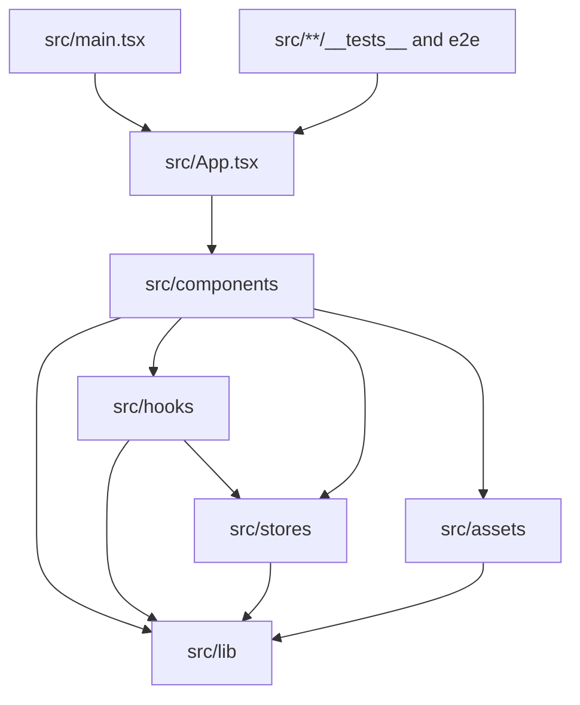

# Codebase Map

## Areas

Paths below are relative to `apps/web/` unless stated otherwise; the repository root now holds only tooling, `supabase/` and `apps/`.

- `src/components/`: editor chrome, feature panels, dialogs, UI primitives, and JSX local to each feature. Account, pricing, migrate and export dialogs are lazy chunks.
- `src/hooks/`: React lifecycle orchestration for canvas, keyboard, export, and layer actions.
- `src/stores/`: project, canvas, history, UI, toast, and auth state domains.
- `src/lib/`: persistence, export, fonts, project-file, asset, dimension, shared domain logic, and Fabric helpers under `lib/canvas/`; the `install-*` modules isolate interactions, viewport and thumbnails with explicit cleanup. `lib` never imports components or hooks. The SaaS edge lives here too: `supabase.ts` (lazy client), `sync.ts` (cloud cycle and queue), `entitlements.ts` (rights and free-tier counter), `plans.ts`, `api.ts` (typed Hono RPC).
- `src/landing/`: the marketing page, a second Vite entry (`landing.html`), pre-rendered at build in French and English.
- `src/assets/`: device-frame definitions, templates, and gradient presets.
- `src/types/`: shared project and layer model.
- `e2e/`: browser-level editor, pixel-exact export, tier and sync contracts. The sync files skip themselves when the local Supabase stack is down, so the suite runs without Docker.
- `apps/api/`: Hono routes for checkout, customer portal, the Polar webhook and account deletion. No build step — Node strips the types and `exports` serves `src/index.ts`; `apps/web` imports its `AppType` with `import type` only.
- `supabase/`: migrations, `config.toml` for the local stack, and RLS tests run by `node --test`.
- `scripts/`: export validation, contrast audit, scale audit, and visual probes. Run from the repository root.
- `aidd_docs/tasks/`: scoped specs, plans, phases, and reviews for completed and active work.

## Entry points

- `src/main.tsx`: mounts React and exposes development-only test handles (`__sfStores`, `__sfAssets`), including the auth store in write so e2e can seed rights a real purchase would otherwise be needed for.
- `src/App.tsx`: initializes persistence and composes the single editor workspace.
- `src/lib/export.ts`: render/export critical path.
- `src/lib/storage.ts`: IndexedDB lifecycle and autosave boundary.
- `apps/api/src/index.ts`: the Hono app and the exported `AppType`.
