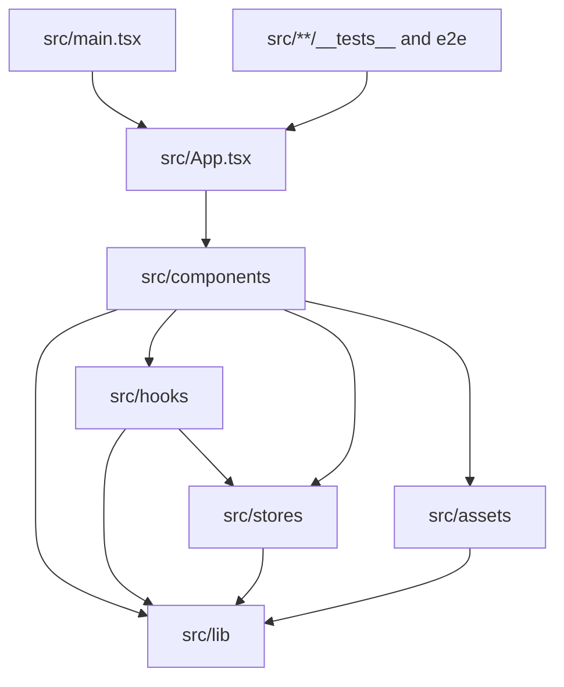

# Codebase Map

## Areas

- `src/components/`: editor chrome, feature panels, dialogs, UI primitives, and JSX local to each feature.
- `src/hooks/`: React lifecycle orchestration for canvas, keyboard, export, and layer actions.
- `src/stores/`: project, canvas, history, UI, and toast state domains.
- `src/lib/`: persistence, export, fonts, project-file, asset, dimension, shared domain logic, and Fabric helpers under `lib/canvas/`; the `install-*` modules isolate interactions, viewport and thumbnails with explicit cleanup. `lib` never imports components or hooks.
- `src/assets/`: device-frame definitions, templates, and gradient presets.
- `src/types/`: shared project and layer model.
- `e2e/`: browser-level editor and pixel-exact export contracts.
- `scripts/`: export validation, contrast audit, and visual probes.
- `aidd_docs/tasks/`: scoped specs, plans, phases, and reviews for completed and active work.

## Entry points

- `src/main.tsx`: mounts React and exposes development-only test handles.
- `src/App.tsx`: initializes persistence and composes the single editor workspace.
- `src/lib/export.ts`: render/export critical path.
- `src/lib/storage.ts`: IndexedDB lifecycle and autosave boundary.
