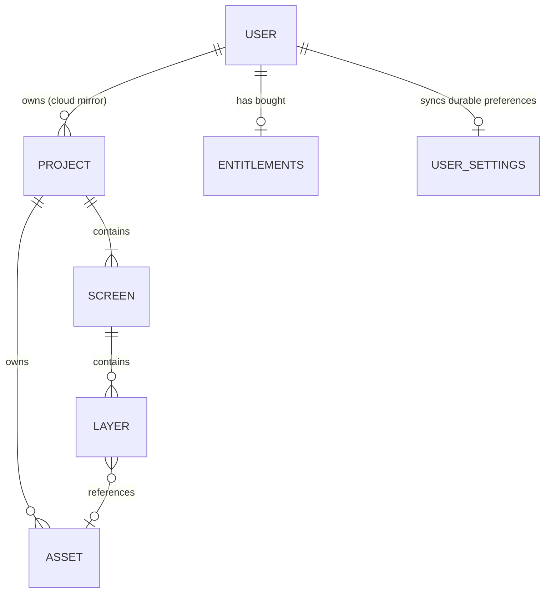

# Database

## Setup

- Browser IndexedDB database `screenforge`, schema version 2, accessed through `idb` in `apps/web/src/lib/storage.ts`. A second local database, `screenforge-sync`, holds sync acknowledgements only — it is disposable, which is why it is not a store inside the one carrying user projects.
- The local copy is authoritative: everything works with no account and no network. The deployment is the mirror offered by the standalone Cloud plan, never a prerequisite.
- Server side: one Convex deployment, schema in `apps/backend/convex/schema.ts`, local deployment on ports 3210/3211 (`pnpm run dev:backend`). There is no migration step — Convex refuses a push whose existing documents do not satisfy the schema, so the schema file is where the data is looked at.

## Main entities

## Conventions

- The `projects` store keys full normalized project graphs by project ID and indexes `updatedAt`; the `assets` store keys payloads by asset ID and indexes project ownership.
- Layers retain short asset IDs; the in-memory registry in `src/lib/assets.ts` deduplicates and resolves payloads on the hot path.
- Project and dirty-asset writes share one read/write transaction. Imports validate fully before atomically persisting and activating a new project copy.
- `project-validation.ts` defines the strict current project contract shared by ZIP and IndexedDB. It bounds the whole graph (500 layers), text, gradients and style strings before Fabric sees them. `normalizeProject` applies only supported legacy migrations (inline v1 assets and shape gradients), then requires that contract before any activation or rewrite.
- Invalid local records are left untouched. Latest-project loading skips them and tries the preceding record instead of silently repairing or deleting user data.
- Autosave is debounced by two seconds and flushes on teardown; every controlled external navigation waits for that save, and delete waits for matching in-flight saves before removing a project and its assets.
- `ensureDurableStorage()` asks for persistent storage at the first successful commit, not at boot: Firefox prompts the user, and the question only earns itself once there is something to lose. The answer is memoised for the session. Without it the origin stays best-effort, which browsers evict on their own — Safari after seven days without a visit, Chrome under disk pressure. A refusal is reported once, in the account dialog, and only while Cloud is inactive.

## Server-side conventions

- **There is no direct path to the data, so the function is the wall.** No table URL, no collection endpoint, no anonymous key that opens a read: a client can only call the functions in `apps/backend/convex/`. `authz.ts` is the single place that decides who may write — `requireUser`, `requireCloud`, and nothing else. This replaces a per-verb policy on every table, and it replaces the reasoning that made those policies necessary: sync used to go from the browser straight to the database, so a middleware would have been a door beside the wall.
- `projects` holds identity and timestamp only; the project document itself is a file (`blobId`). A Convex document caps at 1 MiB and a project with twenty frozen releases exceeds it — and the server has never read inside that JSON, it only compares `updatedAt`.
- `assets` carries ownership as a column plus the `by_user_asset` index, where the bucket carried it as a `{user_id}/{asset_id}` path. No read takes the user as a parameter; it comes from the token, always.
- Authenticated asset responses use `private, no-store`: account changes, revocation and replacement must always re-enter the ownership check instead of hitting a browser cache.
- `entitlements` is one Cloud mirror row per account, forever — an invariant the write upholds (`applyEntitlementsIfNewer`) rather than a primary key, since Convex does not let you choose one. Dates are stored as ISO strings because nothing compares them in the database; `sourceUpdatedAt` is a number because it *is* compared, and it is what stops a late webhook overwriting a newer one.
- `userSettings` est une ligne LWW par compte, limitée à `theme: light | dark` et `updatedAt`. Elle reste lisible après expiration Cloud, tandis que son upsert passe par `requireCloud` et n'accepte qu'une version strictement plus récente. Le client conserve la même forme localement, isolée par compte, et réutilise la file de sync des projets.
- Le document projet complet porte déjà globals, locales, releases, écrans et layout layers; chaque `assetId` source est envoyé avant ce document. Restent exclusivement locaux les clés IA, jetons, cache de droits, langue marketing, zoom, sélection, panneaux, dialogues et miniatures dérivées.
- Privileged work lives in `internalMutation`s. They are unreachable from any client — a boundary declared in the code and enforced by the compiler, which is a better lock than a secret key, since there is no secret to avoid disclosing.
- `apps/backend/convex/*.test.ts` (`pnpm --filter backend test:unit`) are written from the attacker's point of view and each carries its counter-test — a rule that refused everything would otherwise pass a suite of refusals while breaking the feature.
