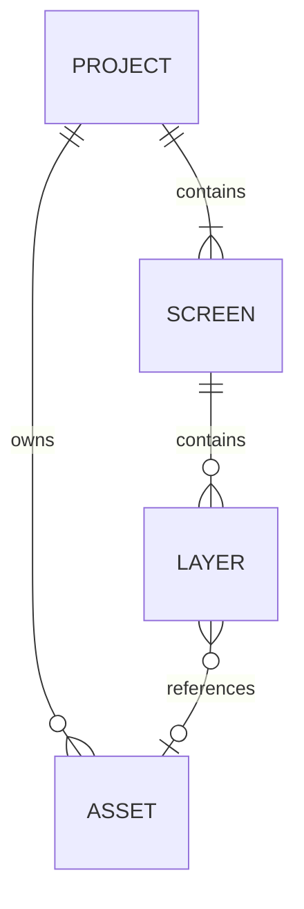

# Database

## Setup

- Browser IndexedDB database `screenforge`, schema version 2, accessed through `idb` in `src/lib/storage.ts`.
- Persistence is entirely local; there is no server database, migration service, or seed process.

## Main entities

## Conventions

- The `projects` store keys full normalized project graphs by project ID and indexes `updatedAt`; the `assets` store keys payloads by asset ID and indexes project ownership.
- Layers retain short asset IDs; the in-memory registry in `src/lib/assets.ts` deduplicates and resolves payloads on the hot path.
- Project and dirty-asset writes share one read/write transaction. Imports validate fully before atomically persisting and activating a new project copy.
- `project-validation.ts` defines the strict current project contract shared by ZIP and IndexedDB. `normalizeProject` applies only supported legacy migrations (inline v1 assets and shape gradients), then requires that contract before any activation or rewrite.
- Invalid local records are left untouched. Latest-project loading skips them and tries the preceding record instead of silently repairing or deleting user data.
- Autosave is debounced by two seconds and flushes on teardown; delete waits for matching in-flight saves before removing a project and its assets.
