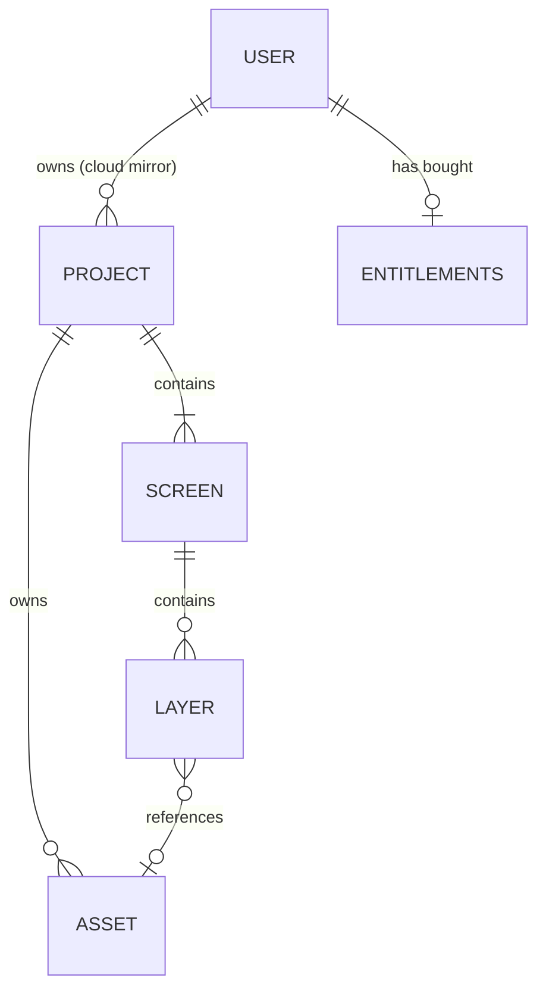

# Database

## Setup

- Browser IndexedDB database `screenforge`, schema version 2, accessed through `idb` in `apps/web/src/lib/storage.ts`. A second local database, `screenforge-sync`, holds sync acknowledgements only — it is disposable, which is why it is not a store inside the one carrying user projects.
- The local copy is authoritative: everything works with no account and no network. Postgres is a mirror the Cloud add-on offers, never a prerequisite.
- Server side: Supabase Postgres, migrations in `supabase/migrations/`, local stack on ports 544xx (`pnpm run db:start` / `db:migrate`).

## Main entities

## Conventions

- The `projects` store keys full normalized project graphs by project ID and indexes `updatedAt`; the `assets` store keys payloads by asset ID and indexes project ownership.
- Layers retain short asset IDs; the in-memory registry in `src/lib/assets.ts` deduplicates and resolves payloads on the hot path.
- Project and dirty-asset writes share one read/write transaction. Imports validate fully before atomically persisting and activating a new project copy.
- `project-validation.ts` defines the strict current project contract shared by ZIP and IndexedDB. `normalizeProject` applies only supported legacy migrations (inline v1 assets and shape gradients), then requires that contract before any activation or rewrite.
- Invalid local records are left untouched. Latest-project loading skips them and tries the preceding record instead of silently repairing or deleting user data.
- Autosave is debounced by two seconds and flushes on teardown; delete waits for matching in-flight saves before removing a project and its assets.

## Server-side conventions

- `public.projects` stores the whole project document as `jsonb` under `user_id`, last-write-wins on `updated_at`. Binaries never go in the column: they live in the private `assets` Storage bucket under `{user_id}/{asset_id}`, which is what makes ownership a path.
- `public.entitlements` is keyed by `user_id` — one account, one row, forever. `licence_granted_at` is perpetual; `cloud_status` and `cloud_period_end` carry the subscription. The row is a mirror of Polar, rebuilt whole from `customer.state_changed`.
- Every table has RLS with one policy per verb, `(select auth.uid()) = user_id`, `with check` on both insert and update, and `revoke all from anon`. The `(select fn())` wrapper is what makes the call run once per query instead of once per row.
- `service_role` bypasses RLS but not table grants: a migration that creates a table must grant it explicitly, or the webhook fails after a payment is taken.
- `supabase/tests/*.test.mjs` (`pnpm run test:rls`) are written from the attacker's point of view, and each file carries its counter-test — policies that refuse everything would otherwise pass a suite of refusals while breaking the feature.
