# Deployment

## Pipeline

- GitHub Actions, three workflows. `quality.yml` runs on pushes to `main` and `preprod` and on every pull request; `release-please.yml` maintains the release pull request from `main`; `deploy-production.yml` fires **only** on a `v*` tag, never on a branch.
- Quality fans out behind one gate: `security` (pinned Gitleaks over every ref, plus the publication audit) is the dependency of `web`, `e2e` and `backend`; `actionlint` runs alone; `deploy-preproduction` needs all five. Concurrency cancels a superseded run on the same ref.
- The E2E job runs the strict cloud gate, so a missing Convex can no longer become a green skip. Playwright diagnostics are scanned for secrets before upload.
- Preproduction deploys from the `preprod` branch, and only when its **tree** equals `origin/main`'s. Comparing trees rather than commits is what lets `preprod` carry its own history without ever shipping code `main` has not accepted.
- Production is one serialized queue (`concurrency: screenforge-production`, `queue: max`) split in two jobs: `validate` runs the full release gate **without production secrets**, and only `deploy` enters the `production` Environment, which keeps a human approval.

```mermaid
flowchart LR
    tag["v* tag"] --> validate["validate — provenance + test:release"]
    validate --> approve["production Environment approval"]
    approve --> preflight["check live production config"]
    preflight --> build["vercel build + staged deploy"]
    build --> canary["deploy candidate Convex to preproduction"]
    canary --> gate["gate candidate against production config"]
    gate --> convex["deploy Convex production"]
    convex --> smoke["smoke test staged URL"]
    smoke --> promote["vercel promote"]
    promote --> verify["verify production headers"]
    verify -->|"fails"| rollback["vercel rollback, then red"]
```

- The tagged SHA must equal the fetched `origin/main` HEAD. That check and the step order are asserted by `scripts/deployment-config-audit.mjs`, which reads the workflow files themselves — the pipeline shape is tested, not just written.
- The production release rehearses on preproduction first: the same backend candidate is deployed there, checked through `convex-preflight-gate.mjs`, and its configuration diffed against production by `convex-production-config-gate.mjs` before production is touched.

## Environments

- **Local** — `pnpm run dev` plus `pnpm run dev:backend`, an anonymous Convex deployment on 3210/3211 that cannot accidentally push to the shared dev deployment.
- **Preprod** — its own Convex deployment and its own `CONVEX_PREPROD_DEPLOY_KEY`. `pnpm run dev:preprod` runs the local editor against it by setting `VITE_CONVEX_URL` on the command line; repointing the `.env` file would break local-first mode and the E2E suite that checks it.
- **Preview** — internal branches get a protected Vercel Preview. Git deployments are disabled for `main` in `vercel.json`, pull-request workflows receive no Vercel token, and only public browser configuration is set.
- **Production** — Vercel for the static bundle, one Convex deployment for everything else. Convex URLs are public and live in `vercel.json`'s CSP; every secret lives in the deployment that uses it.
- No tag exists yet: production has never been released from this repository.

## Release

- Release Please owns the version, the changelog and the tag, through a repository-scoped GitHub App. A ruleset reserves `v*` creation to that App and forbids manual update or deletion. Never create or move a tag by hand — full procedure in `RELEASING.md`.
- Deployment order is deliberate: Convex ships before the web build is promoted, so the backend is always at least as new as the front. Convex follows expand/contract and is never rolled back automatically.
- Rollback is asymmetric and that is the point. A failed smoke test moves no domain; a failed post-promotion check triggers Vercel Instant Rollback and then leaves the workflow red. Fix forward and cut a new patch; never re-tag the same version.

## Monitoring

- PostHog, EU-hosted, and only with consent — see `integration.md`. It is product analytics and diagnostics, not an uptime monitor.
- The rest of the proof is the pipeline: the release gate, the preflight checks around every Convex deploy, the configuration gate between preprod and production, the staged smoke test, and `scripts/security-headers-audit.mjs` against the promoted production.
- `convex run billing:healthcheck` reports which deployment variables are missing, from `apps/backend`.
