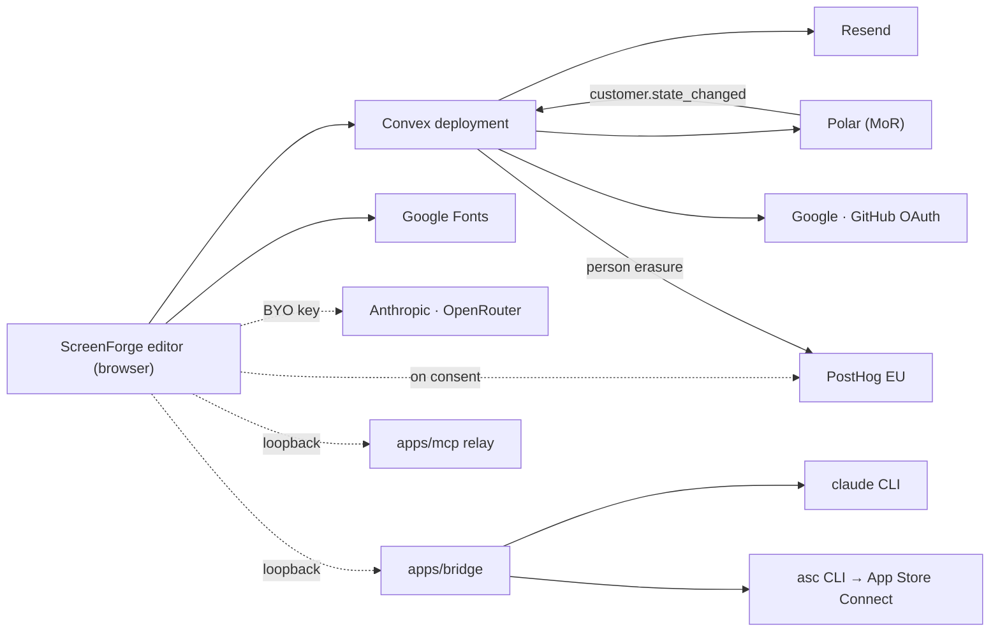

# Integration

## External services

- **Convex** — the deployment behind the Cloud plan: auth, database, file storage, functions, cron. Reached only through `apps/web/src/lib/convex.ts` and `cloud.ts`, both lazily imported so nothing of the SDK enters the bundle when `VITE_CONVEX_URL` is absent.
- **Polar** — Merchant of Record for the annual Cloud subscription. Checkout and billing portal are `action`s in `convex/polar.ts`; the entitlement is mirrored from the signed `customer.state_changed` webhook at `/billing/webhook`. The mirror is the only writer of the commercial truth.
- **Resend** — the magic-link sign-in email, sent from `convex/auth.ts`. The only provider that costs a verified sender, which is why the other three sign-in doors avoid it.
- **Google and GitHub OAuth** — the two SSO providers, configured as Auth.js providers on the deployment. Their callback is a deployment route, not an application route.
- **Vercel** — hosting for the static editor and landing bundle. Deploys are CLI-driven from the workflow, never from the Git integration on `main`.
- **Google Fonts** — stylesheets and font files loaded on demand for editor typography. With PostHog's asset host, one of only two third-party origins the CSP lets the page load code or fonts from.
- **Anthropic and OpenRouter** — optional bring-your-own-key AI providers called straight from the browser by `lib/ai/direct-api.ts`. The key is stored encrypted on the machine, outside projects.
- **PostHog**, EU-hosted, for product analytics and diagnostics. Two independent consents (`analytics`, `diagnostic`) in `lib/analytics.ts`; the SDK initialises `opt_out_capturing_by_default`, so nothing is captured until someone opts in. Account deletion schedules `internal.posthog.deletePerson`, so erasure reaches the analytics store and not only the database.
- **Apple App Store Connect** — reached only through the local `asc` CLI that `apps/bridge/src/asc.ts` spawns. The bridge holds no Apple credential: `asc` resolves its own from the system keychain, and the bridge adds no environment to the child.
  Behind the `asc-publish` token the bridge (protocol 7) also answers three read-only listings — `GET /asc/apps`, `/asc/versions?app=`, `/asc/localizations?version=` — reduced to ids and labels, so the publish dialog offers the destination instead of asking for identifiers. `asc apps list`, `versions list --app --platform IOS`, `localizations list --version` are the commands behind them, `--output json`, 60 s timeout.
- **Text jobs** — `POST /translate` and `POST /proofread` (assistant token) take numbered texts and return the same count in order; the page (`lib/ai/text.ts`) runs the same two jobs through an Anthropic or OpenRouter key when that is the session's writer. No layer id, no image, ever.

## Conventions

- Every dotted edge is optional and absent by default: the editor boots, renders and exports with none of them reachable.
- No provider secret lives in the repository or in a `VITE_` variable. `VITE_POSTHOG_KEY` and `VITE_POSTHOG_HOST` are the exception the prefix already announces: a project key is public by design, which is why the person-management key is a separate server-side name. Server secrets are set with `convex env set` on the deployment that uses them; `convex run billing:healthcheck` reports which are missing. The contract of names is in `.env.example`.
- The only URL parameter the app consumes is `?checkout=success` on return from Polar, removed as soon as it is read.
- Each provider credential exists only in the workflow steps that call it, never at job scope.
