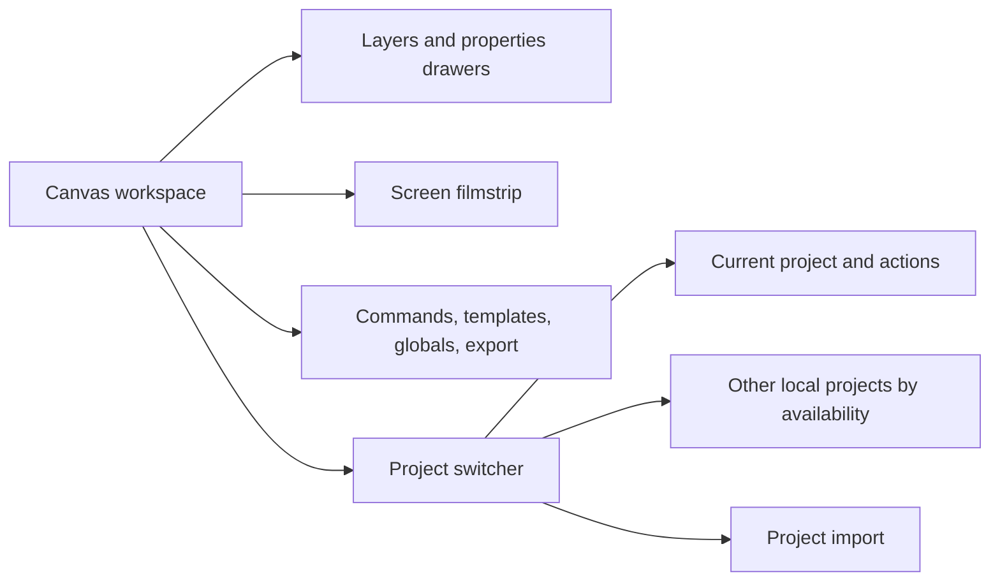

# Navigation

## Routing

- ScreenForge is a single-workspace application with no client router, no URL routes and no protected areas. Sign-in, pricing and account are dialogs, not pages — the deliberate consequence of the app being one screen.
- Navigation state lives in the UI and project stores; overlays and dialogs are lazy-mounted from `src/App.tsx`.
- The only URL parameter consumed is `?checkout=success` on return from Polar; it is removed as soon as it is read.
- OAuth, Polar checkout, the billing portal and controlled recovery reloads wait for the active project save; a storage failure keeps the user in place.

## Structure

- The top bar owns project identity, layer tools, workspace toggles, and export.
- Its project chevron opens a dialog-like popover: the current project is never duplicated among the other projects, the catalogue filters by name, and choosing a project restores focus to the chevron. Rename returns focus to the only editable project-name field.
- On the first eligible Cloud session, local projects created before sign-in remain local until the separate consent dialog names and uploads them. Deferring closes the dialog without creating Cloud acknowledgements; later local commits made during the authenticated Cloud session keep their ordinary automatic sync behavior.
- The screen filmstrip changes the active artboard; Escape closes the nearest overlay before clearing selection.
- Keyboard commands and the command palette provide parallel navigation for editor actions.
