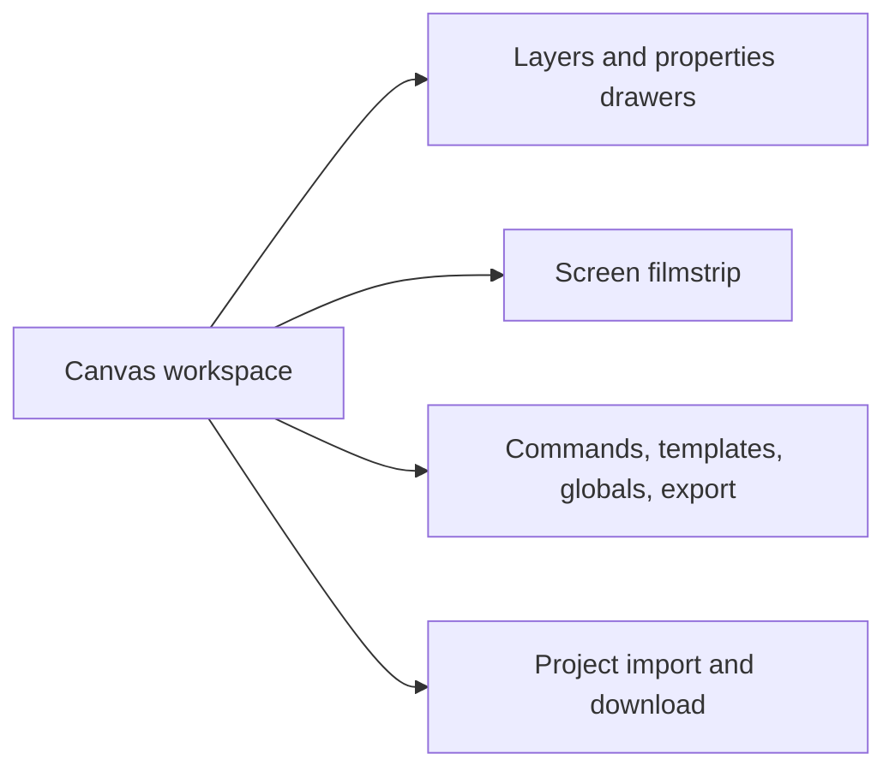

# Navigation

## Routing

- ScreenForge is a single-workspace application with no client router, URL routes, authentication, or protected areas.
- Navigation state lives in the UI and project stores; overlays and dialogs are lazy-mounted from `src/App.tsx`.

## Structure

- The top bar owns project identity, layer tools, workspace toggles, and export.
- The screen filmstrip changes the active artboard; Escape closes the nearest overlay before clearing selection.
- Keyboard commands and the command palette provide parallel navigation for editor actions.
