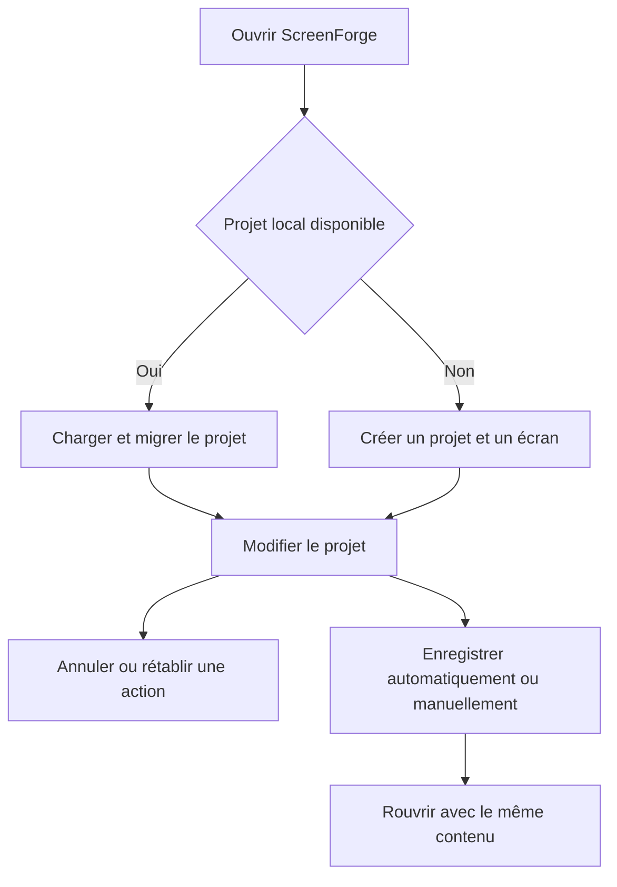

# Instruction: Contrat produit, état et persistance

## Architecture projection

> Tree of the final files. ✅ create · ✏️ modify · ❌ delete

```txt
.
├── ✏️ PRD.md
├── ✏️ src/App.tsx
├── ✏️ src/types/index.ts
├── ✏️ src/lib/dimensions.ts
├── ✏️ src/lib/storage.ts
├── ✏️ src/stores/canvas.store.ts
├── ✏️ src/stores/history.store.ts
├── ✏️ src/stores/project.store.ts
├── ✏️ src/components/globals-editor/GlobalsEditor.tsx
└── ✏️ src/components/toolbar/Toolbar.tsx
```

## User Journey



## Tasks to do

### `1)` Corriger le contrat App Store

> Remplacer les hypothèses Apple périmées par le profil réellement livré.

1. Mettre `PRD.md` et `dimensions.ts` en accord avec la documentation Apple actuelle.
2. Retirer l’alpha autorisé, les classes d’écran obsolètes et les sorties non nécessaires au parcours personnel.
3. Garder 1320×2868 comme unique constante de production et 10 écrans comme limite de projet.

### `2)` Rendre l’état projet invariant

> Empêcher les projets partiels ou historiques de casser l’éditeur.

1. Normaliser les projets chargés dans `storage.ts`, y compris l’ancien champ `layoutLayers`.
2. Garantir un écran minimum, dix maximum, des identifiants uniques et un écran actif valide.
3. Supprimer le faux `setActiveScreen` du project store et conserver une seule responsabilité par store.

### `3)` Réparer l’historique

> Une même pile doit couvrir les actions du canvas, de l’inspecteur et des raccourcis.

1. Stocker correctement passé, état courant et futur pour l’écran actif.
2. Enregistrer une transaction avant chaque mutation utilisateur, sans capturer les synchronisations internes ni les miniatures.
3. Faire appeler exactement les mêmes commandes par la toolbar et `Cmd+Z` / `Cmd+Shift+Z`.

### `4)` Fiabiliser sauvegarde et réglages globaux

> Le projet ne doit plus dépendre d’un bouton factice ni d’un brouillon initialisé trop tôt.

1. Brancher Save sur IndexedDB et exposer les états saving, saved et error.
2. Conserver l’auto-save temporisé, vider proprement le dernier changement à la fermeture et remonter les erreurs.
3. Initialiser le brouillon Globals à l’ouverture depuis le projet courant.
4. Appliquer les globals uniquement aux nouveaux écrans et nouveaux calques.

## Test acceptance criteria

| Task | Acceptance criteria |
| ---- | ------------------- |
| 1 | Le profil affiché et sérialisé est 1320×2868, portrait, PNG sans alpha, avec une limite de dix captures. |
| 2 | Un ancien projet avec `layoutLayers` se charge sans perte et un projet vide récupère automatiquement un écran valide. |
| 3 | Ajout, suppression, déplacement et changement de propriété s’annulent puis se rétablissent depuis la toolbar et le clavier. |
| 4 | Save persiste immédiatement, l’auto-save persiste après délai, l’état de sauvegarde est visible et Globals s’ouvre après le démarrage. |
| 1-4 | Le code ne contient plus les quatre erreurs ESLint observées et reste sans erreur TypeScript. |
