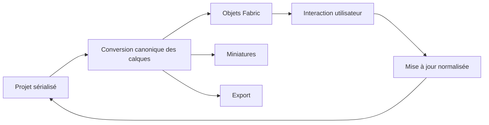

# Instruction: Rendu Fabric et géométrie canonique

## Architecture projection

> Tree of the final files. ✅ create · ✏️ modify · ❌ delete

```txt
src
├── ✏️ hooks/use-canvas.ts
└── components/canvas
    ├── ✏️ canvas-utils.ts
    ├── ❌ ImageLayerHandler.ts
    └── ❌ ShapeLayerHandler.ts
```

## User Journey



## Tasks to do

### `1)` Unifier les coordonnées

> Supprimer le mélange centre/coin haut-gauche qui décale les calques et les captures.

1. Configurer une seule fois les origines Fabric 7 à left/top avant toute création d’objet.
2. Centraliser conversions écran-local, panorama et dimensions mises à l’échelle.
3. Utiliser ces conversions pour fonds, labels, clip paths, fit-all et retour Fabric vers le store.

### `2)` Construire un réconciliateur complet

> Toute propriété sérialisée doit produire le même objet au premier rendu et aux mises à jour suivantes.

1. Étendre `canvas-utils.ts` pour créer et mettre à jour texte, forme, image et appareil.
2. Appliquer contenu, dimensions, police, transformation, dégradé, ombre, opacité, verrouillage et visibilité.
3. Recréer seulement les ressources asynchrones qui changent réellement, notamment image et SVG d’appareil.
4. Révoquer les URL d’objets devenues inutiles.

### `3)` Réparer ordre, sélection et panorama

> Le canvas doit refléter exactement l’ordre du projet après chaque mutation.

1. Réappliquer le z-order après ajout, suppression, duplication et glisser-déposer.
2. Conserver le débordement panoramique sur les zones d’écran tout en masquant les interstices.
3. Persister les transformations de sélection simple et multiple sans écrire des `ActiveSelection` dans le projet.
4. Garder zoom et pan hors de l’historique métier.

### `4)` Stabiliser les miniatures

> Une miniature doit rester fidèle quel que soit le viewport interactif.

1. Conserver le crop par `aCoords` documenté dans le dépôt.
2. Restaurer le viewport dans tous les chemins, y compris erreur ou génération annulée.
3. Exclure les miniatures de l’auto-save et ne les régénérer qu’après un changement visuel.

## Test acceptance criteria

| Task | Acceptance criteria |
| ---- | ------------------- |
| 1 | Un calque placé à x=0/y=0 touche le coin supérieur gauche et conserve ses coordonnées après drag, resize, rotation et reload. |
| 2 | Chaque propriété modifiée dans le store apparaît immédiatement sur un objet Fabric déjà présent. |
| 3 | L’ordre des calques, les verrous, la visibilité et les transformations multiples restent identiques après changement d’écran et reload. |
| 4 | Les miniatures restent complètes et identiques après zoom, pan, resize et fit-all, sans scintillement du canvas. |
