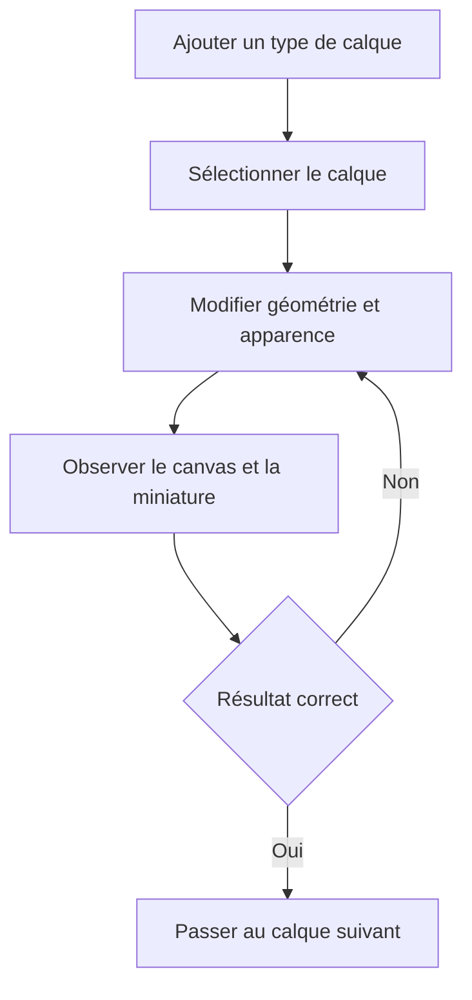

# Instruction: Outils d’édition réellement fonctionnels

## Architecture projection

> Tree of the final files. ✅ create · ✏️ modify · ❌ delete

```txt
src
├── ✏️ assets/device-frames/index.ts
├── ✏️ hooks/use-fonts.ts
├── components
│   ├── ✏️ background-editor/BackgroundEditor.tsx
│   ├── ✏️ color-picker/ColorPicker.tsx
│   ├── ✏️ device-picker/DevicePicker.tsx
│   ├── ✏️ gradient-editor/GradientEditor.tsx
│   ├── layers-panel
│   │   ├── ✏️ LayerItem.tsx
│   │   └── ✏️ LayersPanel.tsx
│   ├── properties-panel
│   │   ├── ✏️ ImageSection.tsx
│   │   ├── ✏️ PropertiesPanel.tsx
│   │   ├── ✏️ ShapeSection.tsx
│   │   └── ✏️ TransformSection.tsx
│   └── text-editor
│       ├── ✏️ FontPicker.tsx
│       └── ✏️ TextEditor.tsx
└── ✏️ index.css
```

## User Journey



## Wireframe

```txt
┌─────────────────────────────────────────────────────────────────────────────┐
│ (1) Projet · sauvegarde · historique · zoom · modèles · export             │
├──────────────┬───────────────────────────────────────────┬──────────────────┤
│ (2) Calques  │ (3) Panorama de captures                  │ (4) Inspecteur   │
│ liste        │ ┌──────────┐ ┌──────────┐ ┌──────────┐   │ transformation   │
│ ordre        │ │ écran 1  │ │ écran 2  │ │ écran 3  │   │ contenu          │
│ visibilité   │ │          │ │          │ │          │   │ apparence        │
│ verrouillage │ └──────────┘ └──────────┘ └──────────┘   │ ressource        │
│ ajout        │                                           │                  │
├──────────────┴───────────────────────────────────────────┴──────────────────┤
│ (5) Écrans : miniature · nom · ajouter                                    │
└─────────────────────────────────────────────────────────────────────────────┘
```

1. Barre projet : identité du fichier et actions globales.
2. Calques : structure et création du contenu de l’écran actif.
3. Panorama : composition continue de plusieurs captures.
4. Inspecteur : champs propres au calque sélectionné.
5. Écrans : séquence finale et ajout d’une capture.

## Tasks to do

### `1)` Terminer texte, formes et images

> Chaque contrôle visible doit agir ou disparaître.

1. Appliquer text transform, famille, taille, graisse, alignement, interligne, tracking, couleur, dégradé, ombre et opacité.
2. Appliquer type de forme, rayon, fill, angle de dégradé, stroke et ombre.
3. Appliquer remplacement, taille, opacité et ombre d’image.
4. Valider valeurs numériques, couleurs et fichiers avant écriture dans le store.

### `2)` Terminer l’appareil et l’import de capture

> L’image importée doit apparaître correctement à l’intérieur du cadre choisi.

1. Appliquer modèle, couleur, orientation, capture et ombre au SVG.
2. Tourner les dimensions et la zone écran en paysage au lieu de changer seulement le champ de données.
3. Accepter PNG/JPEG/SVG pour les images libres et PNG/JPEG pour les captures d’appareil.
4. Afficher un état vide explicite et une erreur lisible pour un fichier invalide.

### `3)` Rendre le panneau Calques cohérent

> Toutes les mutations de liste doivent passer par les commandes du store.

1. Brancher ajout, duplication, suppression, renommage, verrouillage, visibilité et reorder sur l’historique central.
2. Aligner ordre visuel et z-index sans tri contradictoire.
3. Conserver la sélection visible au clavier et au pointeur.

### `4)` Fiabiliser les polices

> L’export ne doit jamais partir avant la police réellement rendue.

1. Réutiliser le chargeur existant et attendre `document.fonts` lors d’un changement ou d’un export.
2. Signaler le fallback si Google Fonts est indisponible.
3. Ne pas ajouter de gestionnaire de polices custom tant que le besoin offline n’est pas confirmé.

### `5)` Corriger l’accessibilité de base

> L’éditeur personnel reste utilisable entièrement au clavier.

1. Garantir labels, focus visible, états pressed/checked et ordre de tabulation.
2. Porter les cibles interactives principales à 44×44 sans agrandir les champs denses de l’inspecteur.
3. Respecter `prefers-reduced-motion` pour les transitions.

## Test acceptance criteria

| Task | Acceptance criteria |
| ---- | ------------------- |
| 1 | Tous les contrôles texte, forme et image changent le canvas, survivent au reload et s’annulent proprement. |
| 2 | Une capture portrait ou paysage remplit le bon écran du cadre, reste clipsée et suit couleur, orientation et ombre. |
| 3 | Le panneau Calques et le canvas montrent toujours le même ordre, la même sélection, la même visibilité et le même verrouillage. |
| 4 | Une police sélectionnée est visible dans l’éditeur, les miniatures et l’export ; un échec réseau produit un fallback explicite. |
| 5 | Les actions principales, modales et champs sont atteignables au clavier avec un focus visible et sans animation forcée. |
