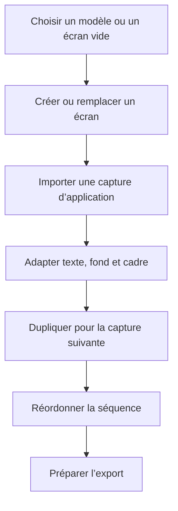

# Instruction: Écrans, modèles et parcours de composition

## Architecture projection

> Tree of the final files. ✅ create · ✏️ modify · ❌ delete

```txt
src
├── ✏️ assets/templates/index.ts
└── components
    ├── screens-bar
    │   ├── ✏️ ScreenThumbnail.tsx
    │   └── ✏️ ScreensBar.tsx
    └── ✏️ template-picker/TemplatePicker.tsx
```

## User Journey



## Wireframe

```txt
┌───────────────────────────────────────────────────┐
│ (1) En-tête du sélecteur                          │
├────────────────────────┬──────────────────────────┤
│ (2) Modèle             │ (3) Modèle              │
│ aperçu · structure     │ aperçu · structure      │
├────────────────────────┼──────────────────────────┤
│ (4) Modèle             │ (5) Modèle              │
│ aperçu · structure     │ aperçu · structure      │
├────────────────────────┴──────────────────────────┤
│ (6) Destination : écran courant · nouvel écran   │
└───────────────────────────────────────────────────┘
```

1. En-tête : contexte et fermeture du sélecteur.
2. Modèle : première structure de composition disponible.
3. Modèle : deuxième structure de composition disponible.
4. Modèle : troisième structure de composition disponible.
5. Modèle : structures restantes dans la même grille.
6. Destination : emplacement du modèle choisi.

## Tasks to do

### `1)` Réparer le cycle de vie des écrans

> Ajouter, dupliquer, supprimer et réordonner sans désynchroniser l’écran actif.

1. Activer automatiquement l’écran créé ou dupliqué lorsque l’action l’exige.
2. Choisir un voisin déterministe après suppression et refuser la suppression du dernier écran.
3. Appliquer la limite de dix dans le store, pas seulement dans l’interface.
4. Conserver noms, ordre et écran actif après reload.

### `2)` Réparer l’application des modèles

> Un modèle appliqué au nouvel écran ne doit plus écraser l’écran courant.

1. Construire les nouveaux calques une seule fois avec des identifiants uniques.
2. Enregistrer fond et calques sur la même cible, puis activer cette cible.
3. Capturer l’opération complète dans une seule entrée d’historique.
4. Produire des aperçus fidèles au modèle au lieu d’afficher seulement son fond.

### `3)` Simplifier la bibliothèque pour Pulpe

> Garder cinq structures éditables utiles sans reproduire le catalogue commercial AppScreens.

1. Conserver Hero, Feature, Side by Side, Full Bleed et Minimal.
2. Corriger géométrie, z-order et champs supportés par le renderer canonique.
3. Remplacer uniquement les textes génériques nécessaires au démarrage, sans intégrer de contenu marketing fictif dans les exports finaux.

### `4)` Vérifier le parcours de composition réel

> Reproduire une séquence proche des cinq captures Pulpe observées.

1. Créer cinq écrans, dont un panorama sur deux captures.
2. Importer des captures brutes de l’application lorsque le propriétaire les fournit.
3. Vérifier duplication, reorder, miniatures et reprise après reload.

## Test acceptance criteria

| Task | Acceptance criteria |
| ---- | ------------------- |
| 1 | Le projet contient toujours entre un et dix écrans, l’écran actif reste valide et l’ordre survit au reload. |
| 2 | Appliquer un modèle au nouvel écran laisse l’écran courant intact ; Undo restaure l’état précédent en une action. |
| 3 | Les cinq modèles affichent un aperçu fidèle et tous leurs calques restent éditables. |
| 4 | Une séquence de cinq captures, dont un visuel panoramique, se construit, se réordonne et se rouvre sans divergence. |
