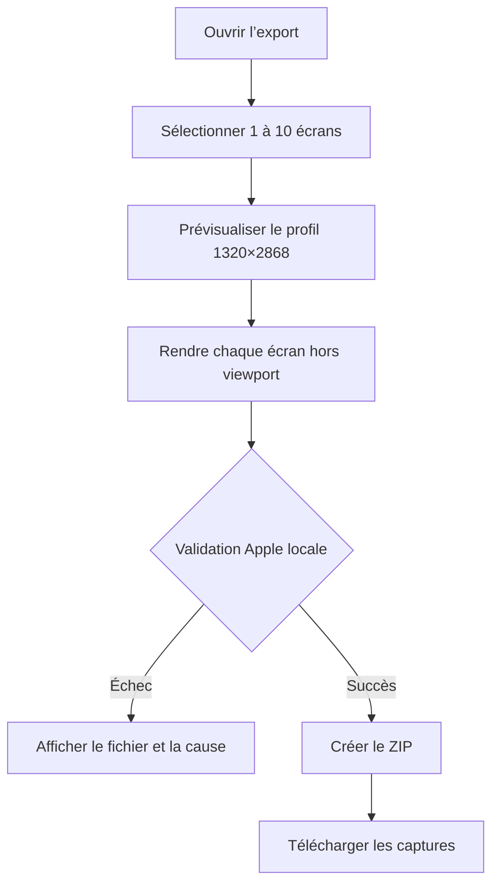

# Instruction: Export App Store validé et durcissement final

## Architecture projection

> Tree of the final files. ✅ create · ✏️ modify · ❌ delete

```txt
.
├── ✏️ package.json
├── ✅ scripts/validate-export.mjs
└── src
    ├── ✏️ lib/export.ts
    ├── ✏️ lib/zip.ts
    ├── ✏️ hooks/use-export.ts
    ├── ✏️ components/export-dialog/ExportDialog.tsx
    ├── ✏️ components/canvas/CanvasEditor.tsx
    └── ✏️ stores/ui.store.ts
```

## User Journey



## Wireframe

```txt
┌───────────────────────────────────────────────────────────┐
│ (1) Export · fermeture                                    │
├───────────────────────────────────┬───────────────────────┤
│ (2) Captures sélectionnées        │ (3) Profil App Store │
│ miniature · nom · validation      │ format · dimensions  │
│ miniature · nom · validation      │ taille · opacité     │
├───────────────────────────────────┴───────────────────────┤
│ (4) Progression ou erreurs par fichier                    │
├───────────────────────────────────────────────────────────┤
│ (5) Annuler                              Exporter le ZIP   │
└───────────────────────────────────────────────────────────┘
```

1. En-tête : contexte de sortie et fermeture.
2. Captures : ordre et sélection du lot final.
3. Profil : contraintes de la sortie officielle.
4. Résultat : progression et problèmes bloquants.
5. Actions : abandon ou production du fichier final.

## Tasks to do

### `1)` Remplacer l’export factice

> Construire chaque capture depuis le modèle de domaine, jamais depuis un objet vide ni le viewport courant.

1. Créer un `StaticCanvas` exact de 1320×2868 par écran sélectionné.
2. Réutiliser le convertisseur canonique de calques, le fond, le z-order, les clips, les polices et les images.
3. Attendre toutes les ressources avant le rendu et toujours disposer le canvas temporaire.
4. Utiliser `toBlob()` et traiter explicitement le retour `null`.

### `2)` Garantir le PNG accepté par Apple

> Refuser localement tout fichier qui serait rejeté par App Store Connect.

1. Aplatir chaque écran sur un fond opaque avant encodage.
2. Vérifier signature PNG, largeur, hauteur, bit depth, color type sans alpha et taille maximale.
3. Afficher une erreur bloquante si le navigateur produit encore un PNG RGBA au lieu de télécharger silencieusement.
4. Garder le PNG sous 5 MB comme cible interne, tout en distinguant cette cible de la limite officielle.

### `3)` Produire le lot final

> Le ZIP doit refléter exactement l’ordre du projet.

1. Exporter les écrans sélectionnés dans `6.9/01_nom.png` à `6.9/10_nom.png`.
2. Nettoyer les noms vides ou dupliqués sans perdre l’index déterministe.
3. Remonter la progression et l’erreur du fichier précis.
4. Ne déclencher le téléchargement qu’après validation de tous les fichiers.

### `4)` Laisser un contrôle reproductible

> Le fichier livré doit pouvoir être revalidé hors de l’interface.

1. Ajouter `scripts/validate-export.mjs` avec Node et JSZip déjà installé.
2. Vérifier chaque PNG du ZIP : chemin, ordre, dimensions, bit depth, absence d’alpha et taille.
3. Exposer une commande package dédiée qui retourne un code non nul au premier défaut.

### `5)` Durcir le parcours complet

> Une session réelle doit réussir sans erreur silencieuse ni perte de données.

1. Vérifier création, import, édition, modèles, écrans, historique, sauvegarde, reload et export dans le navigateur local.
2. Corriger les focus de modales, doubles gestionnaires Escape et états de chargement.
3. Valider typecheck, lint et build de production après le scénario navigateur.
4. Tester le ZIP final avec le validateur local avant remise.

## Test acceptance criteria

| Task | Acceptance criteria |
| ---- | ------------------- |
| 1 | Chaque fichier exporté contient le fond et tous les calques de son écran, indépendamment du zoom, du pan et de l’écran actif. |
| 2 | Chaque PNG mesure exactement 1320×2868, est en 8 bits, ne contient pas de canal alpha et reste sous la cible de 5 MB pour le jeu Pulpe. |
| 3 | Le ZIP contient uniquement les écrans sélectionnés, dans l’ordre, sous `6.9/NN_nom.png`, et aucun téléchargement partiel n’est proposé. |
| 4 | Le validateur accepte le ZIP ScreenForge final et rejette un fichier aux mauvaises dimensions ou avec alpha. |
| 5 | Le scénario complet réussit après reload avec zéro erreur console, zéro erreur de type, zéro erreur lint et un build de production valide. |
