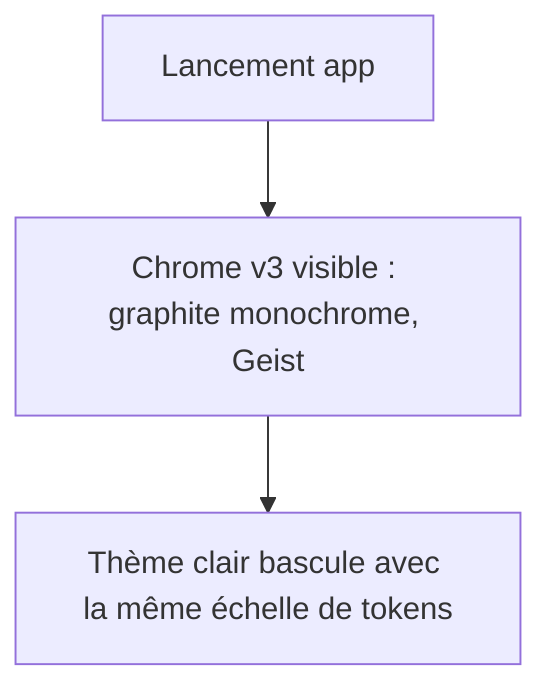

# Instruction: Fondations — tokens, polices et classes globales v3

## Architecture projection

> Tree of the final files. ✅ create · ✏️ modify · ❌ delete

```txt
.
├── index.html              ✏️ polices Geist Sans + Geist Mono, fond anti-flash en oklch
├── src/index.css           ✏️ réécriture complète @theme + classes globales v3
└── .impeccable.md          ✏️ section Aesthetic Direction remplacée par la direction v3
```

## User Journey



## Tasks to do

### `1)` Échelle de neutres monochrome

> Une seule rampe graphite chaud, chroma quasi nul, accent blanc.

1. Réécrire `@theme` dans `src/index.css` : rampe neutre OKLCH teintée ~hue 60 chroma ≤ 0.004 — `stage` (le plus sombre, L≈0.13), `background`, `panel` (L≈0.19), `raised` (L≈0.23), `surface` / `surface-hover` / `surface-active`.
2. Rampe texte 3 crans : `foreground` (L≈0.95), `foreground-muted` (L≈0.68), `faint` (L≈0.48). Supprimer le 4e cran `muted` redondant (migrer les usages vers `foreground-muted` ou `faint`).
3. Bordures : `border` (L≈0.28) et `border-strong` (L≈0.36) uniquement ; supprimer `border-faint`, `panel-header`, `canvas-bg` (alias legacy de stage).

### `2)` Accents et sémantique

> Le blanc devient l'accent ; le rouge ne sert plus qu'à exporter.

1. `--color-primary` : devient le rouge `#d71921` renommé en `--color-export` (+ `export-hover`, `on-export`) — usage unique : CTA export.
2. Supprimer `--color-accent` bleu et ses dérivés ; `:focus-visible` devient un anneau neutre `1.5px solid var(--color-foreground-muted)` (ou `color-mix` 60%).
3. Conserver `danger`, `success`, `warning` (indispensables aux toasts/erreurs), chroma réduit pour rester dans la gamme sobre.

### `3)` Typographie Geist

> Une famille unique ; la hiérarchie passe par poids et taille.

1. `index.html` : remplacer Archivo + Chivo Mono par **Geist** (variable 100–900) et **Geist Mono** (400/500) via Google Fonts ; fond anti-flash `html { background: oklch(0.13 0.003 60) }`.
2. `--font-sans: "Geist", ui-sans-serif, system-ui, sans-serif` ; `--font-mono: "Geist Mono", ui-monospace, monospace` ; supprimer `--font-panel` (doublon).
3. Classes globales : `.mono-label` devient `.caps-label` — Geist Sans 10px, graisse 500, uppercase, tracking 0.06em, `foreground-muted` (plus de mono décoratif) ; `.mono-value` conserve Geist Mono + `tabular-nums` pour les valeurs numériques uniquement.
4. Échelle de tailles resserrée : 10 (labels), 12 (corps dense), 13 (défaut), 16 (titres de dialog) — bannir les `text-[9px]`/`text-[22px]` ad hoc.

### `4)` Élévation, rayons, z-index

> Des surfaces plus plates, des ombres plus discrètes, une échelle de z nommée.

1. Ombres : adoucir — `--shadow-island` `0 1px 2px rgb(0 0 0 / 0.3), 0 8px 24px -8px rgb(0 0 0 / 0.35)` ; `menu` et `modal` dans la même veine réduite.
2. Rayons : îlots et modals à `--radius-lg` (8px) au lieu de 12px ; contrôles 6px ; supprimer les crans inutilisés (`-3xl`).
3. Tokens z : `--z-chrome: 20`, `--z-overlay: 50`, `--z-modal: 60`, `--z-popover: 70`, `--z-toast: 80` — remplacer les z arbitraires (`z-[90]`, `z-[100]`, `z-[110]`, `z-50`).
4. `.island` : fond `panel` + bordure `border` + rayon 8px + ombre adoucie ; `.stage-vignette` atténuée (stage déjà très sombre).

### `5)` Thème clair et contexte design

> Parité claire sur la même échelle ; mémoire du projet mise à jour.

1. Réécrire le bloc `.light` sur la même structure de tokens (neutres chauds clairs, L 0.90–0.995, accent noir).
2. Mettre à jour `.impeccable.md` : nouvelle section Aesthetic Direction v3 (monochrome, Geist, réduction maximale, rouge = export uniquement, focus neutre).

## Test acceptance criteria

| Task | Acceptance criteria                                                              |
| ---- | -------------------------------------------------------------------------------- |
| 1    | L'app démarre ; aucune référence aux tokens supprimés ne subsiste (build OK)     |
| 2    | Le focus clavier affiche un anneau neutre ; aucun bleu n'apparaît dans le chrome |
| 3    | Les labels d'interface sont en Geist Sans caps 10px ; Chivo Mono n'est plus chargé |
| 4    | Inspecteur : seuls les 5 niveaux de z nommés sont utilisés                        |
| 5    | La bascule clair/sombre conserve la même structure visuelle, sans couleur orpheline |
