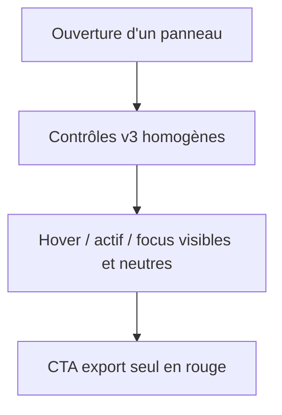

# Instruction: Primitives UI — réécriture du design system `components/ui`

## Architecture projection

> Tree of the final files. ✅ create · ✏️ modify · ❌ delete

```txt
.
└── src/components/ui/
    ├── button.tsx            ✏️ variants renommées (default/primary/export/ghost/danger), CVA
    ├── icon-button.tsx       ✏️ état actif neutre, tailles 28/32
    ├── input.tsx             ✏️ style v3, absorbe la classe globale .input
    ├── number-field.tsx      ✏️ label scrub en .caps-label
    ├── slider.tsx            ✏️ track/thumb affinés via tokens
    ├── segmented.tsx         ✏️ track plate, segment actif raised
    ├── switch.tsx            ✏️ taille 16×28, état on = foreground
    ├── field.tsx             ✏️ label .caps-label
    ├── dialog.tsx            ✏️ rayon 8px, header épuré, z tokens
    ├── popover.tsx           ✏️ z tokens
    ├── dropdown.tsx          ✏️ items alignés sur ContextMenu
    ├── tooltip.tsx           ✏️ z tokens
    ├── kbd.tsx               ✏️ Geist Mono, cap plus discret
    ├── command-palette.tsx   ✏️ z tokens, style v3
    ├── toast.tsx             ✏️ z tokens
    ├── ContextMenu.tsx       ✏️ constantes internes → tokens, style aligné Dropdown
    ├── layer-menu.tsx        inchangé
    └── shortcuts-overlay.tsx ✏️ labels .caps-label
```

## User Journey



## Tasks to do

### `1)` Boutons

> Nomenclature alignée sur les tokens ; un seul bouton coloré par écran.

1. Renommer les variants CVA : `default` (bordure neutre, ex-`secondary`), `primary` (fond `foreground`, texte `panel` — l'action principale non destructive), `export` (fond rouge `--color-export`, réservé à l'export), `ghost`, `danger`. Supprimer l'ancien `accent` ambigu.
2. Hauteurs : `sm` 26px, `md` 30px, `lg` 34px ; rayon 6px ; libellés Geist Sans 12px 500 (plus de caps sur les boutons, sauf export qui peut rester caps 10px).
3. États : hover `surface-hover` (default/ghost), `export-hover` (export), disabled 40%, `active:scale-[0.98]`, focus ring neutre.

### `2)` Contrôles de saisie

> Un seul langage de champ ; la classe `.input` disparaît au profit d'`Input`.

1. `Input` : h-7, fond `surface`, bordure `border`, rayon 6px, texte 12px ; hover `border-strong`, focus `border-foreground-muted` + ring neutre. Variant `mono` conservé pour les valeurs (Geist Mono tabular).
2. `NumberField` : label scrub en `.caps-label`, même habillage qu'`Input`.
3. `Slider` : track 2px, thumb 12px anneau `panel`, fill `foreground-muted` — uniquement tokens.
4. `Segmented` : track `panel-sub` (ou `surface`) + bordure, segments h-6 texte 12px, actif `raised` + bordure.
5. `Switch` : 16×28px, on = fond `foreground` + knob `panel`, off = `surface`.
6. `Select`/textarea : migrer vers `Input` ou une classe dérivée ; supprimer la classe globale `.input` à la fin (phase 4 pour les derniers usages).

### `3)` Surfaces flottantes

> Dialogs, popovers, menus, toasts : un seul modèle d'élévation.

1. `Dialog` : rayon 8px via tokens, header = titre 13px 600 + actions, scrim via token `--color-scrim`, z `--z-modal`.
2. `Popover` / `Tooltip` / `CommandPalette` / `Toast` : z tokens, ombres tokens, rayon 8px (popover/menu) ; palette : input h-10, items 12px.
3. `Dropdown` et `ContextMenu` : aligner le rendu des items (icône 14px, label 12px, meta/Kbd à droite, danger variant identique) ; constantes `MENU_WIDTH`/`ITEM_HEIGHT` déplacées en haut de fichier et cohérentes entre les deux.
4. `Kbd` : Geist Mono 10px, fond `surface`, bordure `border`, rayon 4px.

## Test acceptance criteria

| Task | Acceptance criteria                                                                  |
| ---- | ------------------------------------------------------------------------------------- |
| 1    | Aucun variant `accent`/`secondary` ne subsiste ; seul l'export est rouge              |
| 2    | Tous les champs ont hover/focus neutres cohérents ; `.input` n'est plus référencé     |
| 3    | Dropdown et clic-droit affichent des items visuellement identiques                    |
| 4    | `npm run typecheck` et `npm run lint` passent                                         |
