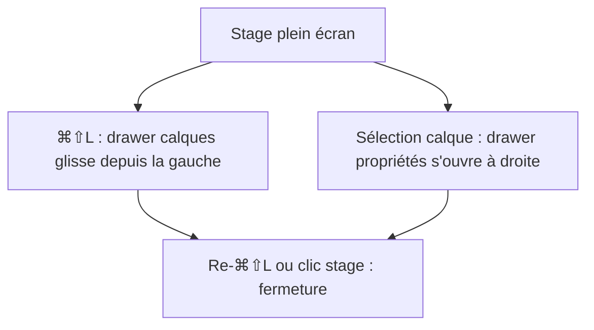

# Instruction: Shell — barre unique, drawers rétractables, stage maximal

## Architecture projection

> Tree of the final files. ✅ create · ✏️ modify · ❌ delete

```txt
.
├── src/App.tsx                      ✏️ compose TopBar + drawers + filmstrip, insets depuis lib/stage
├── src/lib/stage.ts                 ✏️ source unique : hauteurs chrome, largeurs drawers, état ouvert/fermé
├── src/stores/ui.store.ts           ✏️ flags layersOpen / propsOpen (remplacent showLayers/showProps)
├── src/hooks/use-keyboard.ts        ✏️ raccourcis toggle drawers (⌘⇧L calques, ⌘⇧P propriétés)
├── src/components/toolbar/
│   ├── TopBar.tsx                   ✅ barre unique h-11 : projet, outils, actions, export
│   ├── Toolbar.tsx                  ❌ fusionné dans TopBar
│   ├── ProjectIsland.tsx            ❌ fusionné dans TopBar
│   └── ZoomHud.tsx                  ✏️ mini-HUD discret bas-droite (ou intégré filmstrip)
├── src/components/layers-panel/
│   └── LayersDrawer.tsx             ✅ drawer gauche superposé (ex-LayersPanel repositionné)
├── src/components/properties-panel/
│   └── PropertiesDrawer.tsx         ✅ drawer droit superposé (ex-PropertiesPanel repositionné)
└── src/components/screens-bar/
    └── ScreensBar.tsx               ✏️ filmstrip fin h-20, centrée, masquable
```

## User Journey



## Wireframe

```txt
┌────────────────────────────────────────────────────────────────┐
│ (1) ● Nom projet ✎   sauvegarde   │ ↶ ↷ │ Aa ▭ ▷ ◻ │ ▦ □ ◐ │ EXPORT │
├────────────────────────────────────────────────────────────────┤
│┌───────────┐                                       ┌─────────┐│
││(2) drawer │                                       │(3)      ││
││ calques   │          (4) STAGE                    │ drawer  ││
││  ⌕ liste  │          artboard                     │ proprié-││
││  ▤▤▤▤▤▤  │          (full-bleed)                 │ tés     ││
│└───────────┘                                       └─────────┘│
│        ┌──────────────────────────────┐          (6) 100% ±  │
│        │ (5) filmstrip : ▯ ▯ ▯ ▯ +    │                     │
│        └──────────────────────────────┘                      │
└────────────────────────────────────────────────────────────────┘
```

1. TopBar unique h-11 pleine largeur : identité projet + statut de sauvegarde à gauche, outils d'ajout et toggles au centre, Export (rouge) à droite. Fusionne Toolbar + ProjectIsland.
2. Drawer calques : panneau flottant superposé au stage, glisse depuis la gauche, fermeture au re-toggle ou Échap.
3. Drawer propriétés : symétrique à droite ; s'ouvre automatiquement à la sélection d'un calque.
4. Stage : canvas full-bleed, vignette discrète ; les insets se réduisent à la TopBar seule quand les drawers sont fermés.
5. Filmstrip écrans : strip fine (~80px) centrée en bas, thumbnails réduites, bouton + intégré.
6. Zoom HUD : minimal, bas-droite, texte mono tabulaire + steppers.

## Tasks to do

### `1)` TopBar unique

> Un seul îlot en haut qui absorbe Toolbar et ProjectIsland.

1. Créer `TopBar.tsx` (h-11, `.island`, marges 12px) : segment gauche = point rouge 8px + nom de projet éditable inline + statut sauvegarde (`.caps-label` + spinner/check) ; segment centre = undo/redo + outils d'ajout (texte/device/image/shape avec Dropdown device) ; segment droit = toggles (calques, propriétés, thème, globals, templates, ⌘K) + bouton `export` rouge.
2. Supprimer `Toolbar.tsx` et `ProjectIsland.tsx` après migration ; mettre à jour `App.tsx`.
3. Le bouton ⌘K de ProjectIsland devient un IconButton + Kbd dans la TopBar.

### `2)` Drawers latéraux

> Les panneaux deviennent des overlays rétractables, le stage reste plein.

1. `ui.store` : renommer en `layersOpen` / `propsOpen` (persistés), ajouter `openProps()` appelé à la sélection d'un calque (dans `canvas.store` ou via abonnement).
2. `LayersDrawer.tsx` : reprise du contenu de `LayersPanel` dans un conteneur `fixed left-3 top-[60px] bottom-3 w-[264px] .island` + animation `translateX` 180ms ease-out-expo ; fermeture Échap et clic sur le stage.
3. `PropertiesDrawer.tsx` : idem à droite `w-[304px]`.
4. `use-keyboard` : ⌘⇧L / ⌘⇧P basculent les drawers ; Échap ferme d'abord les drawers (avant désélection).

### `3)` Stage et insets unifiés

> Une seule source de vérité pour la géométrie du chrome.

1. `lib/stage.ts` : exporter `TOP_BAR_HEIGHT`, `DRAWER_WIDTH_L/R`, `FILMSTRIP_HEIGHT`, et `stageInsets({ layersOpen, propsOpen, filmstripVisible })` ; quand un drawer est fermé, son inset = marge seule.
2. `App.tsx` : supprimer les valeurs arbitraires `top-[60px]` / `bottom-[168px]` ; tout vient de `stage.ts`.
3. `use-canvas.ts` : consommer la nouvelle signature de `stageInsets`.

### `4)` Filmstrip et zoom

> Une strip d'écrans fine qui ne mange plus le stage.

1. `ScreensBar.tsx` : hauteur ~80px (thumbnails 56px, même ratio), `max-w-[min(640px,50vw)]`, padding 8px, bouton + en thumbnail en pointillés ; garder DnD et ContextMenu.
2. `ZoomHud` : h-8, fond transparent → `.island` au survol uniquement, pourcentage `.mono-value` cliquable (reset 100%).

## Test acceptance criteria

| Task | Acceptance criteria                                                              |
| ---- | -------------------------------------------------------------------------------- |
| 1    | Une seule barre h-11 en haut ; ProjectIsland et Toolbar n'existent plus          |
| 2    | ⌘⇧L / ⌘⇧P ouvrent-ferment les drawers avec animation ; Échap les ferme           |
| 3    | Drawer fermé = artboard recentré (insets recalculés), aucune valeur en dur dans App.tsx |
| 4    | La filmstrip fait ~80px de haut et reste utilisable (DnD, renommage, menu)       |
| 5    | `npm run typecheck` passe ; les e2e de navigation clavier existants restent verts |
