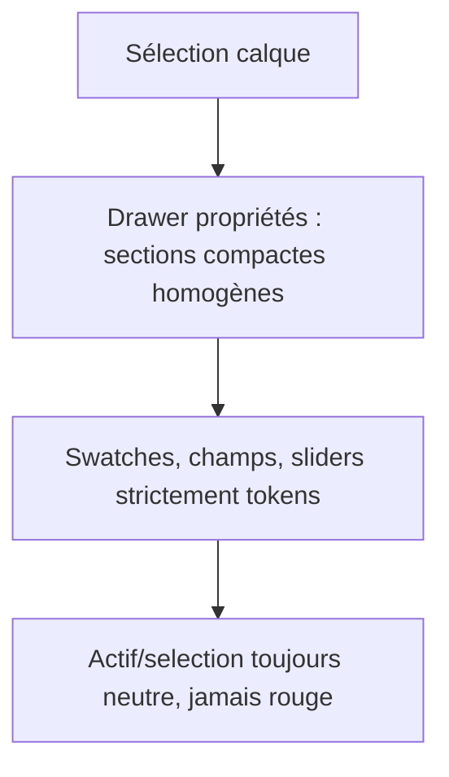

# Instruction: Panneaux & éditeurs — restyle complet des composants feature

## Architecture projection

> Tree of the final files. ✅ create · ✏️ modify · ❌ delete

```txt
.
└── src/components/
    ├── layers-panel/LayerItem.tsx        ✏️ actions → IconButton, ligne 30px, actif neutre
    ├── properties-panel/
    │   ├── PropertiesPanel.tsx           ✏️ sections accordéon épurées (chevron + caps-label)
    │   ├── TransformSection.tsx          ✏️ grille resserrée
    │   ├── ImageSection.tsx              ✏️ boutons v3
    │   ├── ShapeSection.tsx              ✏️ hex par défaut → tokens/contenu, hairlines
    │   ├── BackgroundSection.tsx         inchangé (délègue)
    │   └── ShadowEditor.tsx              ✏️ défaut rgba → constante partagée
    ├── screens-bar/ScreenThumbnail.tsx   ✏️ actif = bordure claire (plus de ring rouge), badge neutre
    ├── background-editor/                ✏️ défauts #6366f1/#a855f7 → presets tokens contenu
    ├── text-editor/
    │   ├── TextEditor.tsx                ✏️ .input → Input primitive, hairlines
    │   └── FontPicker.tsx                ✏️ trigger → Button ghost
    ├── device-picker/DevicePicker.tsx    ✏️ swatches actifs unifiés (bordure claire), défaut ombre partagé
    ├── color-picker/ColorPicker.tsx      ✏️ checkerboard → tokens, swatches tailles stables
    ├── gradient-editor/GradientEditor.tsx ✏️ stops en .surface-inner
    ├── globals-editor/GlobalsEditor.tsx  ✏️ swatches alignés sur DevicePicker, selects → Input
    ├── export-dialog/ExportDialog.tsx    ✏️ layout 2 colonnes affiné, progress bar neutre
    ├── template-picker/
    │   ├── TemplatePicker.tsx            ✏️ cards aplaties, sélection bordure claire
    │   └── TemplatePreview.tsx           ✏️ SCREEN_WIDTH/HEIGHT importés de canvas-utils (dédup)
    └── canvas/canvas-utils.ts            ✏️ couleurs fallback via tokens CSS lus une fois
```

## User Journey



## Tasks to do

### `1)` Cohérence des états actifs

> L'actif devient neutre partout ; le rouge disparaît des sélections.

1. `ScreenThumbnail` : actif = `border-foreground-muted` + fond `surface`, badge index neutre (fond `surface-active`) ; supprimer `border-primary ring-primary`.
2. `BackgroundEditor` presets et `TemplatePicker` cards : sélection = bordure claire, pas de ring rouge.
3. Swatches device (`DevicePicker` + `GlobalsEditor`) : un seul style actif — `border-foreground` + scale 1.05, composant partagé `SwatchButton` extrait dans `components/ui/` si duplication.

### `2)` Migration des primitives et fuites de style

> Plus aucun contrôle hand-rolled quand une primitive existe.

1. `LayerItem` : remplacer les `LayerAction` hand-rolled par `IconButton size="sm"` ; ligne 30px ; grip visible au survol.
2. `TextEditor` / `GlobalsEditor` : remplacer `.input` (selects, textarea) par la primitive `Input` (variant `sans`) ; ajouter un wrapper `Select` dans `ui/` si nécessaire (chevron SVG via token `currentColor`, supprime les hex `#74746e`/`#8a8a85` du CSS).
3. `FontPicker` trigger : `Button variant="default"` avec libellé tronqué.
4. Sections accordéon (`PropertiesPanel`) : bouton section = chevron 12px + `.caps-label`, séparateurs `.hairline` uniquement entre groupes.

### `3)` Valeurs par défaut et constantes partagées

> Les hex en dur sortent des composants.

1. Créer `src/lib/content-defaults.ts` : couleurs par défaut des calques (`#6366f1`, `#8b5cf6`, `#ffffff`…) et ombres par défaut (`rgba(0,0,0,0.3)`…) — consommé par `BackgroundEditor`, `ShapeSection`, `TextEditor`, `GradientEditor`, `ShadowEditor`, `DevicePicker`, `canvas-utils`.
2. `ColorPicker` : damier via tokens (`color-mix` sur `border`/`panel`), tailles de swatches en classes d'échelle.
3. `TemplatePreview` : importer `SCREEN_WIDTH/HEIGHT` depuis `canvas-utils.ts` (supprimer la duplication).

### `4)` Dialogs

> Export, templates, globals : densité réduite, hiérarchie claire.

1. `ExportDialog` : grille `1fr 220px`, liste d'écrans en lignes 36px (checkbox carrée 14px + thumbnail 24px), barre de progression h-0.5 `foreground`, un seul CTA `export` rouge dans le footer.
2. `TemplatePicker` : cards sans ombre, preview `h-56`, sélection bordure claire, description `foreground-muted` 12px.
3. `GlobalsEditor` : sections séparées par `.hairline`, selects migrés, footer default + primary.

## Test acceptance criteria

| Task | Acceptance criteria                                                                  |
| ---- | ------------------------------------------------------------------------------------- |
| 1    | Aucune sélection/active n'utilise le rouge ; vérification visuelle sur écrans, presets, templates, swatches |
| 2    | Plus aucun bouton/champ hand-rolled dans les panneaux (tout passe par `ui/`)          |
| 3    | `rg "#[0-9a-fA-F]{6}"` ne retourne plus de hex dans `src/components/` hors `content-defaults.ts` |
| 4    | Les trois dialogs s'ouvrent, restent navigables au clavier, un seul CTA rouge (export) |
| 5    | `npm run typecheck` et `npm run lint` passent                                          |
