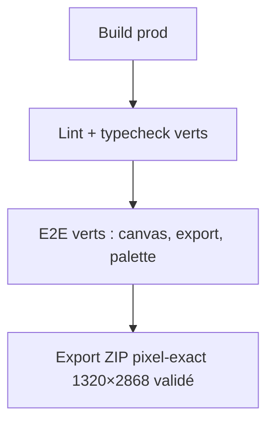

# Instruction: Nettoyage & vérification — mort du legacy, parité thèmes, tests

## Architecture projection

> Tree of the final files. ✅ create · ✏️ modify · ❌ delete

```txt
.
├── src/index.css            ✏️ suppression des tokens/classes orphelins résiduels
├── src/lib/dimensions.ts    inchangé (source de vérité export, hors scope)
├── e2e/                     ✏️ sélecteurs mis à jour si aria-labels/structure changent
├── AGENTS.md                ✏️ section « Design language » réécrite pour v3
└── .impeccable.md           ✏️ relecture finale cohérence v3
```

## User Journey



## Tasks to do

### `1)` Chasse au legacy

> Aucun token, classe ou fichier mort ne survit à la refonte.

1. Grep des tokens supprimés (`--color-accent`, `--color-panel-header`, `--color-canvas-bg`, `--font-panel`, `muted` 4e cran) : zéro occurrence.
2. Classes globales : `.input` supprimée du CSS ; `.mono-label`/`.mono-label-strong` renommées `.caps-label*` ; vérifier les survivants (`.island`, `.surface-inner`, `.surface-modal`, `.menu-shadow`, `.mono-value`, `.hairline`, `.img-outline`, `.hit-40`, `.stage-vignette`).
3. Fichiers `Toolbar.tsx` / `ProjectIsland.tsx` supprimés, imports orphelins nettoyés.

### `2)` Parité thème clair

> Le thème clair suit la même direction, sans couleur orpheline.

1. Rejouer chaque surface (TopBar, drawers, filmstrip, dialogs, toasts) en `.light` : neutres clairs, accent noir, export rouge identique.
2. Vérifier les contrastes ≥ 4.5:1 sur texte/boutons dans les deux thèmes.

### `3)` Tests et validation critique

> Le chemin critique (export pixel-exact) est prouvé non régressé.

1. `npm run lint` + `npm run typecheck` : verts.
2. `npm run test:e2e` : suite verte ; ajuster uniquement les sélecteurs cassés par la nouvelle structure (aria-labels français conservés).
3. `npm run build` puis probe d'export : ZIP validé par `npm run validate:export` (1320×2868, PNG-24 opaque).
4. Probe visuel (`scripts/visual-probe.mjs`) : revue des 2 thèmes, drawers ouverts/fermés.

### `4)` Mémoire du projet

> AGENTS.md reflète le langage v3.

1. Réécrire la section « Design language » d'`AGENTS.md` : monochrome, Geist, barre unique + drawers, rouge = export, z tokens, `.caps-label`.
2. Vérifier la cohérence finale de `.impeccable.md` (principes 1–6 mis à jour).

## Test acceptance criteria

| Task | Acceptance criteria                                                          |
| ---- | ---------------------------------------------------------------------------- |
| 1    | Recherche globale : zéro référence aux tokens/classes/fichiers supprimés     |
| 2    | Bascule clair/sombre sans défaut de contraste visible ni couleur hors palette |
| 3    | Lint, typecheck, e2e verts ; export ZIP validé pixel-exact                   |
| 4    | `AGENTS.md` et `.impeccable.md` décrivent la v3                               |
