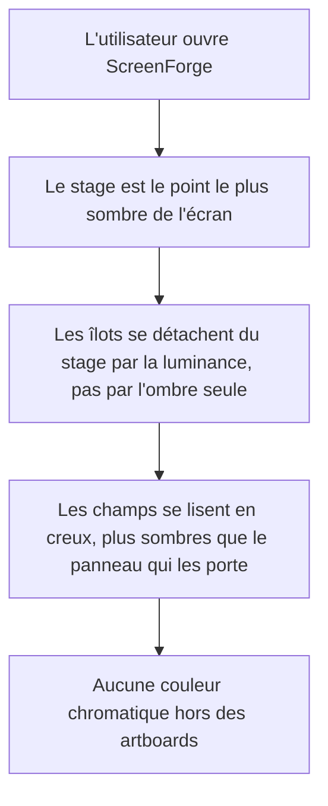

# Instruction: Fondations — rampe neutre, Inter, profondeur

## Architecture projection

> Tree of the final files. ✅ create · ✏️ modify · ❌ delete

```txt
.
├── index.html                      ✏️ Geist + Geist Mono → Inter variable avec axe opsz, une seule famille
├── .impeccable.md                  ✏️ direction esthétique v3 → v4, contrat que suivent les phases 2 à 5
└── src/
    └── index.css                   ✏️ rampe chroma 0 à paliers perceptibles, tokens d'élévation et de
                                       sélection, suppression de .caps-label et de --font-mono
```

## User Journey



## Tasks to do

### `1)` Basculer la typographie sur Inter

> Une seule famille, réglée pour le petit corps, chiffres tabulaires natifs.

1. Dans `index.html`, remplacer le lien Google Fonts par `family=Inter:opsz,wght@14..32,100..900`.
2. Supprimer la requête `Geist+Mono` : plus aucune famille mono dans le chrome.
3. Dans `index.css`, `--font-sans` pointe sur `"Inter", ui-sans-serif, system-ui, -apple-system, sans-serif`.
4. Supprimer le token `--font-mono` et la classe `.mono-value`.
5. Sur `body` : `font-optical-sizing: auto`, `font-feature-settings: "cv05" 1, "cv08" 1, "ss03" 1`,
   `letter-spacing: 0` — Inter n'a pas besoin du `-0.005em` posé pour Geist.
6. Créer `.tabular` : `font-variant-numeric: tabular-nums` seul, pour les valeurs numériques.
   C'est le remplaçant direct de `.mono-value`, sans changement de famille.
7. Passer le corps de base de 13px à 13.5px et vérifier qu'aucun composant ne casse en hauteur.

### `2)` Reconstruire la rampe de neutres

> Chroma 0, paliers d'au moins 0.04 de luminance, le stage toujours le plus sombre.

1. Dark — remplacer les huit neutres actuels par : `stage 0.145`, `background 0.175`,
   `panel 0.205`, `inset 0.155`, `raised 0.245`, `raised-hover 0.285`, `raised-active 0.325`,
   tous en `oklch(L 0 0)`. Renommer `--color-panel-sub` en `--color-inset` : le nom dit
   maintenant le rôle, une surface en creux.
2. Bordures : `border 0.27`, `border-strong 0.36`.
3. Texte : `foreground 0.97`, `foreground-muted 0.72`, `faint 0.58`. Ne pas descendre `faint`
   plus bas : à 0.58 sur `panel 0.205` le rapport tient tout juste 4.5:1.
4. Light — même structure en neutre vrai : `stage 0.88`, `background 0.94`, `panel 1.0`,
   `inset 0.965`, `raised 0.97`, `raised-hover 0.94`, `raised-active 0.91`, `border 0.90`,
   `border-strong 0.82`, `foreground 0.18`, `foreground-muted 0.45`, `faint 0.55`.
   Aucun chroma, aucune teinte 70 : la bande beige actuelle disparaît.
5. Vérifier chaque paire texte/fond au ratio WCAG et corriger la luminance du texte, jamais
   celle du fond, si un couple passe sous 4.5:1.

### `3)` Retirer le rouge du chrome

> Le seul accent est la luminance. Le rouge ne survit que comme signal destructif.

1. Supprimer `--color-export`, `--color-export-hover`, `--color-export-strong`,
   `--color-export-strong-hover`, `--color-on-export`.
2. Conserver `--color-danger` et `--color-danger-soft` : ils servent la suppression, pas l'export.
3. Ajouter `--color-selection: oklch(0.97 0 0)` en dark et `oklch(0.18 0 0)` en light —
   la couleur unique de tout ce qui est sélectionné, poignées Fabric comprises.
4. Ajouter `--color-artboard-ring-active` : `oklch(1 0 0 / 0.5)` en dark, `oklch(0 0 0 / 0.45)`
   en light. L'artboard actif se signale par un contraste de valeur, pas par une couleur.
5. Le focus ring reste neutre : il consomme déjà `--color-foreground`, ne pas y toucher.

### `4)` Poser la profondeur

> Deux directions d'élévation : les îlots montent, les champs descendent.

1. Ajouter `--shadow-inset` : une ombre portée interne d'un pixel en haut du champ, opacité
   0.35 en dark, 0.06 en light. C'est ce qui manque pour qu'un champ se lise comme un champ.
2. Recalibrer `--shadow-island` : l'ombre actuelle est correcte, mais l'îlot doit maintenant
   se détacher d'abord par le saut `stage 0.145 → panel 0.205`, l'ombre ne fait que confirmer.
3. Ajouter `--shadow-artboard` : ombre portée sous les artboards, consommée en phase 3.
4. Ajouter une hairline haute `inset 0 1px 0 oklch(1 0 0 / 0.04)` sur `.island` en dark, pour
   la lumière rasante qui sépare l'îlot du stage. En light, la même en `oklch(1 0 0 / 0.7)`.

### `5)` Supprimer le pattern des capitales

> Les classes disparaissent ici ; leurs 38 appelants sont corrigés en phases 2, 4 et 5.

1. Supprimer `.caps-label` et `.caps-label-strong` de `index.css`.
2. Créer `.field-label` : 11px, poids 500, casse normale, `--color-foreground-muted`, pas de
   tracking, pas de transformation.
3. Créer `.section-title` : 12px, poids 550, casse normale, `--color-foreground`.
4. Ne pas laisser de règle de compatibilité derrière : les 38 usages doivent casser
   visiblement pour être traités, pas se dégrader en silence.

### `6)` Mettre le contrat de design à jour

> `.impeccable.md` est lu par les outils de design avant chaque intervention.

1. Réécrire la section « Aesthetic Direction » en v4 : monochrome intégral, Inter unique,
   dark-first, clair neutre vrai, rampe à paliers perceptibles, deux directions d'élévation.
2. Réécrire le principe 2 : il énonce aujourd'hui « un seul rouge, un seul endroit » — il
   devient « aucune couleur dans le chrome ; la seule couleur vient des artboards ».
3. Réécrire le principe 4 : les labels ne sont plus en capitales.

## Test acceptance criteria

| Task | Acceptance criteria                                                                                                                                  |
| ---- | ------------------------------------------------------------------------------------------------------------------------------------------------------ |
| 1    | `document.fonts.check('500 13.5px Inter')` renvoie vrai après chargement ; aucune requête vers une famille Geist ne part ; aucun `.mono-value` ne subsiste dans `src/` |
| 2    | Chaque couple texte/fond des deux thèmes atteint 4.5:1 ; `stage` est la valeur la plus sombre du thème dark et la plus sombre des surfaces du thème light ; aucun token neutre ne porte de chroma non nul |
| 3    | Aucune occurrence de `--color-export` ni de `#d71921` dans `src/` ; `--color-selection` et `--color-artboard-ring-active` sont définis dans les deux thèmes |
| 4    | Un champ posé sur un panneau se distingue à l'œil du panneau qui le porte, dans les deux thèmes, sans recourir à une bordure plus contrastée         |
| 5    | `grep -r "caps-label" src/` ne renvoie plus aucune définition ; les appelants restants sont visiblement cassés, ce qui est attendu à ce stade         |
| 6    | `.impeccable.md` ne mentionne plus le rouge comme accent ni les capitales comme convention de label                                                  |
