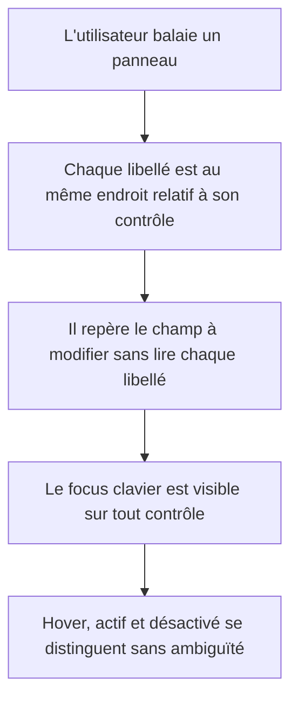

# Instruction: Primitives UI — une seule grammaire de champ

## Architecture projection

> Tree of the final files. ✅ create · ✏️ modify · ❌ delete

```txt
.
└── src/components/ui/
    ├── field.tsx              ✏️ .caps-label → .field-label ; devient le seul porteur de label
    ├── button.tsx             ✏️ variante export → primary blanc plein ; paliers raised ; états complets
    ├── icon-button.tsx        ✏️ mêmes paliers, cible tactile 40px conservée
    ├── input.tsx              ✏️ surface en creux, hairline haute, états focus et invalide
    ├── textarea.tsx           ✏️ aligné sur input, poignée de redimensionnement stylée
    ├── select.tsx             ✏️ aligné sur input, chevron à 11px, alignement optique du texte
    ├── number-field.tsx       ✏️ label inline supprimé au profit de Field ; .mono-value → .tabular
    ├── slider.tsx             ✏️ piste 3px, thumb 11px avec anneau, état actif au drag
    ├── segmented.tsx          ✏️ pilule active en raised, plus de bordure claire seule
    ├── switch.tsx             ✏️ actif en foreground plein, inactif en raised
    ├── swatch-button.tsx      ✏️ damier alpha, contour visible sur pastille claire comme sombre
    ├── dialog.tsx             ✏️ scrim, élévation modale, largeur et rythme de padding unifiés
    ├── popover.tsx            ✏️ élévation menu, même rayon que dropdown
    ├── dropdown.tsx           ✏️ élévation menu, hauteur de ligne unifiée à 28px
    ├── layer-menu.tsx         ✏️ aligné sur dropdown
    ├── ContextMenu.tsx        ✏️ aligné sur dropdown
    ├── tooltip.tsx            ✏️ 11px, délai d'apparition, pas d'ombre lourde
    └── kbd.tsx                ✏️ .tabular, surface raised, plus de famille mono
```

## Wireframe

```txt
┌──────────────────────────────────────────────┐
│ (1) Section                                  │
│                                              │
│  (2) Libellé du champ                        │
│  ┌────────────────────────────────────────┐  │
│  │ (3) Contrôle                           │  │
│  └────────────────────────────────────────┘  │
│                                              │
│  (4) Libellé          ┌───────┐ ┌─────────┐  │
│                       │ (5) X │ │ (5) Y   │  │
│                       └───────┘ └─────────┘  │
│                                              │
│  (6) Libellé                      ◯───────   │
└──────────────────────────────────────────────┘
```

1. Section : titre en `.section-title`, casse normale, jamais de capitales.
2. Libellé : `.field-label`, toujours au-dessus du contrôle, jamais à l'intérieur.
3. Contrôle pleine largeur : surface en creux, hairline haute, hauteur 28px.
4. Libellé partagé par une paire de champs : posé une seule fois au-dessus du groupe.
5. Champ numérique : préfixe court en retrait, puis la valeur. Scrub sur toute la surface.
6. Contrôle sans surface : le libellé et le contrôle partagent une ligne.

## User Journey



## Tasks to do

### `1)` Unifier la grammaire de champ

> Aujourd'hui deux grammaires cohabitent : label au-dessus et label inline dans le champ.

1. `field.tsx` devient le seul endroit qui rend un libellé : `.field-label` au-dessus du
   contrôle, ou sur la même ligne quand `inline` est passé.
2. `number-field.tsx` garde son préfixe court dans le champ, mais en casse normale et en
   retrait. **Écart assumé au plan initial**, qui prévoyait de le supprimer au profit de
   `Field` : une grille X / Y à deux colonnes se lit mieux avec un préfixe dans le champ
   qu'avec un libellé au-dessus, et c'est ce que font Figma, Sketch et Framer. La règle
   reste unique et sans ambiguïté — préfixe dans le champ pour les champs numériques,
   libellé au-dessus via `Field` pour tout le reste — donc les deux grammaires
   concurrentes disparaissent quand même. La zone de scrub couvre le champ entier.
3. Remplacer `.mono-value` par `.tabular` dans `number-field.tsx` et `kbd.tsx`.
4. Vérifier qu'aucune primitive ne rend plus de texte en capitales.

### `2)` Donner une matière aux surfaces

> Un champ doit se lire en creux, un bouton en relief. Aujourd'hui les deux sont plats.

1. `input`, `textarea`, `select`, `number-field` : fond `--color-inset`, bordure `--color-border`,
   `--shadow-inset`, rayon `--radius-md`, hauteur 28px, padding horizontal 8px.
2. `button` variante `default` : fond `--color-raised`, hover `--color-raised-hover`,
   actif `--color-raised-active`. La variante actuelle est transparente, donc invisible tant
   qu'on ne la survole pas.
3. `button` variante `export` renommée en `primary` : `bg-foreground text-stage`, hover à
   `--color-foreground-muted`. Supprimer l'ancienne variante `primary` redondante.
4. Retirer `active:scale-[0.98]` : à 30px de haut la mise à l'échelle produit un tremblement,
   pas un retour tactile. Le retour passe par le palier `raised-active`.

### `3)` Compléter les états

> Le registre produit exige sept états par contrôle interactif. Il en manque.

1. Pour chaque primitive interactive, couvrir : défaut, survol, focus visible, actif,
   désactivé, et selon le cas chargement et invalide.
2. `button` : ajouter un état `loading` qui désactive le contrôle et affiche un indicateur,
   requis par l'export qui est asynchrone.
3. `input`, `textarea`, `select` : ajouter un état invalide qui consomme `--color-danger`
   sur la bordure, jamais sur le fond.
4. `segmented` : l'option active passe en `--color-raised` avec la hairline haute ; supprimer
   la bordure claire seule, illisible sur un panneau clair.

### `4)` Unifier les surfaces flottantes

> Quatre composants de menu divergent aujourd'hui sur le rayon, l'ombre et la hauteur de ligne.

1. `dropdown`, `layer-menu`, `ContextMenu`, `popover` : même rayon `--radius-lg`, même
   `--shadow-menu`, même hauteur de ligne 28px, même padding 4px.
2. `dialog` : `--shadow-modal`, scrim `--color-scrim`, padding 20px, titre en `.section-title`.
3. `tooltip` : 11px, fond `--color-raised`, apparition différée de 400ms, ombre légère.

## Test acceptance criteria

| Task | Acceptance criteria                                                                                                                                        |
| ---- | -------------------------------------------------------------------------------------------------------------------------------------------------------------- |
| 1    | Aucune primitive ne rend de texte en capitales ; un champ numérique est scrubbable sur toute sa surface, y compris au centre du champ, et un clic sans glissement y place le curseur |
| 2    | Sur une même surface, un champ paraît en retrait et un bouton en avant, sans lecture du code ; un bouton `default` est visible au repos, sans survol       |
| 3    | Chaque primitive interactive répond visiblement au survol, au focus clavier et au clic maintenu ; un bouton en chargement refuse le clic                   |
| 4    | Un menu, un menu contextuel, un menu de calque et un popover ouverts côte à côte partagent rayon, ombre et hauteur de ligne                                |
