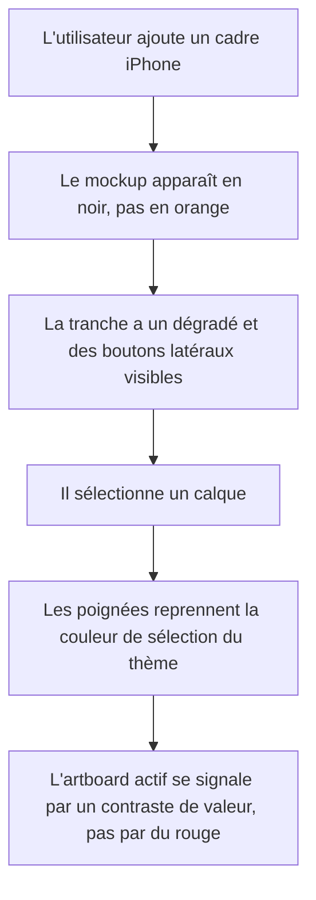

## Écarts constatés à l'implémentation

Quatre points du plan reposaient sur des hypothèses que la mesure a démenties.

1. **Tâche 1.6 — la netteté était le vrai sujet.** Le SVG était rastérisé à sa taille
   naturelle (~184 unités de large) puis agrandi par Fabric : à l'export 1320×2868 un
   appareil de taille par défaut occupe ~740 px, soit quatre fois la source. D'où
   `DEVICE_RASTER_SCALE = 4`. C'est la cause principale de l'aspect « cheap », avant
   toute question de dessin.

2. **Proportions fausses, non prévues au plan.** L'encadrement valait `width × 0,055` et
   `height × 0,047`, soit près du double du réel, et le partage métal/noir était inversé
   (7,5 unités de tranche pour 2,5 de bezel). Les bordures viennent désormais des cotes
   physiques de chaque modèle, contrôlées par recoupement : `hauteur mm × échelle` retombe
   sur la hauteur en unités du gabarit à moins de 1,5 % près.

3. **Coins en superellipse.** Un `rx` de SVG donne un arc de cercle ; Apple utilise des
   coins continus. Invisible tant que la bordure était épaisse, flagrant une fois amincie.

4. **Tâche 3 — l'hypothèse du plan était fausse.** Le cadre n'est pas parsé par
   `loadSVGFromURL` mais rastérisé via `` : le hors-`viewBox` est écrêté par le
   navigateur, la marge transparente mesurée est nulle. Deux causes réelles, distinctes :
   - l'origine de rotation en coin haut-gauche, qui éjectait le calque hors de l'artboard ;
   - un calque partagé (« Partager partout ») placé à `getScreenOffset(i) − i × SCREEN_WIDTH`,
     soit un simple intervalle au lieu du pas complet des écrans. Toutes les instances au-delà
     de la première atterrissaient sur la première planche, hors de leur propre fenêtre de
     découpe : invisibles, mais leurs poignées restaient dessinées. C'est ce que montrait la
     capture de l'utilisateur.

5. **Tâche 6 — les défauts ne venaient pas des fabriques.** `DEFAULT_GLOBALS` écrase les
   fabriques de calques via `applyGlobalsToNewLayer` : c'est là que vivaient `Archivo`,
   `cosmic-orange` et le fond blanc. Les réglages globaux dérivent maintenant des mêmes
   sources uniques que les fabriques, et `DEFAULT_INK_COLOR` réconcilie l'encre, qui valait
   `#1a1a1a` d'un côté et `#141413` de l'autre.

**Reste ouvert :** la bordure de sélection reprend la couleur du thème alors que l'artboard,
lui, n'en dépend pas — blanc sur blanc en thème sombre, donc invisible. Seules les poignées
restent lisibles, grâce à leur anneau sombre. À traiter en phase 4 avec la manipulation directe.

# Instruction: Rendu canvas & mockups appareil

## Architecture projection

> Tree of the final files. ✅ create · ✏️ modify · ❌ delete

```txt
.
├── src/assets/device-frames/index.ts   ✏️ viewBox élargi, bezel noir, tranche métal, verre, ordre des couleurs
├── src/hooks/use-canvas.ts             ✏️ poignées de sélection, anneau d'artboard neutre, police du libellé
├── src/components/canvas/canvas-utils.ts ✏️ défauts de contrôle appliqués à tout objet rendu
├── src/lib/content-defaults.ts         ✏️ contenu de départ crédible à la place des défauts Tailwind
└── src/hooks/use-fonts.ts              ✏️ ordre du catalogue : la police par défaut d'un texte neuf
```

## Wireframe

```txt
     (1) Écran 1
   ┌─────────────────────┐
   │                     │
   │   (3) Titre         │
   │                     │
   │    ┌───────────┐    │
   │    │ (4)  ▬    │    │
   │    │           │    │
   │    │           │    │
   │    │           │    │
   │    └───────────┘    │
   │                     │
   └─────────────────────┘
    (2) ombre portée
```

1. Libellé d'écran : au-dessus de l'artboard, aligné à gauche, dans la police de l'UI.
2. Ombre portée sous l'artboard : ce qui pose l'artboard sur le stage plutôt que de le coller.
3. Contenu utilisateur : la seule source de couleur de l'écran.
4. Mockup : tranche métal, bezel noir, écran en creux, îlot dynamique avec objectif.

## User Journey



## Tasks to do

### `1)` Réparer le mockup d'appareil

> C'est le livrable du produit. Aujourd'hui c'est une dalle plate à laquelle il manque des pièces.

1. Élargir le `viewBox` à `-3 0 ${width + 6} ${height}` : les boutons latéraux sont dessinés
   à `x = -2` et `x = width - 1`, donc actuellement rognés et invisibles. Ajuster `width` et
   `height` de la balise `<svg>` en conséquence.
2. Le bezel cesse d'être `color.bezel` et passe à un noir fixe : sur un vrai appareil la
   bordure entre la tranche et la dalle est noire, quelle que soit la couleur du châssis.
   `color.bezel` ne sert plus qu'aux boutons latéraux et au liseré extérieur.
3. Ajouter un `linearGradient` horizontal sur la tranche : `color.bezel` aux deux bords,
   `color.frame` au centre, avec deux arrêts clairs proches des bords pour la réflexion
   spéculaire du métal. C'est ce qui sépare un mockup crédible d'un rectangle coloré.
4. Ajouter un liseré interne sombre d'un pixel autour de la dalle et un très léger dégradé
   de verre en haut de l'écran, sous 6% d'opacité.
5. Ajouter l'objectif dans l'îlot dynamique : un cercle sombre décalé à droite dans la pilule.
6. Vérifier que le rendu tient à l'échelle d'export : le SVG est écrit à environ 180 unités
   de large puis mis à l'échelle par Fabric. Aucun trait ne doit disparaître ni s'épaissir.

### `2)` Corriger les couleurs par défaut de l'appareil

> Tout nouveau projet démarre aujourd'hui en orange rouille.

1. Réordonner `PRO_17_COLORS` pour placer une couleur neutre en première position.
   `colors[0]` est la couleur retenue par défaut, `cosmic-orange` l'occupe.
2. Appliquer la même règle aux autres jeux de couleurs : le neutre d'abord, les couleurs
   vives ensuite. Les projets existants stockent le nom de la couleur, pas son index :
   le réordonnancement ne les casse pas.

### `3)` Corriger le cadre de sélection décalé

> Signalé par l'utilisateur le 2026-08-02, capture à l'appui : sur un cadre d'appareil pivoté,
> la boîte de sélection est plus grande que le téléphone et débordée vers le haut-droite.
> Lu comme un bug, et c'en est un.

1. Diagnostiquer avant de corriger : mesurer `getBoundingRect()` de l'objet rendu contre les
   bornes visibles du mockup, à rotation nulle puis à 20 degrés.
2. Cause pressentie, à confirmer : les boutons latéraux sont dessinés hors du `viewBox`, à
   `x = -2` et `x = width - 1`. `loadSVGFromURL` les parse en objets réels au-delà du cadre,
   donc la boîte englobante du groupe s'étend dessus alors que le rendu, lui, est écrêté.
   L'élargissement du `viewBox` de la tâche 1 doit à lui seul refermer l'écart.
3. Si l'écart persiste après la tâche 1, vérifier l'origine des objets : Fabric v7 a basculé
   `originX` / `originY` de `left` / `top` à `center` / `center`, et `bug-fabric-v7-origin.md`
   documente déjà un décalage d'une demi-taille causé par ce changement dans ce dépôt.
4. Le contrôle est géométrique, pas visuel : la boîte de sélection doit coïncider avec les
   bornes du mockup à moins d'un pixel, à toute rotation.

### `4)` Habiller la sélection Fabric

> Les poignées sont restées aux défauts de la bibliothèque : carrés bleus de 13px.

1. Dans `readChromeColors`, ajouter la lecture de `--color-selection`. La bascule de
   `activeRing` vers `--color-artboard-ring-active` a été faite en phase 1, avec la
   suppression du token `--color-export` dont il dépendait.
2. Appliquer à tout objet rendu, au moment de sa création dans `canvas-utils.ts` :
   `borderColor` et `cornerColor` à `--color-selection`, `cornerStrokeColor` à `--color-stage`,
   `cornerSize: 8`, `cornerStyle: 'circle'`, `transparentCorners: false`, `borderScaleFactor: 1.5`.
3. Régler la sélection au lasso sur la même couleur : `canvas.selectionColor` en translucide
   et `canvas.selectionBorderColor` en opaque, tous deux dérivés de `--color-selection`.
4. Ces valeurs sont relues au changement de thème, comme le sont déjà les couleurs de chrome.
5. Aucun de ces réglages ne peut atteindre l'export : `lib/export.ts` construit un
   `StaticCanvas` distinct à partir des données de calque, sans contrôles ni anneaux.

### `5)` Corriger la police du libellé d'écran

> Le libellé dessiné sur le canvas est en Archivo, une famille qui n'est plus chargée.

1. `use-canvas.ts` fixe `fontFamily: '"Archivo", system-ui, sans-serif'` sur le `Textbox` du
   libellé. Archivo a disparu de `index.html` en v3 : le libellé tombe donc sur `system-ui`
   et ne correspond à aucune autre lettre de l'écran.
2. Le remplacer par la famille UI et vérifier que la police est chargée avant le rendu du
   libellé, sinon Fabric mesure avec un repli et le libellé se décale.
3. Le libellé passe en `--color-foreground-muted` : `--color-faint` est trop faible sur le stage.

### `6)` Remplacer le contenu de départ

> Le premier écran que voit l'utilisateur est un indigo Tailwind sur une police quelconque.

1. `DEFAULT_SOLID_COLOR` et le couple de dégradé valent `#6366f1` / `#8b5cf6` : ce sont les
   valeurs par défaut de Tailwind, elles signent le gabarit. Les remplacer par un point de
   départ neutre et crédible pour une capture App Store.
2. `POPULAR_FONTS` commence par `Archivo`, qui devient donc la police de tout texte neuf.
   Placer en tête une famille au dessin plus affirmé pour un titre marketing.
3. Vérifier le contraste du texte de démonstration sur le fond de démonstration : le contenu
   par défaut doit être exportable tel quel sans retouche.

## Test acceptance criteria

| Task | Acceptance criteria                                                                                                                                       |
| ---- | ------------------------------------------------------------------------------------------------------------------------------------------------------------- |
| 1    | Les boutons latéraux sont visibles sur le mockup rendu ; le bezel est noir sur les huit couleurs de châssis ; la tranche montre un dégradé, pas un aplat |
| 2    | Ajouter un cadre iPhone sur un projet neuf produit un appareil neutre ; ouvrir un projet enregistré en orange le rouvre en orange                        |
| 3    | Sur un cadre d'appareil pivoté à 20 degrés, la boîte de sélection coïncide avec les bornes visibles du mockup à moins d'un pixel                        |
| 4    | Les poignées de sélection reprennent la couleur du thème et changent avec lui ; un export lancé sur une sélection active ne contient ni poignée ni anneau |
| 5    | Le libellé d'écran est dessiné dans la même famille que l'interface, sans décalage horizontal au chargement                                              |
| 6    | Un projet neuf ne contient plus `#6366f1` ; le premier texte ajouté n'est plus en Archivo                                                                |
