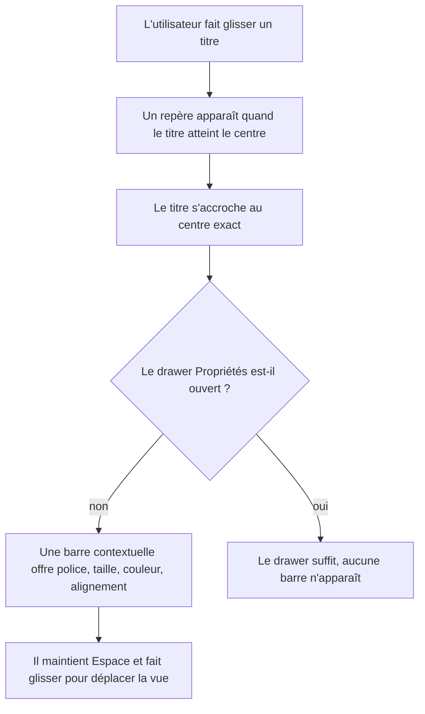

## Écarts constatés à l'implémentation

1. **La sélection était illisible pour une raison structurelle, pas chromatique.** Le cadre
   suivait le thème (phase 3, tâche 4) alors qu'il est posé sur le contenu de l'utilisateur,
   jamais sur l'interface : en thème sombre il devenait blanc sur un artboard blanc. Le
   cadre est désormais indépendant du thème, tracé en deux passes — trait clair sur halo
   sombre — donc lisible sur n'importe quel fond : 9,1:1 sur sombre, 21,0:1 sur clair. Seul
   le lasso, qui vit surtout sur le stage, continue de suivre le thème.

2. **Cause racine du crénage cassé, hors plan.** Fabric mémorise la largeur des glyphes dans
   un cache global par famille et graisse. Un texte mesuré avant l'arrivée de la webfont
   gardait les avances de la police de secours — d'où les mots collés visibles jusque dans
   le PNG exporté. `cache.clearFontCache(family)` au chargement corrige la mesure : écart
   du pire glyphe 27 % avant, 0,0 % après.

3. **Tâche 1.6 (accroche au redimensionnement) reportée.** Les critères d'acceptation ne
   couvrent que le déplacement, et une accroche de redimensionnement approximative est pire
   que pas d'accroche du tout.

4. **Tâche 4.3 restreinte.** Le curseur `text` n'apparaît que sur un calque texte déjà
   sélectionné, pas au simple survol : au repos il promettrait une sélection de caractères
   que le premier clic refuse.

5. **Sélectionner n'ouvre plus le drawer Propriétés.** Il s'ouvrait de force à chaque clic,
   ce qui rendait la barre contextuelle — conditionnée au drawer fermé — inatteignable, et
   mangeait un tiers du stage sans qu'on l'ait demandé. Le drawer reste accessible par son
   bouton et son raccourci.

6. **Écart de la phase 1 relevé ici :** le plan nommait le jeton `--shadow-artboard`, il a
   été livré sous `--color-artboard-shadow` pour rester dans l'espace `@theme` de Tailwind.

# Instruction: Manipulation directe — repères, alignement, édition sur le canvas

## Architecture projection

> Tree of the final files. ✅ create · ✏️ modify · ❌ delete

```txt
.
├── src/lib/snapping.ts                          ✅ calcul des cibles d'accroche et des repères à tracer
├── src/lib/align.ts                             ✅ alignement et distribution d'une sélection
├── src/hooks/use-canvas.ts                      ✏️ accroche au déplacement, tracé des repères, espace pour panner
├── src/hooks/use-keyboard.ts                    ✏️ espace maintenu, Entrée pour éditer un texte, raccourcis d'alignement
├── src/lib/commands.ts                          ✏️ alignement et distribution dans la palette ⌘K
└── src/components/canvas/
    ├── SelectionToolbar.tsx                     ✅ barre contextuelle près de la sélection, drawer fermé seulement
    └── CanvasEditor.tsx                         ✏️ monte la barre contextuelle, affiche le curseur de pan
```

## Wireframe

```txt
┌───────────────────────────────────────────────┐
│                                               │
│         ┊ (1)                                 │
│    ┌────┼────────────────┐                    │
│    │    ┊                │                    │
│    │  ┌─┴──────────┐     │                    │
│ (2)├──┤ (3) sélection│    │                    │
│    │  └────────────┘     │                    │
│    │  ┌──────────────┐   │                    │
│    │  │ (4) Aa 48 ▪ ≡ │  │                    │
│    │  └──────────────┘   │                    │
│    └─────────────────────┘                    │
└───────────────────────────────────────────────┘
```

1. Repère vertical : apparaît quand la sélection s'aligne sur le centre ou un bord.
2. Repère horizontal : même règle, tracé sur toute la largeur de l'artboard.
3. Sélection en cours de déplacement.
4. Barre contextuelle : les commandes les plus utilisées du type sélectionné, sous la sélection.

## User Journey



## Tasks to do

### `1)` Poser les repères d'alignement

> Il n'existe aujourd'hui aucune accroche. Chaque élément est posé à l'œil, et c'est ce qui
> se voit dans le PNG exporté.

1. Créer `lib/snapping.ts` : à partir de la boîte de la sélection et des boîtes des autres
   calques de l'écran, retourner les cibles atteintes et les segments de repère à tracer.
2. Cibles minimales : centre horizontal et vertical de l'artboard, quatre bords de l'artboard,
   bords et centres de chaque autre calque du même écran.
3. Le seuil d'accroche se mesure en pixels d'écran, pas en unités canvas : le diviser par le
   zoom courant, sinon l'accroche devient inutilisable à 25% et collante à 200%.
4. Tracer les repères sur la couche de rendu de Fabric plutôt que comme objets du canvas :
   ils ne doivent apparaître ni dans la liste des calques, ni dans l'export, ni dans l'historique.
5. Maintenir une touche modificatrice pendant le déplacement désactive l'accroche.
6. Étendre l'accroche au redimensionnement, pas seulement au déplacement.

### `2)` Ajouter alignement et distribution

> Aucun outil d'alignement n'existe, alors que le produit sert à composer une mise en page.

1. Créer `lib/align.ts` : aligner à gauche, au centre, à droite, en haut, au milieu, en bas.
   Référence : l'artboard quand un seul calque est sélectionné, la boîte de la sélection
   au-delà.
2. Distribuer horizontalement et verticalement à partir de trois calques sélectionnés.
3. Exposer les commandes dans la section Transformation et dans la palette ⌘K.
4. Une opération d'alignement est un seul pas d'historique, même si elle déplace dix calques.

### `3)` Corriger le déplacement de la vue

> Le pan est sur Alt et glisser. Dans tout éditeur de maquette, Alt et glisser duplique.

1. Ajouter Espace maintenu plus glisser, la convention universelle. Le curseur passe en main
   à l'appui, en main fermée au glissement.
2. Conserver le clic molette, qui ne conflicte avec rien.
3. Retirer Alt et glisser : il entre en collision avec le geste de duplication attendu.
4. Le pan à la molette et le zoom à ⌘ molette fonctionnent déjà, ne pas y toucher.

### `4)` Rendre l'édition de texte découvrable

> Le double-clic ouvre l'édition en place, mais rien ne l'annonce.

1. Entrée sur un calque texte sélectionné ouvre l'édition en place, comme le double-clic.
2. Échap sort de l'édition sans perdre la sélection.
3. Le curseur passe en `text` au survol d'un calque texte.

### `5)` Créer la barre contextuelle de sélection

> Le stage est maximal et les drawers rétractables : sans barre contextuelle, la moindre
> modification force à rouvrir un drawer.

1. `SelectionToolbar` s'affiche sous la sélection, uniquement quand le drawer Propriétés
   est fermé. Ouvert, il ferait doublon — c'est la condition qui évite la duplication.
2. Contenu par type : texte → police, taille, couleur, alignement ; appareil → modèle,
   couleur, capture ; image → ajustement, opacité ; forme → remplissage, rayon.
3. La barre suit la sélection et reste dans le viewport : elle bascule au-dessus de la
   sélection quand il n'y a pas la place en dessous.
4. Elle disparaît pendant le déplacement et le redimensionnement, et revient au relâchement.
5. Elle réutilise les primitives de la phase 2, sans variante propre.

## Test acceptance criteria

| Task | Acceptance criteria                                                                                                                            |
| ---- | ---------------------------------------------------------------------------------------------------------------------------------------------------- |
| 1    | Faire glisser un calque vers le centre de l'artboard affiche un repère et accroche la position ; l'accroche se déclenche à la même distance apparente à 25% et à 200% ; aucun repère n'apparaît dans le PNG exporté |
| 2    | Aligner dix calques à gauche produit un seul pas d'annulation ; distribuer trois calques les espace régulièrement                              |
| 3    | Espace maintenu plus glisser déplace la vue et le curseur le signale ; Alt et glisser ne déplace plus la vue                                   |
| 4    | Entrée sur un texte sélectionné ouvre l'édition en place ; Échap en sort en conservant la sélection                                            |
| 5    | La barre contextuelle apparaît drawer fermé et jamais drawer ouvert ; elle reste visible quand la sélection est en bas du viewport             |
