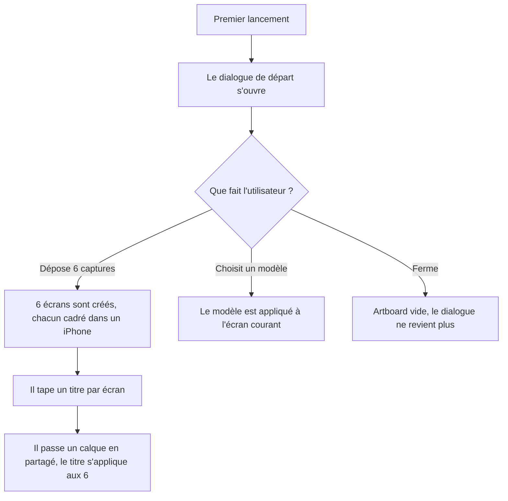

# Instruction: Entrée — première minute, import en lot, le set comme unité

## Architecture projection

> Tree of the final files. ✅ create · ✏️ modify · ❌ delete

```txt
.
├── src/lib/import-screenshots.ts               ✅ N fichiers → N écrans cadrés, dans l'ordre des noms
├── src/components/onboarding/StartDialog.tsx   ✅ premier écran : modèle, import, page blanche
├── src/components/canvas/DropZone.tsx          ✅ cible de dépôt plein stage, avec retour visuel
├── src/App.tsx                                 ✏️ monte le dialogue de départ et la cible de dépôt
├── src/lib/image.ts                            ✏️ lecture de plusieurs fichiers, ordre stable
├── src/lib/layer-factories.ts                  ✏️ fabrique un écran cadré à partir d'une capture
├── src/lib/commands.ts                         ✏️ importer des captures, appliquer à tous les écrans
├── src/stores/project.store.ts                 ✏️ ajout d'écrans en lot, un seul pas d'historique
├── src/stores/ui.store.ts                      ✏️ drapeau de premier lancement, persisté
└── src/components/template-picker/TemplatePicker.tsx ✏️ réemployé comme galerie du dialogue de départ
```

## Wireframe

```txt
┌──────────────────────────────────────────────────────┐
│  (1) Par où commencer ?                          ✕   │
├──────────────────────────────────────────────────────┤
│  ┌────────────────────────────────────────────────┐  │
│  │ (2)  Déposez vos captures ici                  │  │
│  │      ou parcourez vos fichiers                 │  │
│  └────────────────────────────────────────────────┘  │
│                                                      │
│  (3) Modèles                                         │
│  ┌───────┐ ┌───────┐ ┌───────┐ ┌───────┐             │
│  │       │ │       │ │       │ │       │             │
│  │       │ │       │ │       │ │       │             │
│  └───────┘ └───────┘ └───────┘ └───────┘             │
│                                                      │
│                              (4) Page blanche        │
└──────────────────────────────────────────────────────┘
```

1. Titre : une question, pas un slogan. Fermable, jamais bloquant.
2. Zone de dépôt : le chemin le plus court vers un résultat, donc placé en premier.
3. Modèles : aperçus au vrai rendu, assez grands pour être jugés.
4. Sortie de secours : partir d'une page blanche reste à un clic.

## User Journey



## Tasks to do

### `1)` Importer les captures en lot

> C'est le geste pour lequel le produit existe, et il n'est pas implémentable aujourd'hui :
> `handleImageImport` lit `files?.[0]` et l'input ne porte pas `multiple`.

1. Créer `lib/import-screenshots.ts` : à partir d'une liste de fichiers image, produire un
   écran par fichier, chacun contenant un cadre d'appareil dont la capture est le fichier.
2. Trier par nom de fichier avant création : les captures de simulateur sont numérotées, et
   l'ordre du `FileList` ne suit pas l'ordre d'affichage du sélecteur.
3. Le modèle et la couleur d'appareil viennent de `globals`, pas d'un choix par écran.
4. Plafonner à dix écrans, la limite App Store, et le dire quand l'utilisateur en dépose plus.
5. L'import est un seul pas d'annulation, quel que soit le nombre d'écrans créés.
6. Ajouter `multiple` à l'input de `App.tsx` et router vers cette fonction.

### `2)` Accepter le dépôt sur le stage

> Le glisser-déposer n'existe que pour réordonner des calques et des écrans, jamais pour importer.

1. `DropZone` couvre le stage et ne s'active que sur un survol portant des fichiers.
2. Déposer sur un cadre d'appareil renseigne sa capture. Déposer ailleurs sur un artboard
   ajoute un calque image. Déposer hors artboard lance l'import en lot.
3. Le retour visuel nomme ce qui va se passer, il ne se contente pas de surligner la cible.
4. Refuser un type non géré avec un message qui nomme les formats acceptés.

### `3)` Remplacer la page blanche du premier lancement

> Aujourd'hui la première seconde du produit est un artboard blanc et deux panneaux vides.

1. `StartDialog` s'ouvre au premier lancement seulement, sur un drapeau persisté dans
   `ui.store`. Il est fermable au clavier et au clic hors cadre.
2. Trois entrées, dans cet ordre d'efficacité : déposer des captures, partir d'un modèle,
   partir d'une page blanche.
3. Réemployer `TemplatePicker` pour la galerie plutôt que d'écrire une seconde grille.
4. La commande « Recommencer » de la palette ⌘K rouvre le dialogue.
5. Ne jamais enchaîner d'étapes : pas de visite guidée, pas d'écran verrouillé.

### `4)` Rendre le set lisible comme unité

> Le produit livre une planche de dix images cohérentes, mais tout dans l'interface parle
> d'un écran à la fois.

1. Un calque partagé se signale sur le canvas et dans la filmstrip, pas seulement par son
   groupe dans la liste des calques.
2. Modifier un calque partagé déclenche un retour nommant le nombre d'écrans touchés.
3. Ajouter l'action inverse : « appliquer à tous les écrans » sur un calque local, disponible
   au menu contextuel et dans la palette.
4. Ajouter « appliquer ce fond à tous les écrans » : le fond est par écran, et le refaire dix
   fois est le geste répétitif le plus coûteux du produit.
5. Le compteur d'écrans annonce la limite App Store, pas seulement la position courante.

### `5)` Écrire des états vides qui enseignent

> L'état vide des calques est correct. Les autres sont muets.

1. Le panneau Propriétés sans sélection affiche le fond de l'écran, ce qu'il fait déjà, mais
   annonce aussi ce qu'une sélection permettrait.
2. La filmstrip à un seul écran propose d'en ajouter et rappelle la limite de dix.
3. Un cadre d'appareil sans capture le montre sur le canvas et propose le dépôt.
4. Aucun état vide n'est un rectangle sans texte.

## Test acceptance criteria

| Task | Acceptance criteria                                                                                                                                    |
| ---- | ---------------------------------------------------------------------------------------------------------------------------------------------------------- |
| 1    | Déposer six captures crée six écrans cadrés dans l'ordre des noms de fichiers ; une annulation les retire toutes ; déposer douze captures en crée dix et le dit |
| 2    | Déposer une image sur un cadre d'appareil renseigne sa capture sans passer par un panneau ; un fichier non géré affiche les formats acceptés          |
| 3    | Le dialogue de départ s'ouvre au premier lancement et jamais au second ; Échap le ferme et laisse un artboard utilisable                              |
| 4    | Modifier un calque partagé indique combien d'écrans ont changé ; appliquer un fond à tous les écrans est un seul pas d'annulation                     |
| 5    | Aucune zone vide de l'interface n'est dépourvue de texte d'aide ; un appareil sans capture le signale sur le canvas                                   |
