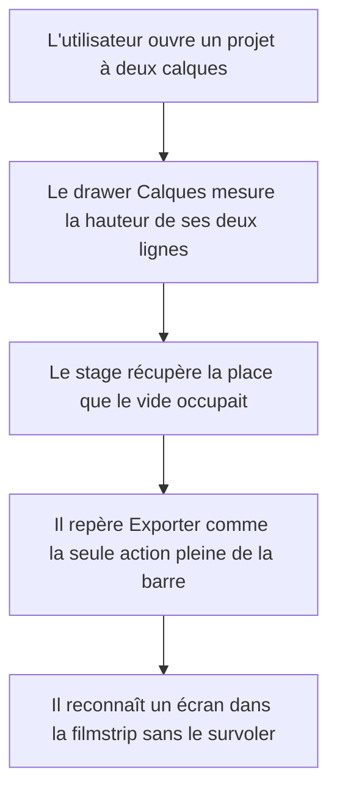

# Instruction: Shell — barre, drawers, filmstrip, zoom

## Architecture projection

> Tree of the final files. ✅ create · ✏️ modify · ❌ delete

```txt
.
├── src/App.tsx                                    ✏️ ordre d'empilement du voile, marges d'îlot
├── src/lib/stage.ts                               ✏️ constantes alignées sur la nouvelle filmstrip
└── src/components/
    ├── toolbar/TopBar.tsx                         ✏️ groupes lisibles, Exporter en primary blanc
    ├── toolbar/ZoomHud.tsx                        ✏️ surface d'îlot permanente
    ├── layers-panel/LayersDrawer.tsx              ✏️ l'îlot épouse son contenu
    ├── properties-panel/PropertiesDrawer.tsx      ✏️ l'îlot épouse son contenu
    ├── screens-bar/ScreensBar.tsx                 ✏️ vignettes lisibles, compteur repositionné
    └── screens-bar/ScreenThumbnail.tsx            ✏️ format agrandi, état actif neutre
```

## Wireframe

```txt
┌──────────────────────────────────────────────────────────────┐
│ (1) Projet ·  état    (2) ↶ ↷ │ T ▭ ⬚ ◻   (3) ◧ ◨ │ ⬚ ⚙ ☾ ⌘K  [Exporter] │
├───────────────┬──────────────────────────────┬───────────────┤
│ (4) Calques   │                              │ (5) Propriétés │
│  ┌─────────┐  │                              │  ┌──────────┐ │
│  │ item    │  │        (6) Stage             │  │ section  │ │
│  │ item    │  │                              │  │ section  │ │
│  └─────────┘  │                              │  └──────────┘ │
└───────────────┤                              ├───────────────┘
                │       (7) ▮ ▯ ▯ +            │      (8) − % + │
                └──────────────────────────────┘
```

1. Identité : nom du projet éditable, état d'enregistrement à sa droite, discret.
2. Groupe historique puis groupe création, séparés par un filet.
3. Groupe affichage puis groupe projet, séparés par un filet ; Exporter détaché à droite.
4. Drawer Calques : l'îlot s'arrête sous son dernier élément, il ne descend pas jusqu'en bas.
5. Drawer Propriétés : même règle, plafonné à la hauteur disponible.
6. Stage : la seule zone que rien ne recouvre au repos.
7. Filmstrip : vignettes assez grandes pour reconnaître un écran, plus le bouton d'ajout.
8. Zoom : îlot au même titre que les autres, plus une surface qui n'apparaît qu'au survol.

## User Journey



## Tasks to do

### `1)` Faire épouser le contenu aux drawers

> C'est le défaut le plus visible : deux îlots pleine hauteur remplis à 15%.

1. `LayersDrawer` : l'îlot passe en hauteur automatique, plafonnée à l'espace libre entre la
   barre du haut et la filmstrip. La liste garde son défilement au-delà du plafond.
2. `PropertiesDrawer` : même règle. À la sélection vide il ne porte que la section
   Arrière-plan, il doit mesurer la hauteur de cette section.
3. Vérifier que le passage d'une hauteur à une autre ne produit pas de saut : la transition
   porte sur la hauteur, donc elle est animée en `max-height` ou non animée, jamais en `height`
   sur un contenu mesuré.
4. Les deux drawers restent superposés au stage : `stage.ts` ne réserve toujours pas leur largeur.

### `2)` Rendre les groupes de la barre lisibles

> Les filets existent mais ne portent pas : dix cibles se lisent comme une seule rangée.

1. Renforcer le filet séparateur d'un cran de luminance et lui donner une hauteur inférieure
   à celle des boutons, pour qu'il sépare sans découper.
2. Porter l'écart intra-groupe à 2px et l'écart inter-groupe à 10px : c'est l'espacement, plus
   que le filet, qui fait lire un groupe.
3. Le bouton Exporter consomme la variante `primary` de la phase 2, blanc plein. Il est la
   seule surface pleine de la barre, donc la seule action qui se lit comme primaire.
4. L'état d'enregistrement passe en casse normale : il est aujourd'hui en capitales trackées
   et se lit comme une alerte alors qu'il informe.

### `3)` Donner une surface au zoom

> Le HUD est transparent au repos, seul élément du shell à ne pas être un îlot.

1. `ZoomHud` reçoit la surface `.island` en permanence, comme la barre et la filmstrip.
2. Conserver le clic sur la valeur pour ajuster aux écrans, et son `title`.
3. Aligner sa hauteur sur celle de la filmstrip pour que les deux îlots bas partagent une ligne de base.

### `4)` Rendre la filmstrip utile

> Une vignette de 34px de large ne permet pas de reconnaître un écran.

1. Agrandir la vignette à une largeur permettant de distinguer une mise en page, en conservant
   le ratio 1320×2868.
2. Déplacer le compteur `1/10` : il est aujourd'hui à gauche des vignettes, dans le même îlot,
   et déséquilibre la rangée. Le poser sous la rangée ou le supprimer si la rangée est
   entièrement visible.
3. L'écran actif se signale par un contour clair et un fond `raised`, jamais par du rouge.
4. Le bouton d'ajout cesse d'être un contour en tirets : il prend la même surface que les
   vignettes, avec une icône centrée.
5. Répercuter la nouvelle hauteur dans `FILMSTRIP_HEIGHT` de `stage.ts`, sans quoi les
   artboards passeront sous la filmstrip au fit.
6. Habiller les repères posés en phase 5 : marque de calque partagé sur la vignette,
   compteur qui annonce la limite de dix. Le comportement vient de la phase 5, cette phase
   ne fait que lui donner sa forme.

### `5)` Corriger l'empilement du voile

> Le voile de vignette et la barre partagent le même niveau z.

1. `App.tsx` pose le voile et la barre à `--z-chrome`. Ils ne se départagent que par l'ordre
   du DOM, ce qui casse à la première réorganisation.
2. Placer le voile sous `--z-chrome`, à un niveau propre entre le canvas et le chrome.

## Test acceptance criteria

| Task | Acceptance criteria                                                                                                                                    |
| ---- | ---------------------------------------------------------------------------------------------------------------------------------------------------------- |
| 1    | Sur un projet à deux calques, le drawer Calques s'arrête sous la deuxième ligne ; sur un projet à trente calques il atteint son plafond et défile      |
| 2    | Les quatre groupes de la barre se distinguent sans lire les icônes ; Exporter est la seule surface pleine                                              |
| 3    | Le HUD de zoom est visible sans survol et partage sa ligne de base avec la filmstrip                                                                   |
| 4    | Deux écrans à mises en page différentes se distinguent dans la filmstrip sans survol ; le fit place les artboards au-dessus de la filmstrip, sans recouvrement |
| 5    | Le voile n'intercepte aucun clic et ne passe jamais devant la barre, quel que soit l'ordre du DOM                                                      |
