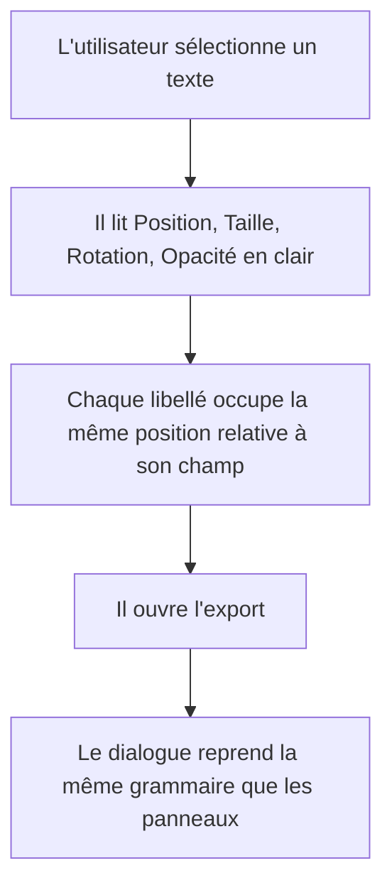

# Instruction: Panneaux, éditeurs et dialogues

## Architecture projection

> Tree of the final files. ✅ create · ✏️ modify · ❌ delete

```txt
.
└── src/components/
    ├── properties-panel/
    │   ├── PropertiesPanel.tsx      ✏️ titres de section, rythme d'espacement, en-tête
    │   ├── TransformSection.tsx     ✏️ paire X/Y et L/H sous un libellé unique, slider d'opacité nommé
    │   ├── TextSection.tsx          ✏️ grammaire de champ unifiée
    │   ├── DeviceSection.tsx        ✏️ grammaire de champ unifiée
    │   ├── ImageSection.tsx         ✏️ grammaire de champ unifiée
    │   ├── ShapeSection.tsx         ✏️ trois libellés capitales à convertir
    │   ├── BackgroundSection.tsx    ✏️ grammaire de champ unifiée
    │   └── ShadowEditor.tsx         ✏️ deux libellés capitales à convertir
    ├── layers-panel/
    │   ├── LayersPanel.tsx          ✏️ en-têtes de groupe, compteur, état vide
    │   └── LayerItem.tsx            ✏️ ligne 28px, actif neutre, icône de type alignée
    ├── background-editor/BackgroundEditor.tsx  ✏️ onglets et grille de préréglages
    ├── color-picker/ColorPicker.tsx            ✏️ damier alpha, couleurs récentes, champ hex
    ├── gradient-editor/GradientEditor.tsx      ✏️ rampe d'arrêts, poignées cohérentes avec le canvas
    ├── device-picker/DevicePicker.tsx          ✏️ pastilles de couleur, aperçu de modèle
    ├── text-editor/TextEditor.tsx              ✏️ grammaire de champ unifiée
    ├── text-editor/FontPicker.tsx              ✏️ aperçu au rendu de la police, liste virtuelle
    ├── export-dialog/ExportDialog.tsx          ✏️ cinq libellés capitales, hiérarchie, état de progression
    ├── template-picker/TemplatePicker.tsx      ✏️ grille d'aperçus, état de survol
    ├── template-picker/TemplatePreview.tsx     ✏️ rendu d'aperçu net
    ├── globals-editor/GlobalsEditor.tsx        ✏️ trois libellés capitales, groupement
    └── ui/
        ├── command-palette.tsx      ✏️ trois libellés capitales, lignes 32px, raccourcis alignés
        ├── shortcuts-overlay.tsx    ✏️ un libellé capitales, tableau en colonnes alignées
        └── toast.tsx                ✏️ élévation, durée, variante d'erreur sur --color-danger
```

## Wireframe

```txt
┌──────────────────────────────────┐
│ (1) Propriétés                   │
├──────────────────────────────────┤
│ (2) [ Cet écran | Partout ]      │
├──────────────────────────────────┤
│ (3) ⌄ Transformation             │
│                                  │
│     Position                     │
│     ┌────────┐ ┌────────┐        │
│     │ 60     │ │ 160    │        │
│     └────────┘ └────────┘        │
│     Taille                       │
│     ┌────────┐ ┌────────┐        │
│     │ 300    │ │ 80     │        │
│     └────────┘ └────────┘        │
│     Rotation      Opacité        │
│     ┌────────┐    ◯──────── 100% │
│     │ 0      │                   │
│     └────────┘                   │
├──────────────────────────────────┤
│ (4) ⌄ Texte                      │
└──────────────────────────────────┘
```

1. En-tête : titre en casse normale, compteur de sélection à droite.
2. Portée du calque : segmented pleine largeur, seule commande hors section.
3. Section repliable : titre en `.section-title`, chevron à gauche.
4. Les champs vont par paires sous un libellé partagé ; l'opacité porte enfin son nom.

## User Journey



## Tasks to do

### `1)` Convertir les 38 usages de libellés capitales

> La phase 1 a supprimé les classes ; les appelants sont visiblement cassés.

1. Remplacer chaque `caps-label` par `.field-label` via le composant `Field`, et chaque
   `caps-label-strong` par `.section-title`.
2. Repasser chaque libellé en casse normale : `COULEUR` devient `Couleur`, `INTERLIGNE`
   devient `Interligne`. Un libellé n'est jamais tronqué en abréviation.
3. Vérifier qu'aucun libellé ne subsiste à l'intérieur d'un champ.

### `2)` Nommer et regrouper les champs de transformation

> `X 60` et `ROT 0` sont des abréviations dans le champ ; le slider d'opacité n'a pas de nom.

1. `TransformSection` : grouper X et Y sous un libellé `Position`, L et H sous `Taille`.
   Les champs n'affichent plus que leur valeur.
2. Donner un libellé au slider d'opacité et afficher sa valeur en `.tabular` à sa droite.
3. Conserver le bouton de verrouillage du ratio entre L et H, et son `aria-label`.
4. Vérifier que les `aria-label` restent ceux que les tests e2e ciblent : `Position X`,
   `Largeur`, `Rotation`. Les tests localisent les champs par ces libellés, pas par position.

### `3)` Donner de la hiérarchie au panneau

> Toutes les lignes ont aujourd'hui le même poids visuel.

1. Rythme d'espacement : 12px entre deux champs d'une même section, 16px entre deux groupes,
   la section porte son padding, pas ses enfants.
2. Les sections repliables gardent leur filet de séparation, mais le filet s'arrête au padding
   pour ne pas couper le panneau de bord à bord.
3. L'en-tête du panneau reste collé en haut au défilement de la liste des sections.

### `4)` Reprendre les éditeurs de couleur et de contenu

> Ce sont les surfaces où l'utilisateur passe le plus de temps.

1. `ColorPicker` : damier alpha derrière la pastille, champ hexadécimal en `.tabular`,
   couleurs récentes sur une rangée de taille fixe.
2. `GradientEditor` : les poignées d'arrêt reprennent la forme et la couleur des poignées de
   sélection du canvas définies en phase 3 — même vocabulaire sur les deux surfaces.
3. `FontPicker` : chaque entrée est rendue dans sa propre police. Sans cela le choix se fait
   à l'aveugle, ce qui est le défaut central d'un outil de mise en page.
4. `DevicePicker` : les pastilles de couleur montrent la vraie couleur de châssis et portent
   un contour visible sur fond clair comme sur fond sombre.

### `5)` Contrôler l'export avant de le lancer

> L'export est le moment où le produit tient ou ne tient pas sa promesse. Aujourd'hui il
> part sans rien vérifier et l'utilisateur découvre le problème dans App Store Connect.

1. Afficher un récapitulatif avant l'action : nombre d'écrans, dimensions cibles, poids estimé.
2. Signaler ce qui va poser problème, sans bloquer : un écran vide, un cadre d'appareil sans
   capture, un texte qui déborde de son artboard, plus de dix écrans pour une dimension.
3. Chaque signalement pointe l'écran concerné et permet d'y aller.
4. Le bouton reste actionnable malgré les avertissements : c'est l'utilisateur qui décide.
5. Pendant l'export, nommer le fichier en cours d'écriture plutôt qu'afficher une barre muette.

### `6)` Reprendre les dialogues

> Ils partagent aujourd'hui le shell mais pas la grammaire interne.

1. `ExportDialog` : hiérarchie explicite entre le choix des dimensions, les options et
   l'action ; une seule action primaire ; la progression désactive le bouton et l'indique.
2. `TemplatePicker` : grille d'aperçus lisibles, état de survol, état sélectionné neutre.
3. `GlobalsEditor` : regrouper les réglages par nature plutôt qu'en une liste plate.
4. `CommandPalette` : lignes à 32px, raccourcis alignés à droite en colonne, groupes nommés
   en casse normale.
5. `ShortcutsOverlay` : les raccourcis alignés en colonnes, les touches en `Kbd`.
6. `toast` : la variante d'erreur consomme `--color-danger` sur la bordure et l'icône,
   jamais en fond plein.

## Test acceptance criteria

| Task | Acceptance criteria                                                                                                                                       |
| ---- | ------------------------------------------------------------------------------------------------------------------------------------------------------------- |
| 1    | `grep -r "caps-label" src/` ne renvoie plus rien ; aucun libellé de l'interface n'est en capitales                                                       |
| 2    | Les champs de transformation affichent leur seule valeur sous un libellé partagé ; le slider d'opacité porte un nom ; la suite e2e des transformations passe sans modification des sélecteurs |
| 3    | Deux champs d'une même section sont plus proches l'un de l'autre que de la section suivante ; l'en-tête reste visible au défilement                      |
| 4    | Une entrée du sélecteur de police est rendue dans sa police ; une couleur semi-transparente laisse voir le damier ; les poignées du dégradé ont la même forme que celles du canvas |
| 5    | Un projet contenant un cadre sans capture est signalé avant l'export, le signalement mène à l'écran concerné, et l'export reste lançable                 |
| 6    | Chaque dialogue a une seule action primaire ; l'export en cours refuse un second clic et nomme le fichier en cours d'écriture                            |
