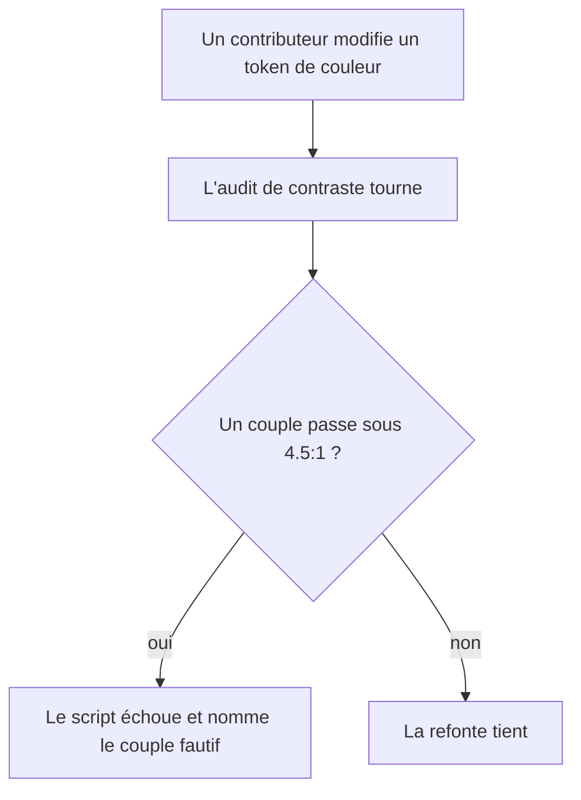

# Instruction: Vérification & garde-fous

## Architecture projection

> Tree of the final files. ✅ create · ✏️ modify · ❌ delete

```txt
.
├── scripts/
│   ├── contrast-audit.mjs   ✅ échoue si un couple texte/fond d'un thème passe sous 4.5:1
│   ├── visual-probe.mjs     ✏️ capture les deux thèmes, vide et peuplé, en densité 2
│   └── font-probe.mjs       ❌ sonde le chargement de Geist, qui n'existe plus
├── CLAUDE.md                ✏️ section « Design language » figée en v2 : Archivo, Chivo Mono, capitales
├── AGENTS.md                ✏️ section « Design language » figée en v3 : Geist, rouge d'export
└── e2e/                     ✏️ seulement si un sélecteur a bougé — aucun n'est censé bouger
```

## User Journey



## Tasks to do

### `1)` Poser l'audit de contraste

> Le seul garde-fou automatisable de cette refonte. Sans lui, la rampe dérivera à nouveau.

1. Écrire `scripts/contrast-audit.mjs` : il lit les tokens des deux thèmes depuis
   `src/index.css`, calcule le ratio WCAG de chaque couple texte/fond réellement employé,
   et sort en code non nul en nommant tout couple sous 4.5:1.
2. Couvrir au minimum : `foreground`, `foreground-muted` et `faint` sur `stage`, `background`,
   `panel`, `inset` et `raised`, dans les deux thèmes.
3. L'exposer en `npm run audit:contrast`. Pas de framework, pas de fixture.

### `2)` Reprendre la sonde visuelle

> Elle ne capture aujourd'hui qu'un thème, une fois, en densité 1.

1. `visual-probe.mjs` capture les quatre états : sombre vide, sombre peuplé, clair vide,
   clair peuplé, en 1600×1000 densité 2.
2. Elle vide `localStorage` avant chaque capture, sans quoi la seconde passe hérite du projet
   de la première.
3. Supprimer `scripts/font-probe.mjs` : il vérifie le chargement de Geist, remplacé en phase 1.

### `3)` Vérifier la non-régression

> La refonte ne touche pas le chemin critique, il faut le prouver plutôt que le supposer.

1. `npm run typecheck` et `npm run lint` passent.
2. `npm run test:e2e` passe. Les specs localisent les champs par `aria-label` français, que la
   refonte conserve ; toute rupture signale un libellé changé par erreur.
3. `e2e/export.spec.ts` reste vert : le ZIP exporté est toujours en 1320×2868, PNG-24 opaque.
   Le rendu d'export passe par un `StaticCanvas` distinct, donc aucune modification de chrome
   ne peut l'atteindre — le test confirme cette isolation.
4. Couvrir les trois flux ajoutés en phases 4 et 5, qui n'ont aujourd'hui aucun test :
   l'import en lot crée le bon nombre d'écrans dans le bon ordre, l'accroche pose un calque
   au centre exact de l'artboard, le dialogue de départ ne s'ouvre qu'au premier lancement.

### `4)` Remettre la documentation au niveau du code

> `CLAUDE.md` décrit encore la v2. C'est ce décalage qui a laissé la dérive s'installer.

1. `CLAUDE.md`, section « Design language » : elle annonce Archivo, Chivo Mono et des labels
   en capitales 10px, tous supprimés depuis deux refontes. La réécrire en v4.
2. `AGENTS.md`, même section : elle est en v3 et mentionne le rouge d'export, supprimé en
   phase 1. La réécrire en v4, identique à celle de `CLAUDE.md`.
3. Renuméroter la section en « Design language (v4) » dans les deux fichiers.

### `5)` Relire le résultat

> Une refonte se juge à l'œil, pas au diff.

1. Comparer les quatre captures aux captures d'avant refonte.
2. Vérifier point par point les quatre défauts du diagnostic : le mockup a ses pièces,
   l'artboard n'est plus rouge, les surfaces se distinguent, plus aucune capitale.
3. Refaire le parcours complet chronométré, d'un dossier de six captures de simulateur au
   ZIP validé, sans documentation et sans toucher au code. C'est la mesure qui compte : si
   ce parcours reste long ou hésitant, la refonte UX a échoué quelle que soit son apparence.
4. Consigner ce qui reste ouvert plutôt que de le laisser implicite.

## Test acceptance criteria

| Task | Acceptance criteria                                                                                                                 |
| ---- | --------------------------------------------------------------------------------------------------------------------------------------- |
| 1    | `npm run audit:contrast` sort en 0 sur la rampe livrée, et en non-zéro en nommant le couple fautif si on assombrit un texte à dessein |
| 2    | La sonde produit quatre captures distinctes ; la capture « vide » ne contient aucun calque hérité de la passe précédente             |
| 3    | Typecheck, lint et suite e2e passent ; le ZIP exporté est toujours en 1320×2868 PNG-24 opaque ; les trois flux ajoutés sont couverts |
| 4    | Ni `CLAUDE.md` ni `AGENTS.md` ne mentionnent Archivo, Chivo Mono, Geist ou le rouge d'export                                         |
| 5    | Les quatre défauts du diagnostic sont vérifiés sur les captures ; le parcours de six captures au ZIP est exécuté de bout en bout sans documentation, et sa durée est consignée |

## Reste ouvert

| Point                                                                | État                                                                                                                                         |
| -------------------------------------------------------------------- | -------------------------------------------------------------------------------------------------------------------------------------------- |
| Critère 3.4 — couverture des flux de la phase 5                      | Sans objet pour l'instant : la phase 5 est `pending`, donc ni l'import en lot ni le dialogue de premier lancement n'existent. Seul le flux de la phase 4 (accroche, repères, barre contextuelle) est couvert, par `assert-p4` |
| Critère 5.3 — parcours chronométré de six captures au ZIP            | Non exécuté : il demande un opérateur humain, non un automate. La chaîne équivalente (créer, importer, éditer, partager, exporter le ZIP) est couverte de bout en bout par la sonde `e2e.mjs`, PNG mesurés à 1320×2868 |
| Décision « monochrome intégral » de la phase 1                       | Renversée en v5 : un accent citron unique est introduit, réservé à l'état (écran courant, calque sélectionné, focus). L'action reste neutre, l'artboard reste neutre. Voir la ligne ajoutée aux `Decisions` du plan |
