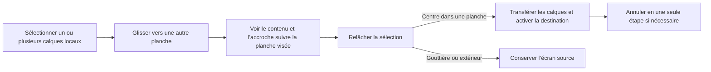

# Instruction: Transfert inter-écrans par glisser-déposer

## Architecture projection

> Tree of the final files. ✅ create · ✏️ modify · ❌ delete

```txt
.
├── e2e
│   ├── canvas-transforms.spec.ts            ✏️ transfert, stabilité et historique
│   └── helpers.ts                            ✏️ centre d’une planche en pixels page
└── src
    └── hooks
        └── use-canvas.ts                     ✏️ ciblage et commit inter-écrans
```

> `canvas-utils.ts` reste inchangé : `ensureScreenClipPath` réinstalle déjà les
> deux enveloppes quand l’indice change, et `clipContentToScreen` relit le
> `render` du prototype — réappeler l’aide ne superpose donc aucun écrêtage.

## User Journey



## Tasks to do

### `1)` Cibler la planche pendant le drag

> Faire suivre l’aperçu et l’accroche à l’écran réellement visé.

1. Déduire l’indice cible du centre en coordonnées scène pendant `object:moving`, **avant** la sortie anticipée réservée aux `ActiveSelection` : une multi-sélection est justement le cas à couvrir, et le centre du groupe est la seule référence commune à ses membres.
2. Mémoriser l’indice source de chaque membre local au premier mouvement du geste, puis, à chaque changement de planche, écrire le nouvel indice dans `data.screenIndex` et réappeler `ensureScreenClipPath` — le contenu et les poignées se réécrêtent alors sur la planche visée.
3. Invalider les cibles d’accroche du geste au changement de planche : `collectSnapTargets` les lit sur `data.screenIndex`, elles doivent donc être recalculées après l’écriture, pas avant.
4. Laisser les membres `layout` sur leur planche partagée.
5. Au relâchement sans planche sous le centre — gouttière ou extérieur —, restaurer l’indice source, `data.screenIndex` compris : un dépôt qui reste dans son écran ne passe que par la synchronisation en patch, qui ne réécrit jamais `data`, et laisserait sinon l’écrêtage réglé sur la mauvaise planche.

### `2)` Persister le changement de propriétaire

> Déplacer les données du calque de l’écran source vers l’écran cible sans saut visuel.

1. Dans `object:modified`, résoudre l’écran de destination **avant** de choisir le grain de l’historique : le classement actuel se déduit de `data.screenId` et de `data.layout`, qui ne savent rien du transfert.
2. Enregistrer un snapshot projet dès qu’un transfert est en jeu. Un snapshot d’écran restaurerait la source en laissant la copie dans la destination, soit un calque dupliqué après annulation.
3. Convertir la position scène avec l’offset de destination, retirer les calques des sources et les ajouter au sommet des destinations en conservant leur ordre relatif.
4. Commiter dans cet ordre : mutation du projet, puis `selectionFromCanvas` levé, puis activation de l’écran de destination, puis re-sélection des identifiants transférés.
   - Le drapeau est ce qui empêche l’abonnement de recadrage de rezoomer le stage sur la seule planche d’arrivée : sans lui, un dépôt téléporte la vue.
   - `setActiveScreenId` vide la sélection : la re-sélection vient après, jamais avant.
5. Laisser la réconciliation complète reconstruire l’appartenance Fabric — deux écrans modifiés et un écran actif changé la déclenchent déjà — et garder inchangé le chemin rapide des transformations qui restent dans leur écran.

### `3)` Verrouiller le comportement par E2E

> Couvrir le transfert réel et ses régressions critiques avec le navigateur.

1. Ajouter à `helpers.ts` le centre d’une planche en pixels page, sur le modèle de `activeCenter` : la distance à parcourir dépend du zoom ajusté et ne peut pas être écrite en dur.
2. Ajouter un scénario à deux écrans qui glisse un calque, vérifie son unique écran propriétaire, sa position locale, la sélection active, la stabilité du zoom et l’annulation en une étape.
3. Couvrir une multi-sélection locale et un dépôt hors planche.
4. Rejouer les transformations et les calques partagés existants pour exclure dérive, double écrêtage et changement de portée.

## Test acceptance criteria

| Task | Acceptance criteria |
| ---- | ------------------- |
| 1 | Pendant le drag, le calque visible et les guides suivent la planche sous le centre de la sélection sans apparaître dans la gouttière comme contenu final. |
| 1 | Un calque partagé continue de représenter un seul calque `layout` sur toutes les planches. |
| 2 | Après relâchement dans une autre planche, chaque calque local transféré est absent de la source, présent une seule fois dans la destination et ne saute pas après synchronisation. |
| 2 | La destination devient active, la sélection transférée reste sélectionnée et une seule annulation restaure l’état projet antérieur. |
| 2 | Le zoom et le cadrage du stage sont inchangés après le dépôt : activer la destination ne recadre pas la vue. |
| 2 | Un relâchement dont le centre est dans une gouttière ou hors planche conserve l’écran propriétaire d’origine, et un déplacement suivant dans cet écran reste correctement écrêté. |
| 3 | Les scénarios E2E de transformation, de transfert et de calques partagés réussissent ensemble. |
