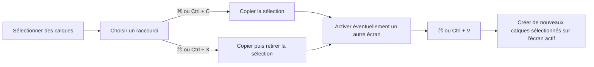

# Instruction: Couper, copier et coller au clavier

## Architecture projection

> Tree of the final files. ✅ create · ✏️ modify · ❌ delete

```txt
.
├── e2e
│   └── layers-panel.spec.ts                 ✏️ scénarios Meta et Control C/X/V
└── src
    ├── components
    │   └── ui
    │       └── shortcuts-overlay.tsx        ✏️ aide C/X/V macOS et Windows
    └── hooks
        └── use-keyboard.ts                  ✏️ coupe et presse-papiers de calques
```

## User Journey



## Tasks to do

### `1)` Compléter le presse-papiers de calques

> Ajouter la coupe sans dupliquer l’infrastructure déjà présente.

1. Réutiliser le presse-papiers en mémoire et la détection commune `metaKey || ctrlKey` de `use-keyboard.ts` : copier et coller existent déjà et fonctionnent sur les deux modificateurs, seule la coupe manque.
2. Sur X, copier puis réutiliser la branche de suppression existante — un seul `setLayers`, donc un seul instantané projet — et vider la sélection active.
3. Vérifier que C, X et V restent natifs pendant l’édition : Fabric v7 accroche son `textarea` caché au `body`, que la garde existante écarte déjà par son nom de balise. Aucun code à ajouter, une assertion à écrire.

### `2)` Aligner l’aide des raccourcis

> Rendre le trio C/X/V découvrable.

1. Étendre l’entrée copier/coller en copier/couper/coller.
2. Conserver la convention de glyphes ⌘ de l’aide : c’est celle des quatorze autres lignes, et une seule ligne portant « Ctrl » s’y lirait comme un défaut. Afficher les deux modificateurs reste possible, mais c’est alors un changement global de l’aide — hors de cette tâche.

### `3)` Vérifier les deux plateformes et l’historique

> Prouver les comportements utilisateur, y compris entre deux écrans.

1. Tester Meta+C puis Meta+V avec de nouveaux identifiants et une sélection mise à jour.
2. Tester Control+X, le retrait immédiat, puis Control+V sur l’écran actif, y compris après changement d’écran.
3. Vérifier qu’une annulation restaure une coupe et que les raccourcis restent natifs pendant l’édition de texte.
4. Exécuter le typecheck, le lint et les E2E concernés.

## Test acceptance criteria

| Task | Acceptance criteria |
| ---- | ------------------- |
| 1 | ⌘C/⌘V et Ctrl+C/Ctrl+V créent des copies distinctes de tous les calques sélectionnés sur l’écran actif. |
| 1 | ⌘X et Ctrl+X placent la sélection dans le presse-papiers puis la retirent du projet en une seule étape annulable. |
| 1 | Les calques collés conservent leur contenu, leurs références d’assets et leur portée, avec de nouveaux identifiants et un ordre de plan valide. |
| 1 | Dans un champ ou pendant l’édition de texte Fabric, C/X/V agissent sur le texte et ne modifient aucun calque. |
| 2 | L’aide des raccourcis présente copier, couper et coller. |
| 3 | Les scénarios E2E Meta/Control, inter-écrans et d’annulation réussissent avec le typecheck et le lint. |
