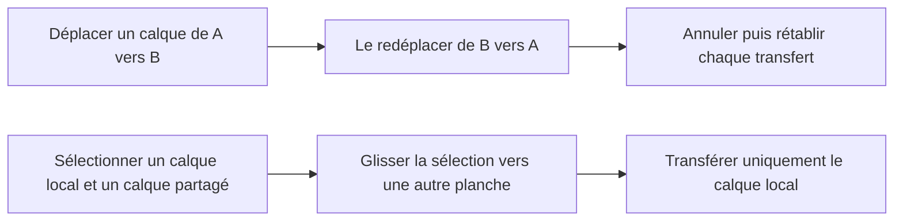

# Instruction: Isoler et verrouiller le transfert

## Architecture projection

> Tree of the final files. ✅ create · ✏️ modify · ❌ delete

```txt
.
├── e2e
│   └── canvas-transforms.spec.ts       ✏️ transferts répétés, undo/redo et sélection mixte
└── src
    ├── hooks
    │   └── use-canvas.ts               ✏️ orchestration Fabric allégée
    └── lib
        └── layer-transfer.ts            ✅ calcul pur du prochain état projet
```

## User Journey



## Tasks to do

### `1)` Isoler le calcul du transfert

> Sortir la mutation multi-écrans du callback Fabric sans modifier son comportement.

1. Définir dans `layer-transfer.ts` l’entrée sérialisable d’un transfert local et une fonction pure qui retire les calques des sources, applique les positions locales, ajoute les calques au sommet des destinations dans leur ordre relatif et applique les mises à jour `layout`.
2. Retourner le prochain tableau d’écrans, les calques partagés et l’écran de destination sans muter le projet ni les entrées.
3. Remplacer le bloc équivalent de `object:modified` par cet appel ; conserver dans le hook la résolution Fabric, le choix du grain d’historique, le commit Zustand, l’activation de destination et la resélection.
4. Ne modifier ni la règle du centre de sélection, ni la restauration en gouttière, ni le chemin rapide des transformations internes à une planche.

### `2)` Verrouiller les enchaînements à risque

> Couvrir les états transitoires que les scénarios actuels ne rejouent pas.

1. Ajouter un scénario A → B → A qui vérifie après chaque dépôt le propriétaire unique, la sélection, la cohérence position stockée/rendue et l’absence de recadrage.
2. Dans ce scénario, annuler puis rétablir le second transfert et vérifier que chaque opération restaure exactement l’écran propriétaire attendu.
3. Ajouter un scénario avec un calque local et un calque `layout` sélectionnés ensemble : le local rejoint la destination, le partagé reste une seule entrée `layout` et n’est ajouté à aucun écran local.
4. Rejouer les scénarios existants de transfert simple, multi-sélection et gouttière avec le typecheck et le lint.

## Test acceptance criteria

| Task | Acceptance criteria |
| ---- | ------------------- |
| 1 | Le calcul du prochain état de transfert est indépendant de Fabric, ne mute ni le projet ni ses entrées, et conserve l’ordre relatif des calques déplacés au sommet de la destination. |
| 1 | Les transferts simple, multiple et en gouttière conservent leur comportement après extraction, y compris l’unique snapshot projet et la stabilité du viewport. |
| 2 | Un calque transféré de A vers B puis de B vers A reste présent une seule fois, sélectionné, aligné avec sa position stockée et sans changement de viewport après chaque dépôt. |
| 2 | Une annulation puis un rétablissement du second transfert restaurent successivement et exactement les propriétaires B puis A. |
| 2 | Lors du déplacement d’une sélection mixte, le calque local rejoint la destination tandis que le calque partagé reste une seule entrée `layout` et n’apparaît dans aucune liste locale. |
| 2 | Le typecheck, le lint et les E2E de transformation et de calques partagés réussissent ensemble. |
