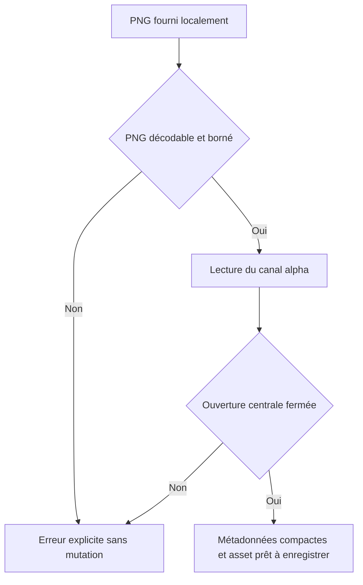

# Instruction: Contrat local et preuve de faisabilité

## Architecture projection

> Tree of the final files. ✅ create · ✏️ modify · ❌ delete

```txt
.
├── PRD.md                                      ✏️ remplacer la décision « SVG bundlés » par l’import local des PNG Apple
├── src/
│   ├── types/
│   │   └── index.ts                            ✏️ ajouter les métadonnées compactes du bezel importé au calque appareil
│   └── lib/
│       ├── device-bezel.ts                     ✅ valider le PNG et détecter son ouverture écran transparente
│       └── storage.ts                          ✏️ normaliser les nouvelles métadonnées au chargement sans migration de DB
└── e2e/
    ├── device-bezel-fixture.ts                 ✅ générer en mémoire des PNG de test déterministes, sans asset Apple
    └── device-bezel-analysis.spec.ts           ✅ prouver l’analyse, les rejets et la compatibilité des anciens projets
```

## User Journey



## Tasks to do

### `1)` Écrire d’abord les fixtures et les tests rouges

> Éprouver l’hypothèse technique sans dépendre d’un fichier Apple commitable.

1. Créer un générateur de PNG RGBA minuscule avec l’encodeur `fast-png` déjà installé.
2. Générer à la volée quatre cas : anneau opaque avec ouverture centrale fermée, image entièrement opaque, anneau ouvert reliant l’écran au fond extérieur, octets PNG corrompus.
3. Donner au cas valide des dimensions et une boîte écran non symétriques et exactes pour détecter les erreurs d’axe, de largeur et de hauteur.
4. Tester le module par le navigateur Chromium/Vite existant, sans snapshot, requête réseau, délai fixe ni nouveau runner.
5. Vérifier que l’analyse valide renvoie exactement les dimensions naturelles et la boîte écran attendues.
6. Vérifier que chaque cas invalide renvoie une erreur de domaine stable et ne produit aucune métadonnée exploitable.
7. Ajouter un cas de normalisation d’un ancien calque sans bezel et d’un calque contenant des coordonnées non finies ou hors image.

### `2)` Définir le contrat de données minimal

> Stocker assez de géométrie pour rendre le PNG, jamais son payload dans l’historique.

1. Ajouter un type `ImportedDeviceBezel` contenant `assetId`, nom de fichier, largeur et hauteur naturelles, puis la boîte écran en pixels naturels.
2. Ajouter `importedBezel?: ImportedDeviceBezel` à `DeviceFrameLayer` ; conserver `deviceModel`, `deviceColor` et `orientation` pour le rendu généré et les anciens projets.
3. Documenter dans le type que `orientation` ne s'applique qu'au cadre généré : `orientedDeviceSvg` fait pivoter le SVG portrait de 90° pour le paysage, et Apple interdit la rotation de son artwork. Un bezel importé se rend donc toujours tel quel.
4. N’enregistrer ni data URL, ni pixels, ni copie du fichier dans le calque.
5. Ne pas ajouter de catalogue global, de table IndexedDB ou de version de schéma.

### `3)` Valider et analyser un Product Bezel

> Accepter uniquement un overlay PNG raisonnable dont le centre transparent est séparé du fond extérieur.

1. Refuser avant décodage tout format non PNG, tout fichier au-delà de 32 Mio et toute image au-delà de 40 mégapixels. Les deux bornes sont nommées dans le module, pas laissées au jugement de l’appelant : le parcours d’alpha alloue un `Uint8Array` d’un octet par pixel et la borne haute est ce qui le garde sous la centaine de mégaoctets.
2. Lire le fichier une fois, le décoder et extraire son canal alpha via un canvas hors écran.
3. Partir du pixel central et parcourir uniquement sa composante transparente ; un seuil alpha documenté absorbe l’anticrénelage du bord.
4. Rejeter si le centre n’est pas transparent, si la composante touche un bord de l’image ou si sa boîte est vide/invraisemblable.
5. Retourner la data URL et les métadonnées détectées, mais laisser l’appelant enregistrer l’asset seulement après succès afin qu’un import invalide ne salisse pas le registre.
6. Garder l’algorithme linéaire, itératif et borné par les limites d’entrée ; aucune reconnaissance de modèle ou de nom de fichier.

### `4)` Protéger le chargement et la rétrocompatibilité

> Un projet ancien ou altéré doit continuer à ouvrir son cadre généré.

1. Dans `normalizeLayer`, conserver un `importedBezel` seulement si tous ses nombres sont finis, positifs et si la boîte écran tient dans les dimensions naturelles.
2. Forcer `orientation` à `portrait` sur un calque qui porte un `importedBezel` valide, y compris pour un projet enregistré avant cette phase : sans cela le renderer applique sa branche paysage à l’artwork Apple.
3. Retirer uniquement les métadonnées invalides ; ne pas supprimer le calque appareil ni son screenshot.
4. Laisser l’absence de `importedBezel` sélectionner implicitement le rendu généré actuel.

### `5)` Aligner la spécification produit

> La documentation ne doit plus demander de redistribuer des SVG d’iPhone présentés comme officiels.

1. Corriger les passages du PRD qui imposent des SVG bundlés pour les mockups officiels.
2. Documenter le cadre généré comme fallback intégré et le PNG Apple comme option importée localement.
3. Noter explicitement qu’aucun fichier Apple ne doit être commité ou servi par ScreenForge.

## Test acceptance criteria

| Task | Acceptance criteria |
| ---- | ------------------- |
| 1 | Le PNG valide synthétique restitue exactement ses dimensions et sa boîte écran ; les trois cas invalides sont refusés sans snapshot, réseau ni attente temporelle |
| 2 | La sérialisation JSON du calque ne contient qu’un identifiant d’asset et des nombres courts ; aucune chaîne `data:image` n’apparaît dans `importedBezel` |
| 3 | Une ouverture centrale fermée est distinguée du fond extérieur transparent ; une ouverture reliée au bord est refusée ; un fichier trop grand est refusé avant allocation du buffer de pixels |
| 4 | Un projet v2 sans le nouveau champ se normalise à l’identique ; des métadonnées corrompues retombent sur le cadre généré sans perdre le calque ou sa capture ; un calque paysage porteur d’un bezel valide ressort en `portrait` |
| 5 | Le PRD décrit l’import local et ne demande plus de bundler un artwork Apple ; aucun nouveau `.png`, `.psd` ou `.dmg` Apple n’existe dans le dépôt |
