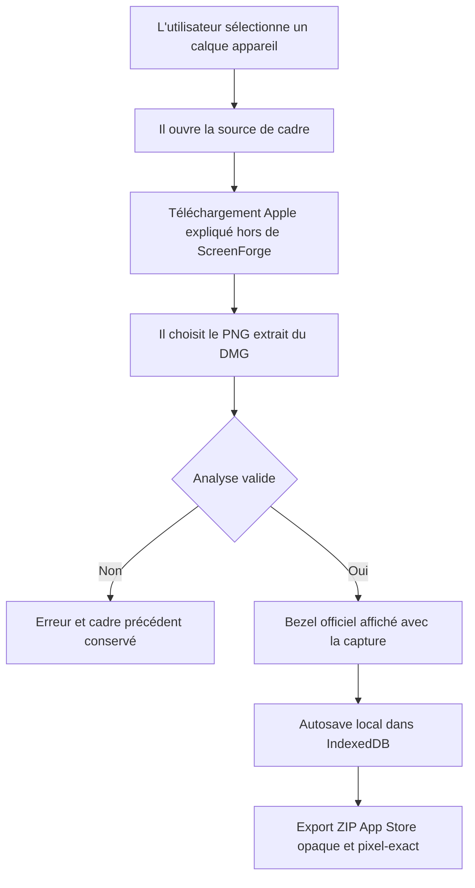

# Instruction: Intégration éditeur, persistance et export

## Architecture projection

> Tree of the final files. ✅ create · ✏️ modify · ❌ delete

```txt
.
├── src/
│   └── components/
│       ├── device-picker/
│       │   └── DevicePicker.tsx                 ✏️ importer, remplacer ou retirer le PNG officiel depuis le panneau existant
│       ├── canvas/
│       │   ├── canvas-utils.ts                  ✏️ composer capture + overlay officiel et verrouiller son rendu conforme
│       │   └── SelectionToolbar.tsx             ✏️ remplacer les couleurs générées par l’identité du fichier importé
│       └── properties-panel/
│           └── TransformSection.tsx             ✏️ préserver le ratio naturel et neutraliser les transformations interdites
└── e2e/
    ├── device-bezel-import.spec.ts              ✅ couvrir l’UI, les erreurs, le rendu et le rechargement IndexedDB
    └── export.spec.ts                            ✏️ échantillonner l’export avec bezel officiel synthétique
```

## User Journey



## Wireframe

```txt
┌────────────────────────────────────────────────────────────┐
│ (1) Planche de travail                         (2) Propriétés │
│                                                ┌─────────────┤
│                                                │ Appareil    │
│                                                │             │
│                                                │ (3) Source  │
│                                                │ [cadre local]│
│                                                │ [lien aide] │
│                                                │             │
│                                                │ (4) Fichier │
│                                                │ [aperçu nom]│
│                                                │ [actions]   │
│                                                │             │
│                                                │ (5) Capture │
│                                                │ [aperçu]    │
│                                                │             │
│                                                │ (6) Options │
│                                                │ [contrôles] │
│                                                └─────────────┘
└────────────────────────────────────────────────────────────┘
```

1. Planche : conserve le contexte et l’aperçu du mockup.
2. Propriétés : réutilise le drawer existant.
3. Source : distingue le cadre ScreenForge du bezel officiel fourni localement.
4. Fichier : expose le PNG sélectionné et les actions de remplacement/retrait.
5. Capture : conserve l’import de l’écran de l’app.
6. Options : n’affiche que les réglages compatibles avec la source choisie.

## Tasks to do

### `1)` Écrire les scénarios UI et export avant le branchement

> Faire échouer les parcours publics, puis implémenter uniquement ce qu’ils exigent.

1. Réutiliser les fixtures synthétiques de phase 1 via de vrais inputs fichier repérés par leurs labels français.
2. Tester l’import réussi, le remplacement invalide qui conserve l’ancien bezel, le retrait qui restaure le cadre généré et la réimportation du même payload dédupliqué.
3. Tester qu’un bezel importé et sa capture survivent à l’état `Enregistré` puis à un rechargement complet de la page.
4. Tester le ratio après modification de largeur et de hauteur ; éviter les coordonnées visuelles et les délais arbitraires.
5. Étendre le test d’export avec des aplats francs et lire les pixels bien à l’intérieur des zones : capture, tranche opaque, coin extérieur transparent et fond de planche.
6. Ajouter un scénario contractuel ignoré par défaut, activé par `APPLE_BEZEL_PATH`, qui importe un vrai PNG Apple depuis son emplacement local sans le copier dans le dépôt.

### `2)` Ajouter l’import au panneau Appareil existant

> Un seul bloc compact dans `DevicePicker`, pas de nouveau dialogue ni de catalogue.

1. Ajouter un choix de source entre le cadre ScreenForge et un bezel officiel local.
2. Fournir un lien vers la page Apple Product Bezels et une instruction courte « DMG → PNG » ; ScreenForge ne télécharge rien lui-même.
3. Ajouter un input PNG accessible permettant l’import, le remplacement et le retrait.
4. Pendant l’analyse, désactiver l’action et montrer l’état de chargement avec les primitives existantes.
5. En cas de succès, enregistrer la data URL dans `lib/assets`, attacher les métadonnées au calque, conserver son grand côté actuel, recalculer l’autre côté au ratio naturel, puis remettre rotation à 0, opacité à 1, ombre à false et `orientation` à `portrait`. L’orientation est dans cette liste pour la même raison que la rotation : le renderer la traduit en une rotation de 90° de l’artwork.
6. En cas d’échec, afficher une erreur `role="alert"` et ne modifier ni l’asset courant, ni le calque, ni l’historique.
7. En mode importé, masquer modèle, couleur et orientation ; afficher le nom du fichier, remplacer, retirer, la capture et la note de conformité.
8. Conserver le parcours actuel inchangé en mode généré.

### `3)` Composer le bezel officiel dans le renderer partagé

> Une seule branche de rendu sert l’éditeur, les miniatures et l’export StaticCanvas.

1. Dans `orientedDeviceSvg`, choisir le chemin importé lorsque les métadonnées et les deux assets sont résolubles ; sinon garder le SVG généré.
2. Retourner depuis cette branche **avant** le bloc de rotation paysage. C’est le point unique où l’interdiction de rotation devient effective côté rendu : la branche existante réécrit le contenu par `(x, y) → (height - y, x)` et s’appliquerait telle quelle au PNG Apple.
3. Construire un SVG transitoire aux dimensions naturelles : capture placée avec `preserveAspectRatio="xMidYMid slice"` dans la boîte écran, puis PNG officiel superposé sans modification.
4. Ne pas ajouter de `clipPath` Fabric ni de cache objet ; l’ouverture transparente du PNG officiel masque la capture et respecte les règles de netteté existantes.
5. Inclure l’identifiant du bezel dans `resourceKey` afin qu’un remplacement recrée exactement l’objet nécessaire et révoque l’ancienne object URL.
6. Si l’asset manque après chargement, retomber sur le cadre généré et rendre l’erreur récupérable depuis le panneau au lieu de casser le canvas.

### `4)` Appliquer les contraintes du mode officiel

> Garder l’artwork intact tout en autorisant placement et mise à l’échelle uniforme.

1. Dans `TransformSection`, calculer le ratio depuis les dimensions naturelles lorsqu’un bezel est importé.
2. Désactiver rotation et opacité pour ce mode ; masquer la poignée de rotation et verrouiller la rotation Fabric.
3. Poser `lockUniScaling` sur l’objet Fabric du bezel importé. `applySelectionStyle` masque déjà les poignées d’arête sur un calque appareil, mais `uniformScaling` du canevas s’inverse à la touche Maj : sans verrou, une poignée de coin plus Maj déforme l’artwork.
4. Ne pas proposer d’ombre sur un bezel officiel et ignorer tout ancien réglage d’ombre pendant son rendu.
5. Laisser position, taille uniforme, visibilité, verrouillage et portée du calque fonctionner comme aujourd’hui.
6. Dans `SelectionToolbar`, afficher le nom du fichier et l’action de capture, sans swatches de couleur qui n’ont aucun effet sur le PNG.
7. Afficher la règle Apple « utiliser tel quel » sans prétendre empêcher automatiquement qu’un autre calque recouvre le téléphone ou qu’il sorte de la planche.

### `5)` Valider la persistance et la sortie App Store

> Le succès n’est acquis que si le même asset revient après reload et dans le ZIP final.

1. Attendre le statut accessible `Enregistré`, recharger la page et vérifier que le renderer utilise encore les identifiants du bezel et de la capture.
2. Exporter la fixture en 1320×2868 et décoder le PNG avec `fast-png` déjà installé.
3. Vérifier les pixels intérieurs attendus avec une tolérance nulle sur les aplats ; ne jamais échantillonner les bords anticrénelés.
4. Conserver les assertions existantes : un fichier, chemin ZIP valide, profondeur 8 bits, RGB opaque et dimensions exactes.
5. Exécuter ensuite le scénario `APPLE_BEZEL_PATH` avec au moins un PNG actuel extrait du DMG Apple avant de déclarer la phase acceptée.
6. Terminer par `pnpm typecheck`, `pnpm lint`, les trois specs ciblées, `pnpm build`, `pnpm validate:export` et `pnpm audit:contrast`. `validate:export` est la porte qui compte ici : la fonctionnalité ne vaut que si la planche sort aux dimensions exactes.

## Test acceptance criteria

| Task | Acceptance criteria |
| ---- | ------------------- |
| 1 | Les tests utilisent uniquement des PNG générés en mémoire en CI ; aucun screenshot visuel, appel réseau, sélecteur positionnel ou `waitForTimeout` n’est nécessaire au nouveau parcours |
| 2 | Un PNG valide remplace visiblement le cadre, un remplacement invalide conserve l’ancien, retirer restaure les contrôles générés, et la même erreur est annoncée aux technologies d’assistance |
| 3 | La capture apparaît au centre transparent, le bezel reste au-dessus, un remplacement change `resourceKey`, et un asset absent ne rend pas le canvas inutilisable |
| 4 | Le ratio naturel reste exact après saisie de largeur ou hauteur, et après un glisser de poignée de coin touche Maj enfoncée ; rotation, opacité et ombre ne modifient pas un bezel officiel ; le cadre généré conserve tous ses réglages actuels |
| 5 | Après le statut `Enregistré` puis reload, bezel et capture sont encore rendus ; le ZIP contient un PNG RGB opaque 1320×2868 dont les échantillons intérieurs correspondent exactement à la capture, au bezel et au fond |
| 5 | Avec `APPLE_BEZEL_PATH` pointant vers un PNG officiel actuel hors dépôt, le parcours import → capture → reload → export passe sans erreur et aucun artwork Apple n’est créé dans le worktree |
| 5 | Sur ce même PNG officiel, un modèle à îlot dynamique n’en montre qu’un : si l’artwork Apple dessine l’îlot, il double celui que porte la capture, et la boîte écran détectée doit alors être relue avant d’aller plus loin |
