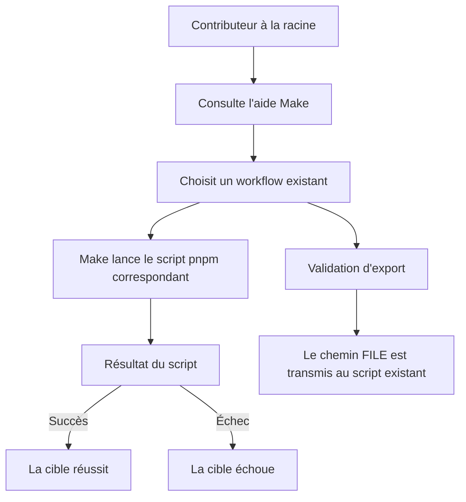

# Instruction: Ajouter la façade Make racine

## Architecture projection

> Tree of the final files. ✅ create · ✏️ modify · ❌ delete

```txt
.
└── Makefile ✅ Façade racine découvrable qui délègue aux scripts pnpm existants.
```

## User Journey



## Tasks to do

### `1)` Exposer les workflows existants

> Créer une façade Make minimale sans dupliquer l’orchestration de `package.json`.

1. Créer le `Makefile` racine avec `help` comme cible par défaut et déclarer toutes les cibles d’action phony.
2. Documenter dans `help` le rôle et l’usage de `dev`, `preview`, `build`, `typecheck`, `lint`, `test`, `test-unit`, `test-e2e`, `test-release`, `audit-contrast` et `validate-export`.
3. Faire déléguer chaque cible directement au script pnpm existant correspondant, sans chaînage ni logique applicative dans Make.
4. Transmettre `FILE` comme argument positionnel unique et correctement quoté à `pnpm run validate:export --`; laisser le script existant gérer un chemin absent ou invalide.

### `2)` Vérifier la transparence de la façade

> Prouver la découvrabilité, la correspondance des commandes et la propagation des échecs.

1. Vérifier que l’invocation Make sans cible affiche l’aide et que celle-ci couvre tous les workflows du périmètre.
2. Contrôler en exécution à blanc que chaque cible appelle exactement le script pnpm annoncé et que `FILE` reste un seul argument, y compris avec des espaces.
3. Exécuter les contrôles finis pertinents et une validation d’export invalide pour confirmer qu’un succès reste un succès et qu’une erreur remonte comme échec Make.

## Test acceptance criteria

| Task | Acceptance criteria |
| ---- | ------------------- |
| 1 | L’invocation Make sans cible affiche chaque workflow disponible, son rôle et l’usage `FILE=<archive.zip>` de la validation d’export. |
| 1 | Chaque cible d’action lance uniquement le script pnpm existant correspondant; le `Makefile` ne duplique aucun enchaînement déjà défini dans `package.json`. |
| 1 | `make validate-export FILE=<chemin>` transmet le chemin comme un seul argument au workflow `validate:export`, y compris lorsque le chemin contient des espaces. |
| 2 | Une cible dont le script pnpm réussit termine avec succès, tandis qu’un script en erreur produit une cible Make en échec sans masquer sa sortie. |
| 2 | Aucun fichier applicatif, script pnpm, workflow CI ou dépendance du projet n’est ajouté ou modifié. |
