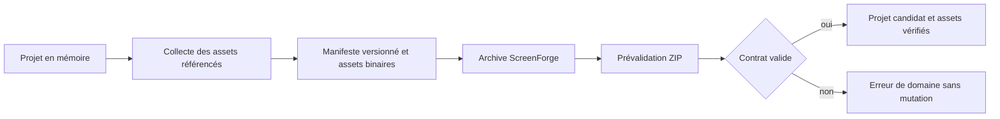

# Instruction: Contrat d’archive versionné et sûr

## Architecture projection

> Tree of the final files. ✅ create · ✏️ modify · ❌ delete

```txt
.
├── src/
│   └── lib/
│       └── project-file.ts              ✅ encoder, décoder et valider le format portable
└── e2e/
    └── project-file.spec.ts             ✅ prouver le contrat sans UI ni fichiers réels
```

## User Journey



## Tasks to do

### `1)` Définir le manifeste portable v1

> Garder un contrat explicite, fermé et évolutif.

1. Définir le marqueur de format, la version `1`, le projet sans miniatures et la liste d’assets `{ id, path, mimeType, byteLength, sha256 }`.
2. Réserver `project.json` au manifeste et `assets/` aux payloads ; refuser les chemins hors contrat et les doublons.
3. Centraliser l’extension, les types MIME acceptés et des bornes explicites de taille, nombre d’entrées et taille décompressée.

### `2)` Construire une archive complète avec les APIs existantes

> Exporter uniquement ce que le projet référence réellement.

1. Parcourir les calques d’écran et de layout pour collecter les `assetId`, `screenshotAssetId` et bezels importés sans doublon.
2. Résoudre chaque asset dans le registre existant et échouer clairement si une référence est absente.
3. Convertir les data URLs en octets, calculer SHA-256 avec Web Crypto et écrire l’archive via JSZip.
4. Exclure les miniatures et vérifier qu’aucun payload `data:` ne reste dans `project.json`.

### `3)` Prévalider et décoder sans effet de bord

> Un fichier sélectionné reste une donnée non fiable jusqu’à validation complète.

1. Refuser avant extraction les fichiers trop volumineux, puis contrôler le nombre d’entrées, leurs chemins et les tailles annoncées.
2. Rejeter le JSON invalide, le mauvais marqueur, une version inconnue, un asset absent, inattendu, trop lourd ou dont le hash diffère.
3. Vérifier que toutes les références du projet pointent vers un asset du manifeste.
4. Retourner un candidat `{ project, assets }` sans toucher aux stores, à IndexedDB ou au registre courant.

### `4)` Verrouiller le contrat avec des archives synthétiques

> Les tests restent rapides, déterministes et hors réseau.

1. Construire en mémoire un projet minimal contenant texte, image, capture d’appareil et bezel synthétique.
2. Vérifier le round-trip du manifeste, les octets de chaque asset, la déduplication et l’absence de miniatures/data URLs dans le graphe.
3. Couvrir au minimum version inconnue, asset manquant, hash corrompu et dépassement de borne avec de petits fixtures déclaratifs.
4. Affirmer qu’aucun cas invalide ne modifie le projet ou les assets déjà chargés.

## Test acceptance criteria

| Task | Acceptance criteria |
| ---- | ------------------- |
| 1 | Une archive v1 expose uniquement `project.json` et les chemins `assets/` déclarés ; les versions et chemins inconnus sont refusés par une erreur stable |
| 2 | Un projet avec image, capture et bezel produit une archive dont chaque asset référencé existe une seule fois, possède le bon MIME/hash et n’apparaît jamais comme data URL dans le JSON |
| 3 | Tout fichier incomplet, corrompu, trop grand ou d’une version non prise en charge est rejeté avant mutation observable du projet ou du registre courant |
| 4 | Les tests utilisent seulement des blobs/PNG synthétiques en mémoire, sans réseau, snapshot ni attente temporelle |
