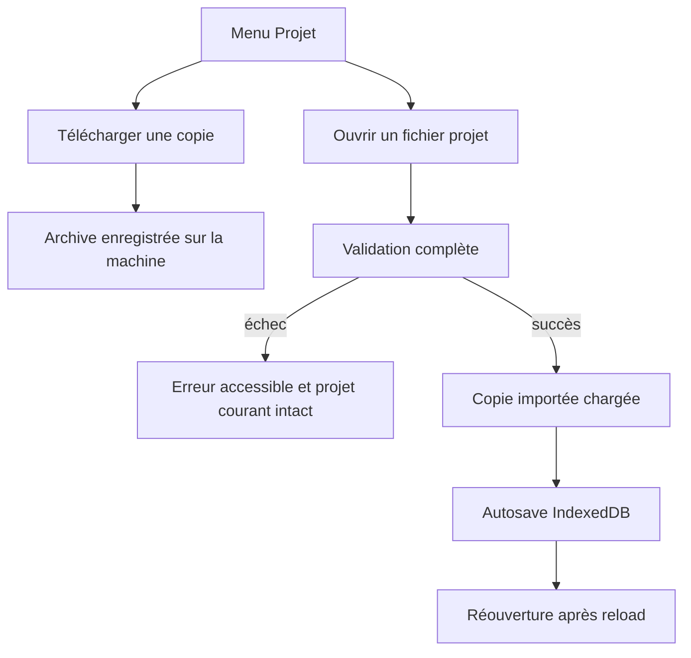

# Instruction: Menu Projet et round-trip navigateur

## Architecture projection

> Tree of the final files. ✅ create · ✏️ modify · ❌ delete

```txt
.
├── PRD.md                                      ✏️ documenter le backup portable livré
├── src/
│   ├── components/
│   │   └── toolbar/
│   │       └── TopBar.tsx                     ✏️ ajouter le menu fichier du projet et son input local
│   └── lib/
│       └── storage.ts                         ✏️ activer et persister atomiquement le projet importé
└── e2e/
    ├── helpers.ts                             ✏️ mutualiser la lecture des téléchargements Playwright
    └── project-file.spec.ts                   ✏️ couvrir le parcours UI, reload et export App Store
```

## User Journey



## Wireframe

```txt
┌──────────────────────────────────────────────────────────────────────┐
│ (1) Identité projet ▾       Outils                    Export App Store │
│      ┌────────────────────────────┐                                  │
│      │ (2) Action copie portable  │                                  │
│      │ (3) Entrée fichier local   │                                  │
│      └────────────────────────────┘                                  │
├──────────────────────────────────────────────────────────────────────┤
│                                                                      │
│                         (4) Canvas existant                          │
│                                                                      │
└──────────────────────────────────────────────────────────────────────┘
```

1. Identité projet : nom, état d’enregistrement et accès aux opérations du fichier projet.
2. Copie portable : action secondaire distincte de l’export App Store.
3. Fichier local : point d’entrée pour sélectionner une archive ScreenForge.
4. Canvas : espace de travail inchangé après ajout du menu.

## Tasks to do

### `1)` Charger une copie sans écraser le travail courant

> Le changement de session n’arrive qu’après parsing et sauvegarde réussis.

1. Décoder entièrement le fichier avant mutation, puis forcer la sauvegarde IndexedDB du projet courant.
2. Donner un nouvel identifiant au projet, enregistrer chaque payload dans le registre pour obtenir les nouveaux asset IDs et réécrire toutes les références.
3. Normaliser le projet, charger son écran actif, vider sélection et historique, puis le persister immédiatement dans IndexedDB.
4. En cas d’échec avant activation, conserver exactement le projet, l’écran actif, l’historique et les assets courants.

### `2)` Ajouter le menu fichier à l’identité du projet

> Deux actions discrètes suffisent ; aucun nouveau dialogue n’est nécessaire.

1. Ancrer un `Dropdown` accessible à côté du nom du projet avec les actions de téléchargement et d’ouverture.
2. Réutiliser un input fichier natif caché acceptant `.screenforge.zip` et `application/zip`.
3. Désactiver les deux actions pendant une opération, exposer l’état occupé et afficher les succès/erreurs avec les toasts existants.
4. Télécharger sous `<nom-normalisé>.screenforge.zip` sans modifier le bouton principal d’export App Store.

### `3)` Prouver le round-trip utilisateur complet

> Le fichier doit restaurer un projet réellement exploitable, pas seulement un JSON lisible.

1. Créer via l’UI un projet synthétique multi-écran avec texte, image, capture et bezel, puis télécharger le fichier projet.
2. Réimporter les octets téléchargés, vérifier le nouvel ID, le contenu sémantique, les références d’assets résolues et l’historique vide.
3. Attendre l’état observable `Enregistré`, recharger la page et vérifier que la copie importée et tous ses assets sont encore rendus.
4. Exporter ensuite les captures App Store et conserver les assertions 1320×2868, RGB opaque et pixels attendus.
5. Importer une archive corrompue via le même contrôle et vérifier l’alerte accessible sans changement de store.

### `4)` Aligner la documentation produit

> Distinguer clairement autosave navigateur, backup portable et export App Store.

1. Documenter le format portable et son usage local dans le PRD.
2. Retirer la mention qui présente l’export/import JSON comme non livré ou ambigu.

## Test acceptance criteria

| Task | Acceptance criteria |
| ---- | ------------------- |
| 1 | L’ouverture valide crée une copie indépendante, remappe toutes les références d’assets, vide l’historique et survit à un reload ; un échec laisse la session courante strictement intacte |
| 2 | Le menu Projet est navigable au clavier, restaure le focus, annonce l’état occupé et télécharge un fichier `.screenforge.zip` sans détourner l’export App Store |
| 3 | Le test E2E télécharge puis réimporte le même projet synthétique, retrouve chaque écran et asset après reload, puis obtient encore un ZIP App Store 1320×2868 RGB opaque aux pixels attendus, sans `waitForTimeout` |
| 4 | Le PRD décrit sans ambiguïté les trois niveaux : autosave IndexedDB, fichier projet portable et ZIP de captures App Store |
