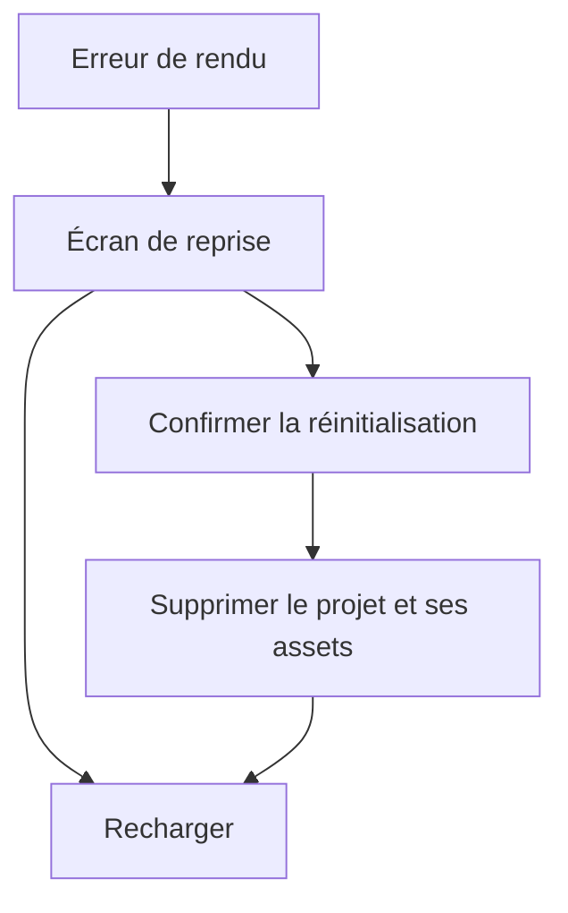

# Instruction: Reprise globale et gate de release

## Architecture projection

> Tree of the final files. ✅ create · ✏️ modify · ❌ delete

```txt
.
├── package.json                           ✏️ gates rapide et release
├── playwright.config.ts                  ✏️ serveur lancé avec pnpm
├── e2e/
│   └── error-boundary.spec.ts            ✅ fallback, focus et reset confirmé
└── src/
    ├── components/
    │   └── error-boundary.tsx             ✅ écran global de reprise
    └── main.tsx                          ✏️ boundary racine et handle de crash DEV
```

## User Journey



## Wireframe

```txt
┌──────────────────────────────────────────────┐
│                                              │
│            ┌──────────────────────┐          │
│            │ (1) État d’erreur    │          │
│            │                      │          │
│            │ (2) Explication      │          │
│            │                      │          │
│            │ (3) Actions          │          │
│            └──────────────────────┘          │
│                                              │
└──────────────────────────────────────────────┘
```

## Tasks to do

### `1)` Monter une Error Boundary globale

> Remplacer l’écran blanc par une reprise accessible.

1. Créer une class component avec `getDerivedStateFromError` et `componentDidCatch`.
2. Utiliser le primitive `Button`, un statut accessible et placer le focus dans le fallback.
3. Proposer rechargement et suppression du seul projet actif après confirmation native.
4. Si la suppression échoue, garder le projet intact et afficher l’erreur dans le fallback.

### `2)` Tester le fallback dans le navigateur

> Déclencher un vrai throw de rendu sous la boundary sans embarquer ce chemin en production.

1. Exposer depuis un composant racine un handle DEV qui déclenche un rerender fautif après l’initialisation du projet.
2. Vérifier avec Playwright l’affichage, le focus initial et le rechargement.
3. Vérifier que l’action destructive demande confirmation avant la transaction de suppression.

### `3)` Définir les gates de validation

> Séparer la boucle locale rapide de la validation avant release.

1. Ajouter `test` pour unit + typecheck + lint.
2. Ajouter `test:release` pour `test`, build, E2E complet et audit de contraste.
3. Remplacer la commande npm du webServer Playwright par pnpm.

## Test acceptance criteria

| Task | Acceptance criteria |
| ---- | ------------------- |
| 1 | Un throw de rendu affiche le fallback ; le premier contrôle utile reçoit le focus et les deux actions restent accessibles au clavier. |
| 2 | Annuler la confirmation ne supprime rien ; confirmer supprime atomiquement le projet actif et ses assets avant rechargement. |
| 3 | `pnpm test` exécute la gate rapide ; `pnpm run test:release` couvre build, E2E export et contraste. |
