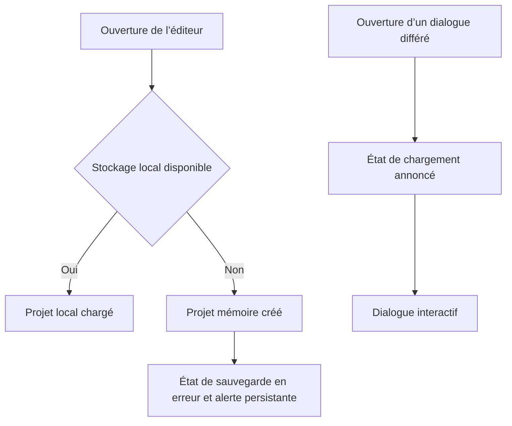

# Instruction: Repli mémoire et feedback de chargement

## Architecture projection

> Tree of the final files. ✅ create · ✏️ modify · ❌ delete

```txt
.
├── src/App.tsx                                   ✏️ bootstrap résilient et fallback Suspense visible
├── src/stores/toast.store.ts                     ✏️ option de durée pour l’alerte persistante
├── e2e/runtime-resilience.spec.ts                ✅ panne IndexedDB et chunk retardé
└── aidd_docs/memory/
    ├── design.md                                 ✏️ états de feedback documentés
    └── testing.md                                ✏️ scénarios de résilience documentés
```

## User Journey



## Wireframe

```txt
┌────────────────────────────────────────────────────────────┐
│ (1) Barre projet · état de persistance                     │
├────────────────────────────────────────────────────────────┤
│                                                            │
│                    (2) Éditeur utilisable                  │
│                                                            │
│ (3) Alerte de stockage persistante                         │
└────────────────────────────────────────────────────────────┘

┌────────────────────────────────────────────────────────────┐
│ (4) Éditeur sous voile                                     │
│              ┌──────────────────────────┐                  │
│              │ (5) Chargement dialogue │                  │
│              └──────────────────────────┘                  │
└────────────────────────────────────────────────────────────┘
```

1. Barre projet : expose durablement que la sauvegarde locale est indisponible.
2. Éditeur : reste utilisable avec un projet en mémoire.
3. Alerte : explique la perte de persistance sans bloquer le travail.
4. Voile : conserve la structure modale pendant l’arrivée du chunk.
5. Chargement : statut annoncé jusqu’au montage du vrai dialogue.

## Tasks to do

### `1)` Démarrer sans IndexedDB

> Préserver une session éditable lorsque la persistance locale échoue.

1. Encadrer le chargement initial dans `App` et créer le projet par défaut dans le `catch`.
2. Marquer la sauvegarde en erreur et afficher un toast sans expiration.
3. Ne pas démarrer l’autosave lorsque l’ouverture IndexedDB échoue; garantir le cleanup si l’effet est démonté pendant l’initialisation.
4. Conserver le projet uniquement en mémoire et ne jamais supprimer les données locales fautives.

### `2)` Afficher l’attente des dialogues lazy

> Éviter qu’une action paraisse ignorée pendant le téléchargement d’un chunk.

1. Remplacer `fallback={null}` par un composant top-level minimal dans `App`.
2. Réutiliser les tokens de scrim, modal et animation existants ainsi qu’une icône Lucide.
3. Exposer un `role="status"` avec nom accessible et respecter `prefers-reduced-motion` via les utilitaires existants.

### `3)` Tester les deux chemins dégradés

> Reproduire les erreurs sans handle de production.

1. Faire échouer `indexedDB.open` avec `addInitScript`, puis vérifier projet mémoire, alerte et état de sauvegarde.
2. Retarder une requête de chunk lazy, vérifier le statut de chargement, puis relâcher la route et vérifier le vrai dialogue.
3. Actualiser la mémoire design et testing.

## Test acceptance criteria

| Task | Acceptance criteria |
| --- | --- |
| 1 | Avec IndexedDB indisponible, un projet vide éditable s’ouvre, l’erreur reste visible et aucune boucle d’autosave ne répète l’échec. |
| 2 | Sur réseau retardé, l’ouverture Export, Modèles ou Réglages affiche immédiatement un état modal annoncé puis le remplace par le dialogue focalisé. |
| 3 | Les E2E reproduisent les deux chemins et le fonctionnement normal conserve chargement local, autosave et focus des dialogues. |
