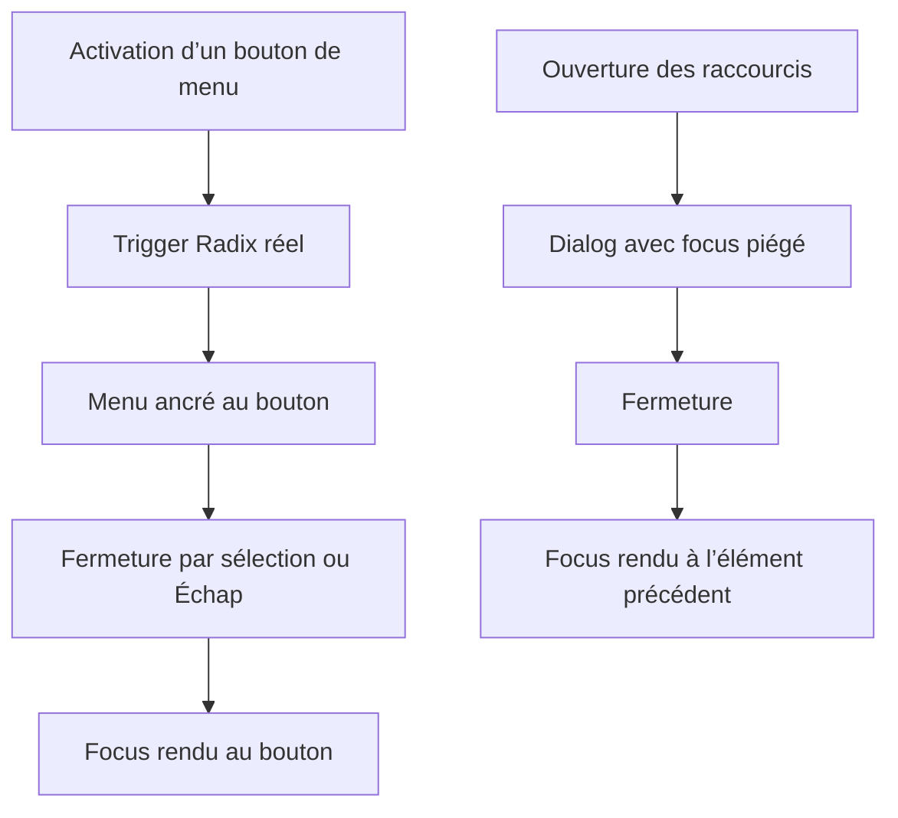

# Instruction: Fiabiliser les primitives Radix

## Architecture projection

> Tree of the final files. ✅ create · ✏️ modify · ❌ delete

```txt
.
├── package.json ✏️ dépendances Radix directes
├── pnpm-lock.yaml ✏️ résolution sans paquet parapluie
├── src
│   ├── components
│   │   ├── device-picker
│   │   │   └── DevicePicker.tsx ✏️ vrai déclencheur du menu de modèles
│   │   ├── toolbar
│   │   │   └── TopBar.tsx ✏️ vrais déclencheurs des menus Projet et iPhone
│   │   └── ui
│   │       ├── ContextMenu.tsx ✏️ import direct du menu Radix
│   │       ├── button.tsx ✏️ import direct de Slot
│   │       ├── dialog.tsx ✏️ import direct et retour de focus
│   │       ├── dropdown.tsx ✏️ suppression du proxy géométrique
│   │       ├── label.tsx ✏️ import direct de Label
│   │       ├── popover.tsx ✏️ import direct de Popover
│   │       ├── select.tsx ✏️ import direct de Select
│   │       ├── slider.tsx ✏️ import direct de Slider
│   │       ├── switch.tsx ✏️ import direct de Switch
│   │       └── toggle-group.tsx ✏️ import direct de ToggleGroup
│   └── lib
│       ├── __tests__
│       │   └── utils.test.ts ✅ contrat de fusion des classes
│       └── utils.ts ✏️ tailwind-merge standard
└── e2e
    └── layers-panel.spec.ts ✏️ retour de focus du dialog
```

## User Journey



## Tasks to do

### `1)` Simplifier `cn()`

> Retirer les faux groupes exclusifs qui suppriment des classes custom indépendantes.

1. Remplacer `extendTailwindMerge()` par le `twMerge()` standard autour de `clsx()`.
2. Ajouter un test prouvant que `field-label` et `tabular` coexistent, tout en conservant la résolution normale des conflits Tailwind.

### `2)` Importer uniquement les primitives Radix utilisées

> Supprimer le barrel `radix-ui` et ses primitives inutiles.

1. Déclarer directement `@radix-ui/react-slot`, `dialog`, `dropdown-menu`, `label`, `popover`, `select`, `slider`, `switch` et `toggle-group`.
2. Remplacer les dix imports `from 'radix-ui'` par leurs modules directs.
3. Retirer la dépendance `radix-ui` et régénérer le lockfile.

### `3)` Donner un vrai Trigger au `Dropdown`

> Laisser Radix mesurer et suivre le bouton réel, sans `getBoundingClientRect()` pendant le render.

1. Faire accepter au wrapper le nœud déclencheur et un `onOpenChange` contrôlé.
2. Monter ce nœud dans `DropdownMenu.Trigger asChild`; supprimer le span portalisé, la mesure synchrone et la restauration manuelle devenue inutile.
3. Adapter les deux usages de `TopBar` et celui de `DevicePicker` sans changer leurs libellés, états busy ou actions.
4. Étendre le scénario clavier du menu Projet pour vérifier l’ancrage et le retour de focus après fermeture.

### `4)` Restaurer le focus des dialogs sans Trigger monté

> Conserver le montage conditionnel des overlays tout en mémorisant l’élément qui avait le focus.

1. Capturer l’élément actif avant que `onOpenAutoFocus` déplace le focus dans le panneau.
2. Empêcher l’autofocus de fermeture Radix et rendre explicitement le focus à cette cible si elle existe encore.
3. Compléter le scénario « Raccourcis clavier » : focus initial connu, ouverture, Échap, puis assertion du focus restauré.

## Test acceptance criteria

| Task | Acceptance criteria |
| ---- | ------------------- |
| 1 | `cn('field-label', 'tabular')` conserve les deux classes, tandis que deux utilitaires Tailwind réellement conflictuels restent fusionnés. |
| 2 | Aucun fichier applicatif n’importe `radix-ui`, et le paquet parapluie n’est plus une dépendance du projet. |
| 3 | Les menus Projet et Modèle d’iPhone s’ouvrent au clic et au clavier, restent attachés à leur bouton après déplacement du drawer ou redimensionnement, puis rendent le focus au bouton. |
| 4 | « Raccourcis clavier » piège le focus, se ferme avec Échap et restaure le focus sur l’élément actif avant ouverture. |
