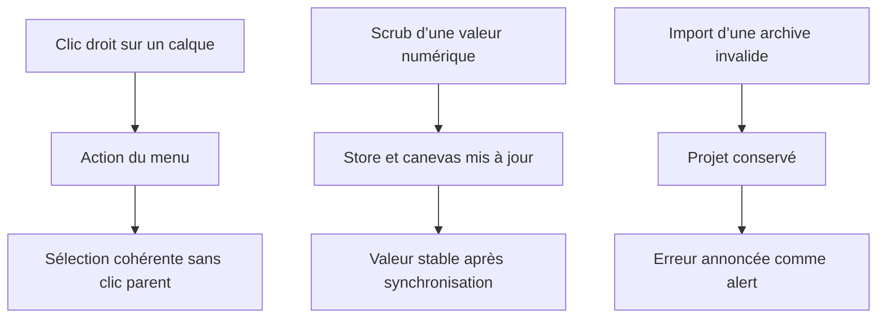

# Instruction: Verrouiller les contrats d’interaction

## Architecture projection

> Tree of the final files. ✅ create · ✏️ modify · ❌ delete

```txt
.
├── src
│   └── components
│       └── ui
│           └── ContextMenu.tsx ✏️ isolation des clics du menu portalisé
└── e2e
    ├── canvas-transforms.spec.ts ✏️ scénario de scrub NumberField
    ├── layers-panel.spec.ts ✏️ sélection après dupliquer et supprimer
    └── project-file.spec.ts ✏️ rôle alert de l’erreur d’import
```

## User Journey



## Tasks to do

### `1)` Isoler le menu contextuel du calque

> Empêcher le clic d’une action portalisée de remonter vers `LayerItem`.

1. Stopper la propagation du clic au niveau du contenu du menu, une seule fois pour toutes les entrées.
2. Après duplication, vérifier que la sélection produite par l’action n’est pas remplacée par le calque source.
3. Après suppression, vérifier qu’aucun identifiant supprimé ne reste sélectionné, y compris en multi-sélection.

### `2)` Formaliser la sémantique des toasts

> Conserver `alert` pour les erreurs et `status` pour les messages non urgents.

1. Remplacer l’assertion textuelle de l’archive corrompue par une assertion sur `role="alert"` et son message.
2. Garder les assertions `status` existantes pour les succès d’enregistrement.

### `3)` Couvrir le scrub du `NumberField`

> Tester le geste pointer que les saisies clavier actuelles ne couvrent pas.

1. Scrubber un champ de transformation via son libellé accessible, sans dépendre de sa position dans le panneau.
2. Lire immédiatement puis après synchronisation la valeur Fabric, la valeur store et les identifiants sélectionnés.
3. Vérifier que le geste change la valeur, ne déplace pas les autres axes et ne provoque aucun drift après relâchement.

## Test acceptance criteria

| Task | Acceptance criteria |
| ---- | ------------------- |
| 1 | Dupliquer sélectionne les nouvelles copies; supprimer vide ou nettoie la sélection sans jamais resélectionner un identifiant supprimé. |
| 2 | « Archive projet invalide. » est exposé par un `alert`, le projet courant reste intact, et les succès restent exposés par des `status`. |
| 3 | Un scrub de position modifie store et canevas de la même quantité, conserve la sélection et reste stable après le cycle canevas → store → sync. |
