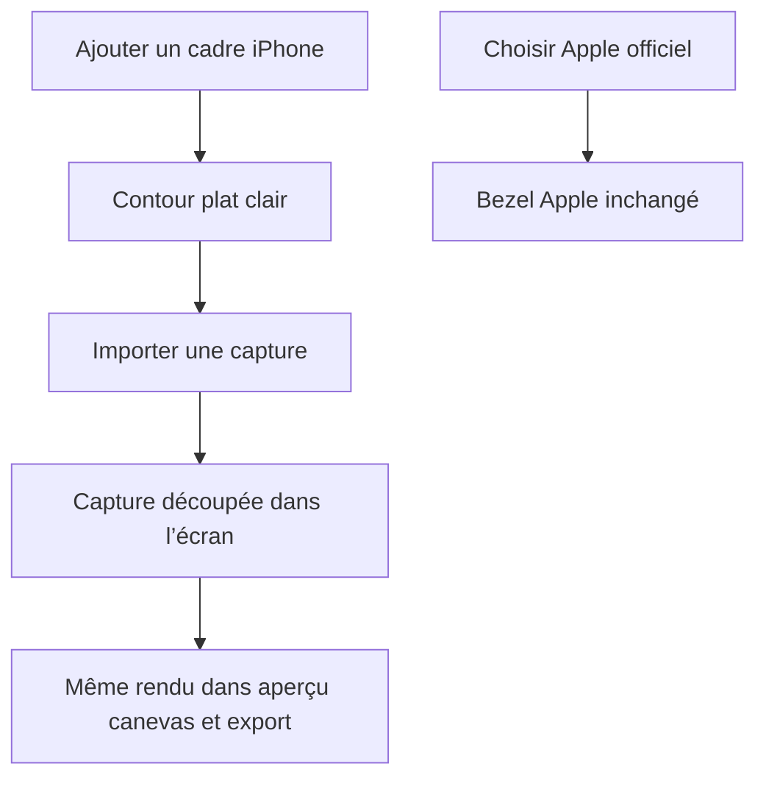

# Instruction: Aplatir le cadre iPhone

## Architecture projection

> Tree of the final files. ✅ create · ✏️ modify · ❌ delete

```txt
.
└── src
    ├── assets
    │   ├── device-frames
    │   │   ├── __tests__
    │   │   │   └── device-frame-svg.test.ts ✅ contrat du rendu plat
    │   │   └── index.ts ✏️ contour simple et défaut clair
    │   └── templates
    │       └── index.ts ✏️ cadres blancs dans les modèles existants
    └── lib
        └── layer-factories.ts ✏️ ombre douce activée par défaut
```

## User Journey



## Wireframe

```txt
┌────────────────────────┐
│ (1) Contour unique      │
│  ┌──────────────────┐  │
│  │ (2) Écran/capture │  │
│  │      (3)          │  │
│  │                   │  │
│  └──────────────────┘  │
└────────────────────────┘
```

1. Contour : une seule enveloppe autour de l’écran.
2. Écran : zone qui découpe la capture importée.
3. Îlot ou encoche : seul détail matériel conservé quand la capture ne le fournit pas déjà.

## Tasks to do

### `1)` Simplifier le SVG généré

> Remplacer la réplique de châssis par un cadre de présentation plat.

1. Conserver les squircles, les dimensions d’écran, le clip de capture et la distinction îlot/encoche propres à chaque modèle.
2. Dessiner un unique contour plein avec la couleur choisie, puis la dalle noire ou la capture découpée à l’intérieur.
3. Supprimer les boutons latéraux, le bleed associé, les gradients de tranche, les reflets de verre, le liseré spéculaire et les cercles de caméra de l’îlot vide, puis retirer les constantes, helpers et champs de couleur devenus morts.
4. Garder une simple pastille noire pour un appareil vide; ne rien redessiner par-dessus une capture qui contient déjà son îlot.

### `2)` Faire du contour clair le défaut

> Reproduire l’aspect blanc et légèrement flottant visible chez AppScreens.

1. Placer la finition claire neutre en première position pour chaque modèle actuel et normaliser son contour de présentation à `#ffffff`, sans retirer les autres couleurs plates.
2. Activer sur les nouveaux calques l’ombre douce déjà définie dans `content-defaults.ts`.
3. Utiliser la finition blanche sur les cinq templates, sans modifier leurs positions, dimensions, textes ou arrière-plans.
4. Préserver la couleur stockée par les projets existants; le changement de défaut ne doit pas réécrire un calque chargé.

### `3)` Verrouiller le rendu et valider la release

> Tester la structure SVG et juger le résultat dans les états réels de l’éditeur.

1. Ajouter un test du SVG avec et sans capture : contour unique, clip conservé, aucune primitive de relief, îlot non dupliqué.
2. Exécuter la sonde visuelle dark/light peuplée et comparer le calque à la référence AppScreens.
3. Exécuter l’audit contraste puis le gate release complet, y compris les scénarios de bezel Apple et l’export pixel-exact.

## Test acceptance criteria

| Task | Acceptance criteria |
| ---- | ------------------- |
| 1 | Le cadre ScreenForge affiche un contour uniforme sans bouton latéral, gradient métallique, reflet de verre, double liseré ni détail de caméra simulé. |
| 1 | Une capture remplit et reste découpée dans la dalle; son îlot n’est pas redessiné, tandis qu’un appareil vide garde une pastille ou une encoche simple selon le modèle. |
| 2 | Tout modèle actuel nouvellement choisi démarre avec un contour blanc `#ffffff` et une ombre douce; les couleurs alternatives restent plates. |
| 2 | Les cinq templates utilisent le même contour blanc sans changement de composition, et les projets existants conservent leur valeur `deviceColor` et leur géométrie enregistrées. |
| 3 | Le chemin Apple officiel reste visuellement et fonctionnellement inchangé, sans ombre ni transformation ajoutée au PNG Apple. |
| 3 | Les probes dark/light montrent un contour blanc net, le contraste reste ≥ 4.5:1 et l’export reste pixel-exact en 1320×2868. |
| 3 | Les suites unitaires, TypeScript, lint, build et E2E terminent sans échec. |
