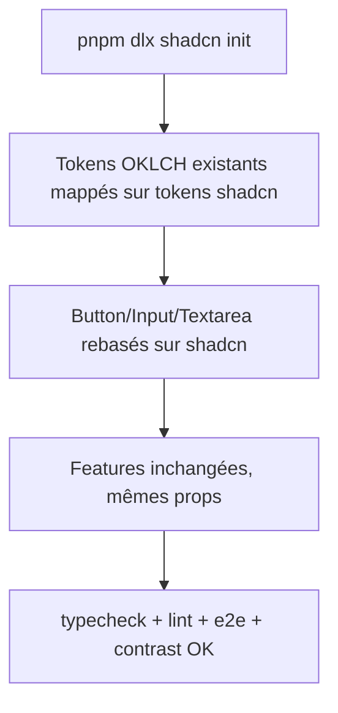

<!-- Fill or omit these sections; never add, rename, or reorder one. -->

# Instruction: Fondations shadcn + composants simples

## Architecture projection

> Tree of the final files. ✅ create · ✏️ modify · ❌ delete

```txt
.
├── components.json                     ✅ config shadcn CLI (baseColor neutral, aliases @/)
├── package.json                        ✏️ +radix-ui, tw-animate-css, sonner, cmdk (sonner/cmdk utilisés en phase 4)
├── src/
│   ├── index.css                       ✏️ tokens shadcn mappés sur les vars OKLCH existantes via @theme inline
│   ├── lib/utils.ts                    ✏️ cn() : extendTailwindMerge pour les classes custom (field-surface, accent-mark…)
│   └── components/ui/
│       ├── button.tsx                  ✏️ rebuilt sur shadcn Button (variants mappés, sizes 30/34/40px, prop loading conservée)
│       ├── icon-button.tsx             ✏️ rebuilt sur Button size="icon" + état active (data-active), aria-label obligatoire
│       ├── input.tsx                   ✏️ rebuilt sur shadcn Input (variante font tabular conservée)
│       ├── textarea.tsx                ✏️ rebuilt sur shadcn Textarea
│       └── tooltip.tsx                 ❌ supprimé (code mort, 0 import)
```

## User Journey



## Tasks to do

### `1)` Initialiser shadcn/ui

> CLI + components.json + dépendances, sans régénérer index.css (déjà CSS-first v4).

1. `pnpm add radix-ui tw-animate-css sonner cmdk`
2. `pnpm dlx shadcn@latest init` → `components.json` : style `new-york`, `baseColor: "neutral"`, alias `@/components/ui`, `@/lib/utils`, cssVariables true
3. Importer `tw-animate-css` dans `src/index.css`

### `2)` Mapper le thème

> Les composants shadcn consomment les tokens natifs du design system, pas l'inverse.

1. Dans `src/index.css`, ajouter le bloc de mapping : `--color-primary`, `--color-muted`, `--color-card`, `--color-popover`, `--color-ring`, `--color-destructive`… pointant vers les vars OKLCH existantes (`--color-raised`, `--color-accent`, `--color-danger`…), dark + `.light`
2. Conserver rayons custom (`--radius-xs…xl`), z-index nommés, `@utility accent-fill/mark`, classes `.field-surface`…
3. Étendre `cn()` dans `src/lib/utils.ts` avec `extendTailwindMerge` pour ne pas dédupliquer à tort les classes custom

### `3)` Rebaser Button, IconButton, Input, Textarea

> Copier les composants shadcn puis restaurer l'API exacte actuelle.

1. `pnpm dlx shadcn@latest add button input textarea`
2. `button.tsx` : variants `default/primary/ghost/danger` mappés (primary→fill clair, danger→destructive), sizes `sm/md/lg` = 30/34/40px, prop `loading` (Loader2 + aria-busy) conservée
3. `icon-button.tsx` : Button `size="icon"` 32/36px + `data-active`, `'aria-label'` requis en types
4. `input.tsx` : variante `font: tabular/sans` + `aria-invalid:border-danger` conservés
5. Supprimer `tooltip.tsx`

## Test acceptance criteria

<!-- Each criterion is an observable behavior, not a command. -->

| Task | Acceptance criteria                                                                        |
| ---- | ------------------------------------------------------------------------------------------ |
| 1    | `components.json` existe et `shadcn add` fonctionne sans régénérer le thème                 |
| 2    | L'UI rendue est visuellement identique en dark et light (probe visuel), contraste ≥ 4.5:1   |
| 3    | Tous les usages existants de Button/IconButton/Input/Textarea compilent sans changement d'appel ; `pnpm run test` et `pnpm run test:e2e` passent |
