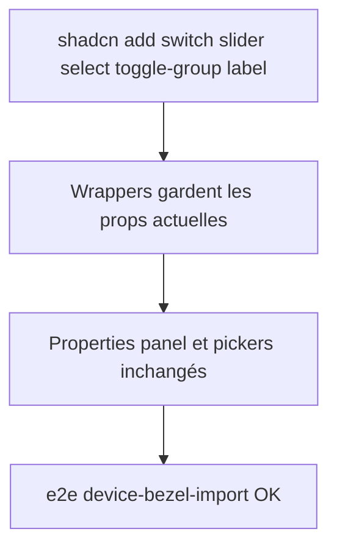

<!-- Fill or omit these sections; never add, rename, or reorder one. -->

# Instruction: Contrôles de formulaire

## Architecture projection

> Tree of the final files. ✅ create · ✏️ modify · ❌ delete

```txt
.
└── src/components/ui/
    ├── switch.tsx     ✏️ rebuilt sur Radix Switch (16×28px conservé, role/aria identiques)
    ├── slider.tsx     ✏️ rebuilt sur Radix Slider (readout formatValue tabulaire conservé)
    ├── select.tsx     ✏️ rebuilt sur Radix Select (prop label inline + aria-label FR conservés)
    ├── segmented.tsx  ✏️ rebuilt sur Radix ToggleGroup (API générique options/value/onChange conservée)
    └── field.tsx      ✏️ rebuilt sur shadcn Label (wrapper label + contrôle, inline?)
```

## User Journey



## Tasks to do

### `1)` Rebaser Switch et Slider

> Équivalents Radix directs ; densité et readout custom à restaurer.

1. `pnpm dlx shadcn@latest add switch slider`
2. `switch.tsx` : props `checked/onChange/ariaLabel/disabled` inchangées, taille 16×28px via variants
3. `slider.tsx` : props `ariaLabel/value/onChange/min/max/step/formatValue` inchangées, readout tabulaire à droite conservé, styles de piste `--fill` portés sur le thumb/track Radix

### `2)` Rebaser Select et Segmented

> Préserver le « field grammar » (label inline) et l'API générique.

1. `pnpm dlx shadcn@latest add select toggle-group`
2. `select.tsx` : Radix Select + prop `label` rendue en préfixe inline du trigger, `aria-label` français conservé (ex. « Modèle d'appareil »)
3. `segmented.tsx` : ToggleGroup `type="single"` sous-jacent, API `options: {value, label?, icon?, ariaLabel?}[]` inchangée, `role="group"` + nom accessible conservé

### `3)` Rebaser Field

1. `pnpm dlx shadcn@latest add label`
2. `field.tsx` : wrapper Label + slot contrôle, props `id/label/children/inline` et classe `.field-label` inchangées

## Test acceptance criteria

<!-- Each criterion is an observable behavior, not a command. -->

| Task | Acceptance criteria                                                                                       |
| ---- | --------------------------------------------------------------------------------------------------------- |
| 1    | `getByLabel('Opacité')` et `getByLabel('Activer l’ombre de l’appareil')` pilotent toujours les contrôles (e2e device-bezel-import vert) |
| 2    | `getByRole('group', { name: 'Source du cadre' })` expose toujours des boutons actionnables ; clavier ←→ navigue entre options |
| 3    | `getByLabel('Modèle d’appareil')` ouvre la liste des iPhones et sélectionne un modèle (e2e vert)           |
