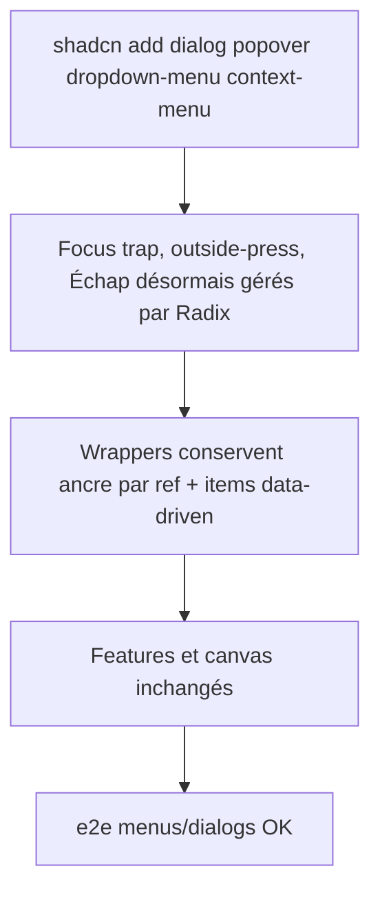

<!-- Fill or omit these sections; never add, rename, or reorder one. -->

# Instruction: Overlays, menus et dialogs

## Architecture projection

> Tree of the final files. ✅ create · ✏️ modify · ❌ delete

```txt
.
└── src/
    ├── components/ui/
    │   ├── dialog.tsx            ✏️ rebuilt sur Radix Dialog (API monolithique open/title/footer/size conservée en wrapper)
    │   ├── popover.tsx           ✏️ rebuilt sur Radix Popover (ancrage par ref externe préservé)
    │   ├── dropdown.tsx          ✏️ rebuilt sur Radix DropdownMenu (API data-driven items conservée)
    │   ├── ContextMenu.tsx       ✏️ rebuilt sur Radix ContextMenu (ouverture à position libre conservée)
    │   ├── shortcuts-overlay.tsx ✏️ suit la nouvelle API Dialog
    │   └── layer-menu.tsx        ❌ déplacé hors de ui/ (helper, pas un composant)
    └── lib/
        └── layer-menu.ts         ✅ buildLayerMenuItems() déplacé tel quel
```

## User Journey



## Tasks to do

### `1)` Rebaser Dialog

> Remplacer le portail/focus-trap maison par Radix, sans changer les appels des 3 dialogs.

1. `pnpm dlx shadcn@latest add dialog`
2. `dialog.tsx` : wrapper monolithique gardant `open/onClose/title/children/footer/size/headerActions` ; focus return et `[data-autofocus]` délégués à Radix (`onOpenAutoFocus`)
3. `shortcuts-overlay.tsx` : branché sur le nouveau Dialog, `role="dialog"` nommé « Raccourcis clavier » conservé

### `2)` Rebaser Popover et Dropdown

> Conserver le paradigme « ancre externe par ref » et les menus data-driven.

1. `pnpm dlx shadcn@latest add popover dropdown-menu`
2. `popover.tsx` : `Anchor` virtuel Radix pointant sur la ref externe ; props `open/anchor/onClose/align/side/offset` inchangées, clamp viewport délégué à Radix (`collisionPadding`)
3. `dropdown.tsx` : API `items: MenuItem[]` conservée, rendue en `DropdownMenuItem` ; nav clavier flèches/Home/End native Radix ; `role="menu"` + aria-labels FR conservés (« Fichier du projet », « iPhone 17 Pro Max »…)

### `3)` Rebaser ContextMenu + déplacer layer-menu

1. `pnpm dlx shadcn@latest add context-menu`
2. `ContextMenu.tsx` : ouverture à `position: {left, top}` via ancre virtuelle à coordonnées fixes (usage canvas clic droit)
3. Déplacer `buildLayerMenuItems()` vers `src/lib/layer-menu.ts` et mettre à jour les 2 imports (CanvasEditor, LayerItem)

## Test acceptance criteria

<!-- Each criterion is an observable behavior, not a command. -->

| Task | Acceptance criteria                                                                                              |
| ---- | ---------------------------------------------------------------------------------------------------------------- |
| 1    | `getByRole('dialog', { name: 'Raccourcis clavier' })` s'ouvre, piège le focus, Échap ferme et rend le focus (e2e vert) |
| 2    | `getByRole('menu', { name: 'Fichier du projet' })` → `menuitem 'Télécharger une copie'` télécharge le projet (e2e project-file vert) |
| 3    | Clic droit sur une layer du canvas ouvre le menu à la position du curseur, clavier navigable, clic dehors ferme   |
