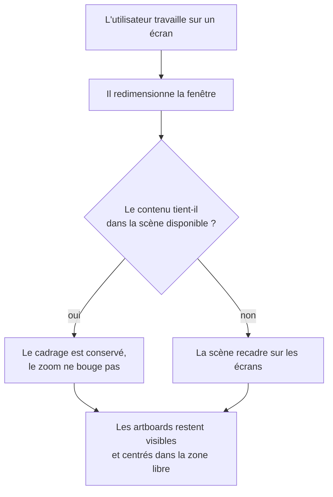

<!-- Fill or omit these sections; never add, rename, or reorder one. -->

# Instruction: Correctifs a11y et responsive

## Architecture projection

> Tree of the final files. ✅ create · ✏️ modify · ❌ delete

```txt
.
├── src
│   ├── index.css                                   ✏️ prefers-reduced-motion ciblé au lieu du kill global
│   ├── lib
│   │   └── canvas
│   │       └── install-viewport.ts                  ✏️ le ResizeObserver recadre le viewport, pas seulement les dimensions
│   └── components
│       ├── ui
│       │   ├── button.tsx                          ✏️ zone de frappe 44px sans changer la taille visuelle
│       │   ├── icon-button.tsx                     ✏️ idem
│       │   └── switch.tsx                          ✏️ idem, la piste ne fait que 16px de haut
│       ├── toolbar/ZoomHud.tsx                     ✏️ boutons de zoom sous le seuil
│       ├── screens-bar/ScreenThumbnail.tsx         ✏️ bouton d'activation sous le seuil
│       └── layers-panel/LayerItem.tsx              ✏️ boutons œil et cadenas sous le seuil
└── e2e
    └── canvas-viewport.spec.ts                      ✅ scénario de redimensionnement
```

## User Journey



## Tasks to do

### `1)` Recadrer la scène au redimensionnement

> Le `ResizeObserver` ajuste les dimensions du canvas mais laisse la transformation de viewport calculée pour l'ancienne taille.

1. Dans `src/lib/canvas/install-viewport.ts`, le rappel du `ResizeObserver` appelle aujourd'hui `canvas.setDimensions()` puis `requestRenderAll()` sans toucher au viewport. La fonction `fitAll()`, définie plus haut dans le même module, n'est jamais appelée à cet endroit : c'est la cause du décrochage.
2. Après `setDimensions`, réévaluer le cadrage. Ne pas rappeler `fitAll()` inconditionnellement : cela écraserait un zoom et un panoramique choisis par l'utilisateur.
3. Choisir la règle suivante : conserver le zoom courant et ne recentrer que la translation sur la nouvelle zone libre ; ne recadrer entièrement que si le contenu ne tient plus dans la scène disponible après recentrage.
4. Réutiliser `availableStage()` pour que le recentrage respecte les retraits des îlots flottants, comme `fitAll()` le fait déjà.
5. Vérifier le cas du drawer qu'on ouvre ou ferme : `stageInsets` change sans que le conteneur change de taille, donc le `ResizeObserver` ne se déclenche pas. Confirmer si ce chemin est déjà couvert par l'abonnement UI, et le traiter sinon.

### `2)` Rendre le mouvement réduit utilisable

> Le kill global à `0.01ms` supprime aussi le retour d'état, pas seulement la décoration.

1. Remplacer la règle `*` de `@media (prefers-reduced-motion: reduce)` par une règle ciblée : neutraliser les animations de keyframes décoratives et les transitions de `transform`, conserver les transitions de couleur et d'opacité à durée courte.
2. Garder l'entrée des menus, popovers et modales perceptible : une transition d'opacité brève remplace le glissement, l'apparition ne doit pas être instantanée au point qu'on ne voie pas d'où elle vient.
3. Vérifier que les états de survol, de focus et de sélection changent toujours visiblement sous mouvement réduit : ce sont des informations, pas de la décoration.
4. Conserver les usages ponctuels de `motion-reduce:animate-none` déjà posés, par exemple sur l'indicateur de chargement du bouton.

### `3)` Porter les zones de frappe au seuil

> Les contrôles rendent 32 à 36 px de haut ; l'utilitaire `.hit-40` existe et n'est posé que cinq fois.

1. Recenser les contrôles interactifs dont la boîte rendue est sous 44 px dans les deux dimensions.
2. Étendre leur zone de frappe par pseudo-élément, sans changer leur taille visuelle : c'est ce que fait déjà `.hit-40`, dont le retrait doit être ajusté au seuil visé.
3. Traiter en priorité les contrôles isolés ou proches les uns des autres : boutons du HUD de zoom, vignettes d'écran, boutons œil et cadenas des lignes de calque, piste du switch.
4. Vérifier qu'aucune zone étendue n'en recouvre une autre : deux cibles voisines qui se chevauchent produisent des clics attribués au mauvais contrôle.

### `4)` Couvrir le redimensionnement par un scénario

> Le décrochage est reproductible : il doit le rester en test.

1. Écrire `e2e/canvas-viewport.spec.ts` : charger l'app, ajouter un cadre iPhone, relever la position de l'artboard, redimensionner la fenêtre, relever à nouveau.
2. Asserter que l'artboard reste intersecté avec la zone libre de la scène après redimensionnement, dans les deux sens, agrandissement et rétrécissement.
3. Asserter qu'un zoom choisi manuellement avant redimensionnement n'est pas écrasé tant que le contenu tient.

## Test acceptance criteria

| Task | Acceptance criteria                                                                                                                         |
| ---- | --------------------------------------------------------------------------------------------------------------------------------------------- |
| 1    | Après redimensionnement de la fenêtre dans les deux sens, les artboards restent visibles et centrés dans la zone libre entre les îlots.      |
| 1    | Un zoom réglé à la main avant redimensionnement est conservé tant que le contenu tient dans la scène.                                        |
| 2    | Sous mouvement réduit, l'ouverture d'un menu reste perceptible et les changements de survol, focus et sélection restent visibles.            |
| 3    | Chaque contrôle interactif du chrome répond au clic sur une zone d'au moins 44 px dans les deux dimensions, sans que sa taille visuelle change. |
| 3    | Deux contrôles voisins ne se volent pas de clic sur la frontière de leurs zones étendues.                                                    |
| 4    | `pnpm run test:e2e` couvre le redimensionnement et échoue si le recadrage régresse.                                                          |
